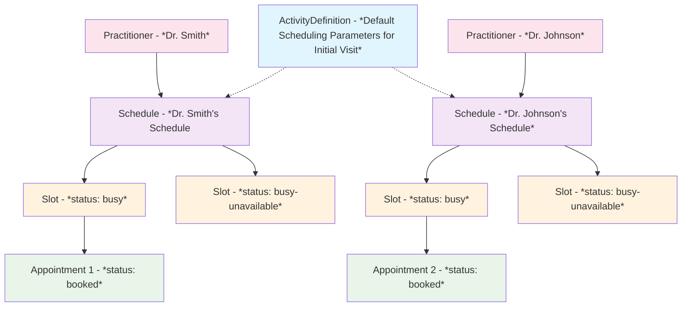
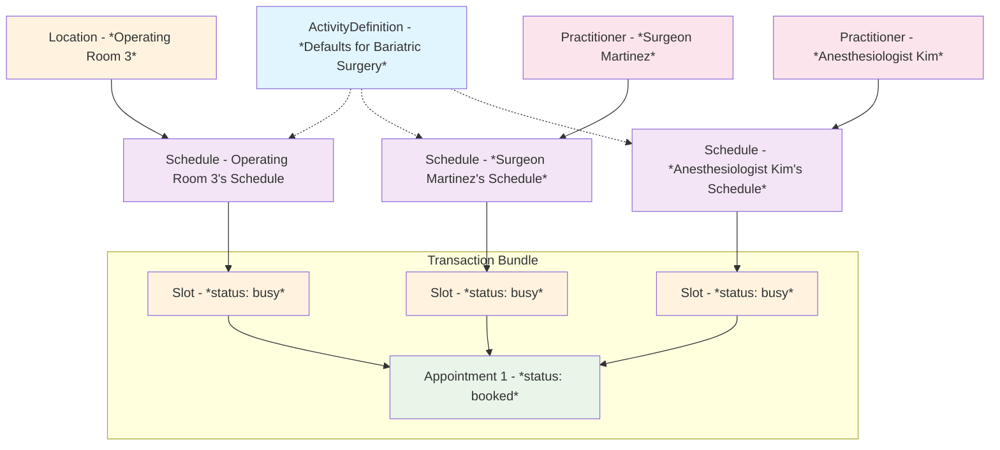
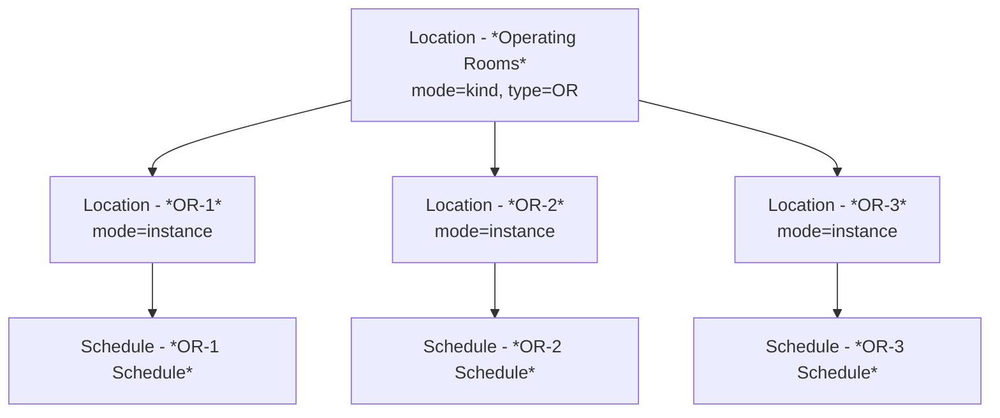

# FHIR Scheduling Data Model Guide

This guide explains how to implement scheduling in Medplum using FHIR resources and Medplum's implemented custom [extensions](/docs/api/fhir/datatypes/extension). This guide covers the core concepts, operations, and best practices for scheduling in Medplum.

## Resources

| Resource | Purpose |
|----------|---------|
| [`ActivityDefinition`](/docs/api/fhir/resources/activitydefinition) | Defines appointment types and their default constraints |
| [`Schedule`](/docs/api/fhir/resources/schedule) | Represents a provider/room/device's availability |
| [`Slot`](/docs/api/fhir/resources/slot) | Represents specific time blocks (created on-demand at booking or for unavailability) |
| [`Appointment`](/docs/api/fhir/resources/appointment) | Represents a booked appointment |



## Core Concepts

### One Schedule Per Resource thats Available for Booking
Each provider, room, or device has one [`Schedule`](/docs/api/fhir/resources/schedule) that lists all service types they can perform. This reflects reality: **a resource can only be used for one thing at a time.**

```json
{
  "resourceType": "Schedule",
  "id": "dr-smith-schedule",
  "actor": [{"reference": "Practitioner/dr-smith"}]
}
```

### Operations

**Appointment Booking FHIR Operations**
- `$find` - Find available appointment slots **[In Development - Coming Soon]**
- `$hold` - Temporarily hold a slot **[In Development - Coming Soon]**
- `$book` - Book an appointment **[In Development - Coming Soon]**
- `$cancel` - Cancel an appointment **[In Development - Coming Soon]**

### Slot Model

This scheduling guide **only uses the [`Slot`](/docs/api/fhir/resources/slot) resource to represent time blocks that are booked by an appointment or explicitly blocked out by unavailability.**

**Time that has no corresponding Slot resource is considered available for booking.**

Slots are calculated dynamically within the `$find` operation, returning a [`Bundle`](/docs/api/fhir/resources/bundle) of [`Slot`](/docs/api/fhir/resources/slot) resources that have not yet been actually created as FHIR resources yet. Then, based on the selected time window, the corresponding [`Slot`](/docs/api/fhir/resources/slot) resource can be created with `Slot.status = 'busy'`.

- An appointment is booked (`Slot.status = 'busy'`)
- Unavailable time blocked out (`Slot.status = 'busy-unavailable'`)

## Scheduling Parameters Extension

All scheduling constraints are managed through a single consolidated extension: `scheduling-parameters`. This extension can appear on both [ActivityDefinition](/docs/api/fhir/resources/activitydefinition) (for defaults) and [Schedule](/docs/api/fhir/resources/schedule) (for overrides).

**Extension URL**: `http://medplum.com/fhir/StructureDefinition/scheduling-parameters`

### Extension Structure

```json
{
  "url": "http://medplum.com/fhir/StructureDefinition/scheduling-parameters",
  "extension": [
    // Optional: specify service type (omit for default configuration)
    {
      "url": "serviceType",
      "valueCodeableConcept": {
        "coding": [{"code": "bariatric-surgery"}]
      }
    },
    
    // Recurring availability (Schedule only)
    {
      "url": "availability",
      "valueTiming": {
        "repeat": {
          "dayOfWeek": ["mon", "wed", "fri"],
          "timeOfDay": ["09:00:00"], // ensure TZ aware string
          "duration": 8,
          "durationUnit": "h"
        }
      }
    },
    
    // Buffer time before appointment
    {
      "url": "bufferBefore",
      "valueDuration": {
        "value": 15,
        "unit": "min",
        "system": "http://unitsofmeasure.org",
        "code": "min"
      }
    },
    
    // Buffer time after appointment
    {
      "url": "bufferAfter",
      "valueDuration": {
        "value": 10,
        "unit": "min",
        "system": "http://unitsofmeasure.org",
        "code": "min"
      }
    },
    
    // Time alignment interval (appointment start time boundaries)
    {
      "url": "alignmentInterval",
      "valueDuration": {
        "value": 15,
        "unit": "min",
        "system": "http://unitsofmeasure.org",
        "code": "min"
      }
    },
    
    // Time alignment offset (shift from interval boundaries)
    {
      "url": "alignmentOffset",
      "valueDuration": {
        "value": 0,
        "unit": "min",
        "system": "http://unitsofmeasure.org",
        "code": "min"
      }
    },
    
    // Booking limits (can have multiple)
    {
      "url": "bookingLimit",
      "valueTiming": {
        "repeat": {
          "frequency": 8,
          "period": 1,
          "periodUnit": "d"
        }
      }
    }
  ]
}
```

## Override Behavior

**All-or-nothing rule**: When a `scheduling-parameters` extension includes a `serviceType`, it **completely replaces** the default configuration for that service type. No attribute-level merging occurs.

**Priority order** (highest to lowest):
1. Schedule with `http://medplum.com/fhir/StructureDefinition/scheduling-parameters.serviceType` extension defined. Schedule overrides ActivityDefinition defaults.
2. ActivityDefinition where `ActivityDefinition.code` matches `Schedule.serviceType`. ActivityDefinition defaults are used.
3. Schedule without `Schedule.serviceType` defined (therefore no ActivityDefinition defaults).


### Example 1: Scheduling Parameters for a Simple Primary Care Office with Appointment Type Defaults

<details>
<summary>ActivityDefinition: Default Scheduling Parameters for an Office Visit</summary>

```json
{
  "resourceType": "ActivityDefinition",
  "id": "office-visit",
  "status": "active",
  "kind": "Appointment",
  "code": {
    "coding": [{
      "system": "http://example.org/appointment-types",
      "code": "office-visit",
      "display": "Office Visit"
    }]
  },
  "timingDuration": {
    "value": 30,
    "unit": "min",
    "system": "http://unitsofmeasure.org",
    "code": "min"
  },
  "extension": [{
    "url": "http://medplum.com/fhir/StructureDefinition/scheduling-parameters",
    "extension": [
      {
        "url": "bufferBefore",
        "valueDuration": {"value": 5, "unit": "min"}
      },
      {
        "url": "bufferAfter",
        "valueDuration": {"value": 5, "unit": "min"}
      },
      {
        "url": "alignmentInterval",
        "valueDuration": {"value": 15, "unit": "min"}
      },
      {
        "url": "alignmentOffset",
        "valueDuration": {"value": 0, "unit": "min"}
      }
    ]
  }]
}
```

</details>

<details>
<summary>Schedule: Practitioner's Schedule without any Overrides</summary>
```json
{
  "resourceType": "Schedule",
  "id": "dr-johnson-schedule",
  "active": true,
  "serviceType": [{
    "coding": [{
      "system": "http://example.org/appointment-types",
      "code": "office-visit"
    }]
  }],
  "actor": [{
    "reference": "PractitionerRole/dr-johnson",
    "display": "Dr. Sarah Johnson"
  }],
  "planningHorizon": {
    "start": "2025-01-01T00:00:00Z",
    "end": "2025-12-31T23:59:59Z"
  },
  "extension": [{
    "url": "http://medplum.com/fhir/StructureDefinition/scheduling-parameters",
    "extension": [{
      "url": "availability",
      "valueTiming": {
        "repeat": {
          "dayOfWeek": ["mon", "tue", "wed", "thu", "fri"],
          "timeOfDay": ["09:00:00"],
          "duration": 8,
          "durationUnit": "h"
        }
      }
    }]
  }]
}
```

</details>

**Result**: Dr. Johnson's schedule inherits all the default parameters from the ActivityDefinition:
- Dr. Johnson is available Mon-Fri 9am-5pm for 30-minute office visits **[from Schedule]**
- Available to start every 15 minutes (:00, :15, :30, :45) **[from ActivityDefinition]**
- 5-minute buffers **[from ActivityDefinition]**

### Example 2: Multi-Service Provider with Multiple Appointment Types and Overrides

A provider who offers different appointment types with varying availability and constraints. Overrides the default scheduling parameters for new patient visits.

<details>
<summary>New Patient Visit ActivityDefinition: Defines a 60-minute new patient visit with specific scheduling constraints including buffers and booking limits.</summary>
```json
{
  "resourceType": "ActivityDefinition",
  "id": "new-patient-visit",
  "status": "active",
  "kind": "Appointment",
  "code": {
    "coding": [{
      "system": "http://example.org/appointment-types",
      "code": "new-patient-visit",
      "display": "New Patient Visit"
    }]
  },
  "timingDuration": {"value": 60, "unit": "min"},
  "extension": [{
    "url": "http://medplum.com/fhir/StructureDefinition/scheduling-parameters",
    "extension": [
      {"url": "bufferBefore", "valueDuration": {"value": 15, "unit": "min"}},
      {"url": "bufferAfter", "valueDuration": {"value": 15, "unit": "min"}},
      {"url": "alignmentInterval", "valueDuration": {"value": 30, "unit": "min"}},
      {
        "url": "bookingLimit",
        "valueTiming": {
          "repeat": {"frequency": 3, "period": 1, "periodUnit": "d"}
        }
      }
    ]
  }]
}
```
</details>

<details>
<summary>Follow-up Visit ActivityDefinition: Defines a shorter 20-minute follow-up visit with minimal buffers and more frequent scheduling intervals.</summary>
```json
{
  "resourceType": "ActivityDefinition",
  "id": "follow-up-visit",
  "status": "active",
  "kind": "Appointment",
  "code": {
    "coding": [{
      "system": "http://example.org/appointment-types",
      "code": "follow-up",
      "display": "Follow-up Visit"
    }]
  },
  "timingDuration": {"value": 20, "unit": "min"},
  "extension": [{
    "url": "http://medplum.com/fhir/StructureDefinition/scheduling-parameters",
    "extension": [
      {"url": "bufferBefore", "valueDuration": {"value": 5, "unit": "min"}},
      {"url": "bufferAfter", "valueDuration": {"value": 5, "unit": "min"}},
      {"url": "alignmentInterval", "valueDuration": {"value": 10, "unit": "min"}}
    ]
  }]
}
```
</details>

<details>
<summary>Schedule: Multi-Service Schedule with Overrides: Shows how to configure a schedule with default availability for all services, then override specific services with different availability patterns.</summary>
```json
{
  "resourceType": "Schedule",
  "id": "dr-chen-schedule",
  "active": true,
  "serviceType": [
    {"coding": [{"code": "new-patient-visit"}]},
    {"coding": [{"code": "follow-up"}]}
  ],
  "actor": [{"reference": "PractitionerRole/dr-chen"}],
  "planningHorizon": {
    "start": "2025-01-01T00:00:00Z",
    "end": "2025-12-31T23:59:59Z"
  },
  "extension": [
    // Default availability for all services
    {
      "url": "http://medplum.com/fhir/StructureDefinition/scheduling-parameters",
      "extension": [{
        "url": "availability",
        "valueTiming": {
          "repeat": {
            "dayOfWeek": ["mon", "tue", "wed", "thu", "fri"],
            "timeOfDay": ["09:00:00"],
            "duration": 8,
            "durationUnit": "h"
          }
        }
      }]
    },
    // New patient visits only on Tuesdays and Thursdays mornings
    {
      "url": "http://medplum.com/fhir/StructureDefinition/scheduling-parameters",
      "extension": [
        {
          "url": "serviceType",
          "valueCodeableConcept": {
            "coding": [{"code": "new-patient-visit"}]
          }
        },
        {
          "url": "availability",
          "valueTiming": {
            "repeat": {
              "dayOfWeek": ["tue", "thu"],
              "timeOfDay": ["09:00:00"],
              "duration": 4,
              "durationUnit": "h"
            }
          }
        }
      ]
    }
  ]
}
```
</details>

**Result**:
- **New patient visits**: Tue/Thu 9am-1pm only, 60 minutes, can start every 30 minutes, max 3 per day, 15-min buffers
- **Follow-ups**: Mon-Fri 9am-5pm, 20 minutes, can start every 10 minutes, 5-min buffers

## Location Modeling

### Example 3: Location-Specific Complex Surgical Scheduling

A bariatric surgery requiring surgeon, OR room, and anesthesiologist coordination.

<details>
<summary>Bariatric Surgery ActivityDefinition: Defines a complex 120-minute surgical procedure requiring multiple participants (surgeon, anesthesiologist, OR room) with extended buffers and booking limits.</summary>
```json
{
  "resourceType": "ActivityDefinition",
  "id": "bariatric-surgery",
  "status": "active",
  "kind": "Appointment",
  "code": {
    "coding": [{
      "system": "http://snomed.info/sct",
      "code": "287809009",
      "display": "Bariatric Surgery"
    }]
  },
  "timingDuration": {"value": 120, "unit": "min"},
  "participant": [
    {
      "type": "practitioner",
      "role": {
        "coding": [{
          "system": "http://snomed.info/sct",
          "code": "304292004",
          "display": "Surgeon"
        }]
      }
    },
    {
      "type": "practitioner",
      "role": {
        "coding": [{
          "system": "http://snomed.info/sct",
          "code": "88189002",
          "display": "Anesthesiologist"
        }]
      }
    },
    {
      "type": "location",
      "role": {
        "coding": [{
          "system": "http://terminology.hl7.org/CodeSystem/v3-RoleCode",
          "code": "OR",
          "display": "Operating Room"
        }]
      }
    }
  ],
  "extension": [{
    "url": "http://medplum.com/fhir/StructureDefinition/scheduling-parameters",
    "extension": [
      {"url": "bufferBefore", "valueDuration": {"value": 45, "unit": "min"}},
      {"url": "bufferAfter", "valueDuration": {"value": 30, "unit": "min"}},
      {"url": "alignmentInterval", "valueDuration": {"value": 30, "unit": "min"}},
      {
        "url": "bookingLimit",
        "valueTiming": {
          "repeat": {"frequency": 2, "period": 1, "periodUnit": "d"}
        }
      },
      {
        "url": "bookingLimit",
        "valueTiming": {
          "repeat": {"frequency": 8, "period": 1, "periodUnit": "wk"}
        }
      }
    ]
  }]
}
```
</details>

<details>
<summary>Surgeon Schedule: Dr. Martinez's availability for bariatric surgeries, limited to Tuesday and Thursday mornings.</summary>
```json
{
  "resourceType": "Schedule",
  "id": "surgeon-martinez-schedule",
  "active": true,
  "serviceType": [
    {"coding": [{"system": "http://snomed.info/sct", "code": "287809009"}]}
  ],
  "actor": [{
    "reference": "PractitionerRole/surgeon-martinez",
    "display": "Dr. Maria Martinez - Bariatric Surgeon"
  }],
  "extension": [{
    "url": "http://medplum.com/fhir/StructureDefinition/scheduling-parameters",
    "extension": [{
      "url": "availability",
      "valueTiming": {
        "repeat": {
          "dayOfWeek": ["tue", "thu"],
          "timeOfDay": ["08:00:00"],
          "duration": 8,
          "durationUnit": "h"
        }
      }
    }]
  }]
}
```
</details>

<details>
<summary>Operating Room Schedule: Operating Room 3's availability for surgical procedures, available weekdays with extended hours.</summary>
```json
{
  "resourceType": "Schedule",
  "id": "or-3-schedule",
  "active": true,
  "serviceType": [
    {"coding": [{"system": "http://snomed.info/sct", "code": "287809009"}]}
  ],
  "actor": [{
    "reference": "Location/or-3",
    "display": "Operating Room 3"
  }],
  "extension": [{
    "url": "http://medplum.com/fhir/StructureDefinition/scheduling-parameters",
    "extension": [{
      "url": "availability",
      "valueTiming": {
        "repeat": {
          "dayOfWeek": ["mon", "tue", "wed", "thu", "fri"],
          "timeOfDay": ["07:00:00"],
          "duration": 12,
          "durationUnit": "h"
        }
      }
    }]
  }]
}
```
</details>

<details>
<summary>Anesthesiologist Schedule: Dr. Kim's availability for surgical procedures, covering weekdays with standard hours.</summary>
```json
{
  "resourceType": "Schedule",
  "id": "anesthesiologist-kim-schedule",
  "active": true,
  "serviceType": [
    {"coding": [{"system": "http://snomed.info/sct", "code": "287809009"}]}
  ],
  "actor": [{
    "reference": "PractitionerRole/anesthesiologist-kim",
    "display": "Dr. James Kim - Anesthesiologist"
  }],
  "extension": [{
    "url": "http://medplum.com/fhir/StructureDefinition/scheduling-parameters",
    "extension": [{
      "url": "availability",
      "valueTiming": {
        "repeat": {
          "dayOfWeek": ["mon", "tue", "wed", "thu", "fri"],
          "timeOfDay": ["07:00:00"],
          "duration": 10,
          "durationUnit": "h"
        }
      }
    }]
  }]
}
```
</details>

<details>
<summary>Transaction Bundle (Booking): Complete FHIR transaction bundle showing how to atomically book all required resources for a surgical procedure.</summary>
```json
{
  "resourceType": "Bundle",
  "type": "transaction",
  "entry": [
    {
      "request": {"method": "POST", "url": "Slot"},
      "resource": {
        "resourceType": "Slot",
        "schedule": {"reference": "Schedule/surgeon-martinez-schedule"},
        "status": "busy",
        "start": "2025-10-16T07:45:00-07:00",
        "end": "2025-10-16T11:00:00-07:00",
        "comment": "Includes 45min pre-op and 30min post-op"
      }
    },
    {
      "request": {"method": "POST", "url": "Slot"},
      "resource": {
        "resourceType": "Slot",
        "schedule": {"reference": "Schedule/or-3-schedule"},
        "status": "busy",
        "start": "2025-10-16T07:45:00-07:00",
        "end": "2025-10-16T11:00:00-07:00"
      }
    },
    {
      "request": {"method": "POST", "url": "Slot"},
      "resource": {
        "resourceType": "Slot",
        "schedule": {"reference": "Schedule/anesthesiologist-kim-schedule"},
        "status": "busy",
        "start": "2025-10-16T07:45:00-07:00",
        "end": "2025-10-16T11:00:00-07:00"
      }
    },
    {
      "request": {"method": "POST", "url": "Appointment"},
      "resource": {
        "resourceType": "Appointment",
        "status": "booked",
        "serviceType": [{
          "coding": [{"system": "http://snomed.info/sct", "code": "287809009"}]
        }],
        "appointmentType": {
          "coding": [{"code": "bariatric-surgery"}]
        },
        "start": "2025-10-16T08:30:00-07:00",
        "end": "2025-10-16T10:30:00-07:00",
        "participant": [
          {
            "actor": {"reference": "PractitionerRole/surgeon-martinez"},
            "required": "required",
            "status": "accepted"
          },
          {
            "actor": {"reference": "Location/or-3"},
            "required": "required",
            "status": "accepted"
          },
          {
            "actor": {"reference": "PractitionerRole/anesthesiologist-kim"},
            "required": "required",
            "status": "accepted"
          },
          {
            "actor": {"reference": "Patient/example-patient"},
            "required": "required",
            "status": "accepted"
          }
        ],
        "slot": [
          {"reference": "Slot/surgeon-slot-id"},
          {"reference": "Slot/or-slot-id"},
          {"reference": "Slot/anesthesiologist-slot-id"}
        ]
      }
    }
  ]
}
```
</details>

**Result**: When booking a bariatric surgery, the system queries all three schedules, calculates intersection of availability, and creates atomic transaction bundles to book all required resources simultaneously.




### Hierarchy Pattern

```
Organization (Surgery Center)
  └─ Location (Building) [mode=kind]
       ├─ Location (Operating Rooms) [mode=kind, type=OR]
       │    ├─ Location (OR-1) [mode=instance]
       │    ├─ Location (OR-2) [mode=instance]
       │    └─ Location (OR-3) [mode=instance]
       └─ Location (Recovery Rooms) [mode=kind, type=RR]
            ├─ Location (Recovery-A) [mode=instance]
            └─ Location (Recovery-B) [mode=instance]
```

### Specific vs. "Any Available" Room

**Specific room required:**
- Query `Schedule?actor=Location/or-3`

**Any OR room acceptable:**
- Query: `Schedule?actor:Location.type=OR`


    

## Blocking Time (Unavailability)

Use Slots with `status=busy-unavailable` to block time:

```json
{
  "resourceType": "Slot",
  "schedule": {"reference": "Schedule/dr-johnson-schedule"},
  "status": "busy-unavailable",
  "start": "2025-12-24T00:00:00-08:00",
  "end": "2025-12-26T23:59:59-08:00",
  "comment": "Holiday vacation",
  "serviceType": [{"coding": [{"code": "office-visit"}]}]
}
```

- **With serviceType**: Blocks only that specific service
- **Without serviceType**: Blocks all services

## Best Practices

### 1. Use All-or-Nothing Overrides
If adding a `serviceType` configuration on Schedule, **specify ALL attributes** to avoid confusion about inheritance.

### 2. Minimize Pre-Generated Slots
Only create Slot resources for:
- Booked appointments (status: busy)
- Blocked time (status: busy-unavailable)

Let `$find` calculate available windows dynamically.

### 3. Transaction Bundles for Multi-Resource Booking
Always use [FHIR transaction bundles](/docs/fhir-datastore/fhir-batch-requests#batches-vs-transactions) when booking appointments that require multiple resources to ensure atomicity.
