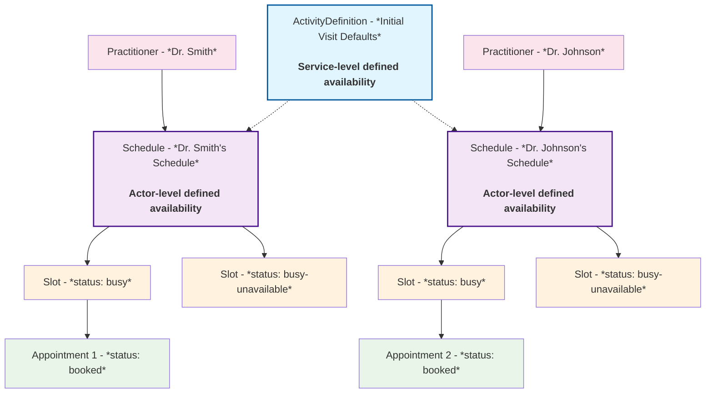
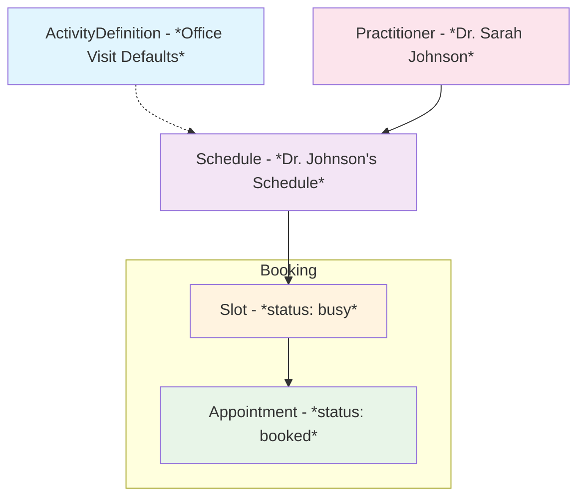
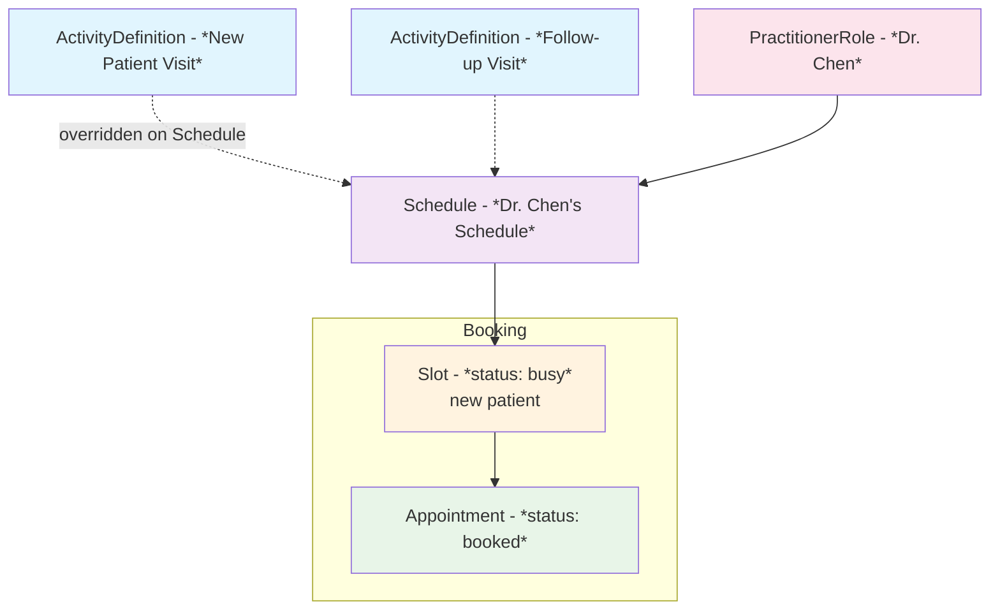
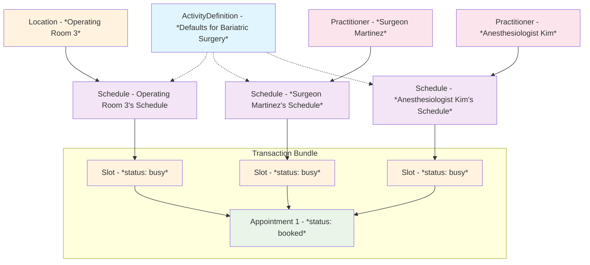
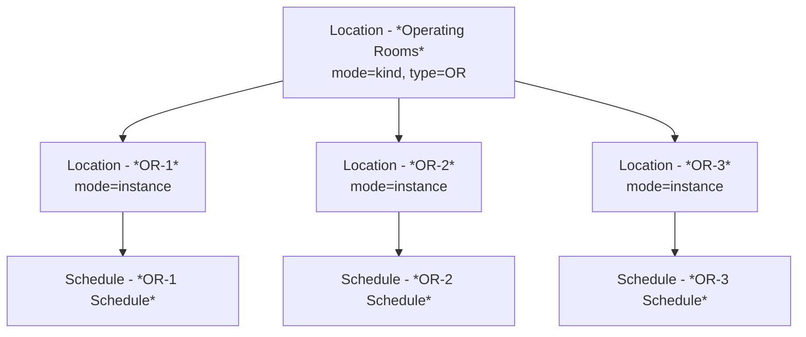

# Defining Availability

This guide explains how to define and find availability information at both the service level and actor level in Medplum using FHIR resources and Medplum's custom [extensions](/docs/api/fhir/datatypes/extension). You'll learn how to configure when services can be performed in time, how different scheduling constraints interact, and how to model complex multi-resource scheduling scenarios.

## Core Scheduling Concepts

### Key FHIR Resources

The following FHIR resources work together to define availability:

| Resource | Purpose |
|----------|---------|
| [`ActivityDefinition`](/docs/api/fhir/resources/activitydefinition) | Defines appointment types and their default constraints |
| [`Schedule`](/docs/api/fhir/resources/schedule) | Represents a provider/room/device's availability |
| [`Slot`](/docs/api/fhir/resources/slot) | Represents specific time blocks (created on-demand at booking or for unavailability) |
| [`Appointment`](/docs/api/fhir/resources/appointment) | Represents a booked appointment |

The other key entity is the **Service Type**, which is a [codeable concept](/docs/api/fhir/datatypes/codeableconcept) that defines a specific service type (appointment type). Service types are used to group appointments into categories, such as `office visit`, `telephone visit`, and `emergency room visit`. FHIR's recommendation is to use codes from https://build.fhir.org/valueset-procedure-code.html.

### Appointment Booking FHIR Operations
- `$find` - Find available appointment slots **[In Development - Coming Soon]**
- `$hold` - Temporarily hold a slot **[In Development - Coming Soon]**
- `$book` - Book an appointment **[In Development - Coming Soon]**
- `$cancel` - Cancel an appointment **[In Development - Coming Soon]**

### Resource Relationships

The diagram below illustrates how these resources work together. The key takeaways are:

- Each [Practitioner](/docs/api/fhir/resources/practitioner), [Location](/docs/api/fhir/resources/location), or [Device](/docs/api/fhir/resources/device) has **one** [`Schedule`](/docs/api/fhir/resources/schedule)
- An [ActivityDefinition](/docs/api/fhir/resources/activitydefinition) defines default scheduling parameters for a specific service type
- Multiple Practitioners can reference the same ActivityDefinition through their `Schedule.serviceType`, allowing shared defaults across providers
- [Slot](/docs/api/fhir/resources/slot) resources **only** represent time that is explicitly blocked (either by booked appointments or unavailability)

The system supports two levels of configuration:
- **[Actor-level defined availability](#actor-level-availability)**: Defined directly on a Practitioner's or Location's [`Schedule`](/docs/api/fhir/resources/schedule) using the `scheduling-parameters` extension
- **[Service type-level defined availability](#service-level-availability)**: Defined on [`ActivityDefinition`](/docs/api/fhir/resources/activitydefinition) and referenced by matching `Schedule.serviceType` codes



### The Scheduling Parameters Extension

All scheduling constraints are managed through a single consolidated extension: `scheduling-parameters`. This extension can appear on both [ActivityDefinition](/docs/api/fhir/resources/activitydefinition) (for defaults) and [Schedule](/docs/api/fhir/resources/schedule).

#### Extension Fields Reference

| Url | Type | Applies To | Required | Behavior when defined | Behavior when not defined |
|-------|------|------------|----------|----------------------|---------------------------|
| `serviceType` | [CodeableConcept](/docs/api/fhir/datatypes/codeableconcept) | Schedule only | Optional | Applies configuration only to the specified service type, overriding defaults for that service | Values apply as the default for all services |
| `availability` | [Timing](/docs/api/fhir/datatypes/timing) | Schedule only | Optional | Bookings must fully fit within the recurring windows | Time is implicitly available by default (unless blocked by Slots or other constraints) |
| `bufferBefore` | [Duration](/docs/api/fhir/datatypes/duration) | Both Schedule and ActivityDefinition | Optional | Requires prep time before start to also be free | No prep time required |
| `bufferAfter` | [Duration](/docs/api/fhir/datatypes/duration) | Both Schedule and ActivityDefinition | Optional | Requires cleanup time after end to also be free | No cleanup time required |
| `alignmentInterval` | [Duration](/docs/api/fhir/datatypes/duration) | Both Schedule and ActivityDefinition | Optional | Start times must align to the interval (e.g., every 15 minutes) | Start times are not constrained by an interval grid |
| `alignmentOffset` | [Duration](/docs/api/fhir/datatypes/duration) | Both Schedule and ActivityDefinition | Optional, and alignmentInterval must be defined | Shifts allowed start times by the offset relative to the interval (e.g., with a 15-minute alignmentInterval and a 5-minute alignmentOffset, valid starts are :05, :20, :35, :50) | Grid anchored to :00 (no shift) |
| `bookingLimit` | [Timing](/docs/api/fhir/datatypes/timing) | Both Schedule and ActivityDefinition | Optional | Caps number of appointments per period (multiple entries can stack) | No capacity cap for that period |

<details>
<summary>Example of the `scheduling-parameters` extension</summary>

```tsx
{
  "url": "http://medplum.com/fhir/StructureDefinition/scheduling-parameters",
  "extension": [
    // Optional: specify service type (omit for default configuration)
    {
      "url": "serviceType",
      "valueCodeableConcept": {
        "coding": [{"code": "bariatric-surgery"}]
      }
    },
    
    // Recurring availability (Schedule only)
    {
      "url": "availability",
      "valueTiming": {
        "repeat": {
          "dayOfWeek": ["mon", "wed", "fri"],
          "timeOfDay": ["09:00:00"],
          "duration": 8,
          "durationUnit": "h"
        }
      }
    },
    
    // Buffer time before appointment
    {
      "url": "bufferBefore",
      "valueDuration": {
        "value": 15,
        "unit": "min",
        "system": "http://unitsofmeasure.org",
        "code": "min"
      }
    },
    
    // Buffer time after appointment
    {
      "url": "bufferAfter",
      "valueDuration": {
        "value": 10,
        "unit": "min",
        "system": "http://unitsofmeasure.org",
        "code": "min"
      }
    },
    
    // Time alignment interval (appointment start time boundaries)
    {
      "url": "alignmentInterval",
      "valueDuration": {
        "value": 15,
        "unit": "min",
        "system": "http://unitsofmeasure.org",
        "code": "min"
      }
    },
    
    // Time alignment offset (shift from interval boundaries)
    {
      "url": "alignmentOffset",
      "valueDuration": {
        "value": 0,
        "unit": "min",
        "system": "http://unitsofmeasure.org",
        "code": "min"
      }
    },
    
    // Booking limits (can have multiple)
    {
      "url": "bookingLimit",
      "valueTiming": {
        "repeat": {
          "frequency": 8,
          "period": 1,
          "periodUnit": "d"
        }
      }
    }
  ]
}
```

</details>


## Actor Level Availability

### The Concept of Implicit Availability

Medplum's scheduling model uses **implicit availability**: time is assumed to be free by default. You define availability rules using extensions that specify when resources are available based on recurring patterns. [`Slot`](/docs/api/fhir/resources/slot) resources are only used for explicit overrides—either to mark time as busy (when an appointment is booked) or to block out unavailable time.

This approach avoids the need to pre-generate thousands of Slot resources for every possible time slot. Instead, the system calculates available windows dynamically based on the availability rules you define.

### The Schedule Resource

The [`Schedule`](/docs/api/fhir/resources/schedule) resource is the foundation for defining actor-level availability for a provider, location, or device. 


Here is an example of a [Schedule](/docs/api/fhir/resources/schedule) resource that defines general availability for a [Practitioner](/docs/api/fhir/resources/practitioner).

```tsx
{
  "resourceType": "Schedule",
  "id": "dr-smith-schedule",
  "actor": [{"reference": "Practitioner/dr-smith"}],
  "extension": [{
    "url": "http://medplum.com/fhir/StructureDefinition/scheduling-parameters",
    "extension": [{
      "url": "availability",
      "valueTiming": {
        "repeat": {
          "dayOfWeek": ["mon", "tue", "wed", "thu", "fri"],
          "timeOfDay": ["09:00:00"],
          "duration": 8,
          "durationUnit": "h"
        }
      }
    }]
  }]
  //...
}
```

## Service Level Availability

### Service Types and ActivityDefinition

An [ActivityDefinition](/docs/api/fhir/resources/activitydefinition) gives a mechanism to define the default scheduling parameters for a specific service type (appointment type), which can then be used by multiple [Practitioner](/docs/api/fhir/resources/practitioner)'s [Schedules](/docs/api/fhir/resources/schedule). This allows you to define standard appointment durations, buffer times, alignment intervals, and booking limits once and apply them across multiple providers.

To get the [Schedule](/docs/api/fhir/resources/schedule) to use the [ActivityDefinition](/docs/api/fhir/resources/activitydefinition)'s scheduling parameters, the `Schedule.serviceType` must match the `ActivityDefinition.code`.

```tsx
{
  "resourceType": "ActivityDefinition",
  "id": "office-visit",
  "code": {
    "coding": [{
      "system": "http://example.org/appointment-types",
      "code": "office-visit"  // ← This is the key
    }]
  },
  //...
  "extension": [{
    "url": "http://medplum.com/fhir/StructureDefinition/scheduling-parameters",
    "extension": [{
      "url": "availability",
      "valueTiming": {
        "repeat": {
          "dayOfWeek": ["mon", "tue", "wed", "thu", "fri"],
          "timeOfDay": ["09:00:00"],
          "duration": 8,
          "durationUnit": "h"
        }
      }
    }]
  }]
}
```

```tsx
{
  "resourceType": "Schedule",
  "id": "dr-smith-schedule",
  "actor": [{"reference": "Practitioner/dr-smith"}],
  "serviceType": [{"coding": [{"code": "office-visit"}]}], // matches the ActivityDefinition.code
  //...
}
```

### Override Behavior

A [Practitioner](/docs/api/fhir/resources/practitioner)'s [Schedule](/docs/api/fhir/resources/schedule) can also override the default [ActivityDefinition](/docs/api/fhir/resources/activitydefinition)'s availability for a specific service type by defining a `serviceType` extension.

Here is an example Schedule that defines generic availability for all services and then overrides the availability for a specific service type.

```tsx
{
  "resourceType": "Schedule",
  "id": "dr-chen-schedule",
  "active": true,
  "serviceType": [
    {"coding": [{"code": "new-patient-visit"}]},
    {"coding": [{"code": "follow-up"}]}
  ],
  "actor": [{"reference": "Practitioner/dr-chen"}],
  "extension": [
    // Practitioner level availability
    {
      "url": "http://medplum.com/fhir/StructureDefinition/scheduling-parameters",
      "extension": [{
        "url": "availability",
        "valueTiming": {
          "repeat": {
            "dayOfWeek": ["mon", "tue", "wed", "thu", "fri"],
            "timeOfDay": ["09:00:00"],
            "duration": 8,
            "durationUnit": "h"
          }
        }
      }]
    },
    // Service type level availability for this Practitioner - overrides any availability parameters specified elsewhere
    {
      "url": "http://medplum.com/fhir/StructureDefinition/scheduling-parameters",
      "extension": [
        {
          "url": "serviceType",
          "valueCodeableConcept": {
            "coding": [{"code": "new-patient-visit"}]
          }
        },
        {
          "url": "availability",
          "valueTiming": {
            "repeat": {
              "dayOfWeek": ["tue", "thu"],
              "timeOfDay": ["09:00:00"],
              "duration": 4,
              "durationUnit": "h"
            }
          }
        }
      ]
    }
  ]
}
```


**All-or-nothing rule**: When a `scheduling-parameters` extension includes a `serviceType`, it **completely replaces** the default configuration for that service type. No attribute-level merging occurs.

**Priority order** (highest to lowest):
1. Schedule with `http://medplum.com/fhir/StructureDefinition/scheduling-parameters.serviceType` extension defined.
2. ActivityDefinition where `ActivityDefinition.code` matches `Schedule.serviceType`. ActivityDefinition parameters are used.
3. Schedule without `Schedule.serviceType` defined. Uses generic availability defined on the Schedule.

### Blocking Time by Service Type

Here is an example of a [Slot](/docs/api/fhir/resources/slot) resource that blocks time for a specific service type.

```tsx
{
  "resourceType": "Slot",
  "schedule": {"reference": "Schedule/dr-johnson-schedule"},
  "status": "busy-unavailable",
  "start": "2025-12-24T08:00:00Z",
  "end": "2025-12-27T07:59:59Z",
  "comment": "Holiday vacation",
  "serviceType": [{"coding": [{"code": "office-visit"}]}]
}
```

- **With serviceType**: Blocks only that specific service
- **Without serviceType**: Blocks all services


## Examples

### Example 1: Simple Primary Care Office with Appointment Type Defaults

This example shows how to define availability for a simple primary care office where Practitioner's Schedules inherit default scheduling parameters from an ActivityDefinition.

<details>
<summary>ActivityDefinition: Office Visit Defaults</summary>

This ActivityDefinition defines default scheduling parameters for a 30-minute office visit with 5-minute buffers and 15-minute alignment intervals.

```tsx
{
  "resourceType": "ActivityDefinition",
  "id": "office-visit",
  "status": "active",
  "kind": "Appointment",
  "code": {
    "coding": [{
      "system": "http://example.org/appointment-types",
      "code": "office-visit",
      "display": "Office Visit"
    }]
  },
  "timingDuration": {
    "value": 30,
    "unit": "min",
    "system": "http://unitsofmeasure.org",
    "code": "min"
  },
  "extension": [{
    "url": "http://medplum.com/fhir/StructureDefinition/scheduling-parameters",
    "extension": [
      {
        "url": "bufferBefore",
        "valueDuration": {"value": 5, "unit": "min"}
      },
      {
        "url": "bufferAfter",
        "valueDuration": {"value": 5, "unit": "min"}
      },
      {
        "url": "alignmentInterval",
        "valueDuration": {"value": 15, "unit": "min"}
      },
      {
        "url": "alignmentOffset",
        "valueDuration": {"value": 0, "unit": "min"}
      }
    ]
  }]
}
```

</details>

<details>
<summary>Schedule: Practitioner's Schedule without Overrides</summary>

This Schedule shows Dr. Johnson's availability (Mon-Fri 9am-5pm) that inherits all default parameters from the ActivityDefinition without any service-specific overrides.

```tsx
{
  "resourceType": "Schedule",
  "id": "dr-johnson-schedule",
  "active": true,
  "serviceType": [{
    "coding": [{
      "system": "http://example.org/appointment-types",
      "code": "office-visit"
    }]
  }],
  "actor": [{
    "reference": "Practitioner/dr-johnson",
    "display": "Dr. Sarah Johnson"
  }],
  "planningHorizon": {
    "start": "2025-01-01T00:00:00Z",
    "end": "2025-12-31T23:59:59Z"
  },
  "extension": [{
    "url": "http://medplum.com/fhir/StructureDefinition/scheduling-parameters",
    "extension": [{
      "url": "availability",
      "valueTiming": {
        "repeat": {
          "dayOfWeek": ["mon", "tue", "wed", "thu", "fri"],
          "timeOfDay": ["09:00:00"],
          "duration": 8,
          "durationUnit": "h"
        }
      }
    }]
  }]
}
```

</details>

**Result**: Dr. Johnson's schedule inherits all the default parameters from the ActivityDefinition:
- Dr. Johnson is available Mon-Fri 9am-5pm for 30-minute office visits **[from Schedule]**
- Available to start every 15 minutes (:00, :15, :30, :45) **[from ActivityDefinition]**
- 5-minute buffers **[from ActivityDefinition]**



### Example 2: Multi-Service Provider with Multiple Appointment Types and Overrides

A provider who offers different appointment types with varying availability and constraints. Overrides the default scheduling parameters for new patient visits.

<details>
<summary>ActivityDefinition: New Patient Visit</summary>

This ActivityDefinition defines a 60-minute new patient visit with 15-minute buffers, 30-minute alignment intervals, and a booking limit of 3 per day.

```tsx
{
  "resourceType": "ActivityDefinition",
  "id": "new-patient-visit",
  "status": "active",
  "kind": "Appointment",
  "code": {
    "coding": [{
      "system": "http://example.org/appointment-types",
      "code": "new-patient-visit",
      "display": "New Patient Visit"
    }]
  },
  "timingDuration": {"value": 60, "unit": "min"},
  "extension": [{
    "url": "http://medplum.com/fhir/StructureDefinition/scheduling-parameters",
    "extension": [
      {"url": "bufferBefore", "valueDuration": {"value": 15, "unit": "min"}},
      {"url": "bufferAfter", "valueDuration": {"value": 15, "unit": "min"}},
      {"url": "alignmentInterval", "valueDuration": {"value": 30, "unit": "min"}},
      {
        "url": "bookingLimit",
        "valueTiming": {
          "repeat": {"frequency": 3, "period": 1, "periodUnit": "d"}
        }
      }
    ]
  }]
}
```
</details>

<details>
<summary>ActivityDefinition: Follow-up Visit</summary>

This ActivityDefinition defines a 20-minute follow-up visit with 5-minute buffers and 10-minute alignment intervals for more frequent scheduling.

```tsx
{
  "resourceType": "ActivityDefinition",
  "id": "follow-up-visit",
  "status": "active",
  "kind": "Appointment",
  "code": {
    "coding": [{
      "system": "http://example.org/appointment-types",
      "code": "follow-up",
      "display": "Follow-up Visit"
    }]
  },
  "timingDuration": {"value": 20, "unit": "min"},
  "extension": [{
    "url": "http://medplum.com/fhir/StructureDefinition/scheduling-parameters",
    "extension": [
      {"url": "bufferBefore", "valueDuration": {"value": 5, "unit": "min"}},
      {"url": "bufferAfter", "valueDuration": {"value": 5, "unit": "min"}},
      {"url": "alignmentInterval", "valueDuration": {"value": 10, "unit": "min"}}
    ]
  }]
}
```
</details>

<details>
<summary>Schedule: Multi-Service with Overrides</summary>

This Schedule shows how to configure default availability for all services (Mon-Fri 9am-5pm), then override new patient visits to only be available on Tuesday and Thursday mornings (9am-1pm).

```tsx
{
  "resourceType": "Schedule",
  "id": "dr-chen-schedule",
  "active": true,
  "serviceType": [
    {"coding": [{"code": "new-patient-visit"}]},
    {"coding": [{"code": "follow-up"}]}
  ],
  "actor": [{"reference": "PractitionerRole/dr-chen"}],
  "planningHorizon": {
    "start": "2025-01-01T00:00:00Z",
    "end": "2025-12-31T23:59:59Z"
  },
  "extension": [
    // Default availability for all services
    {
      "url": "http://medplum.com/fhir/StructureDefinition/scheduling-parameters",
      "extension": [{
        "url": "availability",
        "valueTiming": {
          "repeat": {
            "dayOfWeek": ["mon", "tue", "wed", "thu", "fri"],
            "timeOfDay": ["09:00:00"],
            "duration": 8,
            "durationUnit": "h"
          }
        }
      }]
    },
    // New patient visits only on Tuesday and Thursday mornings
    {
      "url": "http://medplum.com/fhir/StructureDefinition/scheduling-parameters",
      "extension": [
        {
          "url": "serviceType",
          "valueCodeableConcept": {
            "coding": [{"code": "new-patient-visit"}]
          }
        },
        {
          "url": "availability",
          "valueTiming": {
            "repeat": {
              "dayOfWeek": ["tue", "thu"],
              "timeOfDay": ["09:00:00"],
              "duration": 4,
              "durationUnit": "h"
            }
          }
        }
      ]
    }
  ]
}
```
</details>

**Result**:
- **New patient visits**: Tue/Thu 9am-1pm only, 60 minutes, can start every 30 minutes, max 3 per day, 15-min buffers
- **Follow-ups**: Mon-Fri 9am-5pm, 20 minutes, can start every 10 minutes, 5-min buffers



### Example 3: Location-Specific Complex Surgical Scheduling

A bariatric surgery requiring surgeon, OR room, and anesthesiologist coordination.

<details>
<summary>ActivityDefinition: Bariatric Surgery</summary>

This ActivityDefinition defines a 120-minute surgical procedure requiring coordination of surgeon, anesthesiologist, and OR room with 45/30-minute buffers and multiple booking limits (2 per day, 8 per week).

```tsx
{
  "resourceType": "ActivityDefinition",
  "id": "bariatric-surgery",
  "status": "active",
  "kind": "Appointment",
  "code": {
    "coding": [{
      "system": "http://snomed.info/sct",
      "code": "287809009",
      "display": "Bariatric Surgery"
    }]
  },
  "timingDuration": {"value": 120, "unit": "min"},
  "participant": [
    {
      "type": "practitioner",
      "role": {
        "coding": [{
          "system": "http://snomed.info/sct",
          "code": "304292004",
          "display": "Surgeon"
        }]
      }
    },
    {
      "type": "practitioner",
      "role": {
        "coding": [{
          "system": "http://snomed.info/sct",
          "code": "88189002",
          "display": "Anesthesiologist"
        }]
      }
    },
    {
      "type": "location",
      "role": {
        "coding": [{
          "system": "http://terminology.hl7.org/CodeSystem/v3-RoleCode",
          "code": "OR",
          "display": "Operating Room"
        }]
      }
    }
  ],
  "extension": [{
    "url": "http://medplum.com/fhir/StructureDefinition/scheduling-parameters",
    "extension": [
      {"url": "bufferBefore", "valueDuration": {"value": 45, "unit": "min"}},
      {"url": "bufferAfter", "valueDuration": {"value": 30, "unit": "min"}},
      {"url": "alignmentInterval", "valueDuration": {"value": 30, "unit": "min"}},
      {
        "url": "bookingLimit",
        "valueTiming": {
          "repeat": {"frequency": 2, "period": 1, "periodUnit": "d"}
        }
      },
      {
        "url": "bookingLimit",
        "valueTiming": {
          "repeat": {"frequency": 8, "period": 1, "periodUnit": "wk"}
        }
      }
    ]
  }]
}
```
</details>

<details>
<summary>Schedule: Surgeon Availability</summary>

This Schedule shows Dr. Martinez's availability for bariatric surgeries, limited to Tuesday and Thursday mornings (8am-4pm).

```tsx
{
  "resourceType": "Schedule",
  "id": "surgeon-martinez-schedule",
  "active": true,
  "serviceType": [
    {"coding": [{"system": "http://snomed.info/sct", "code": "287809009"}]}
  ],
  "actor": [{
    "reference": "PractitionerRole/surgeon-martinez",
    "display": "Dr. Maria Martinez - Bariatric Surgeon"
  }],
  "extension": [{
    "url": "http://medplum.com/fhir/StructureDefinition/scheduling-parameters",
    "extension": [{
      "url": "availability",
      "valueTiming": {
        "repeat": {
          "dayOfWeek": ["tue", "thu"],
          "timeOfDay": ["08:00:00"],
          "duration": 8,
          "durationUnit": "h"
        }
      }
    }]
  }]
}
```
</details>

<details>
<summary>Schedule: Operating Room Availability</summary>

This Schedule shows Operating Room 3's availability for surgical procedures, available weekdays 7am-7pm with extended 12-hour blocks.

```tsx
{
  "resourceType": "Schedule",
  "id": "or-3-schedule",
  "active": true,
  "serviceType": [
    {"coding": [{"system": "http://snomed.info/sct", "code": "287809009"}]}
  ],
  "actor": [{
    "reference": "Location/or-3",
    "display": "Operating Room 3"
  }],
  "extension": [{
    "url": "http://medplum.com/fhir/StructureDefinition/scheduling-parameters",
    "extension": [{
      "url": "availability",
      "valueTiming": {
        "repeat": {
          "dayOfWeek": ["mon", "tue", "wed", "thu", "fri"],
          "timeOfDay": ["07:00:00"],
          "duration": 12,
          "durationUnit": "h"
        }
      }
    }]
  }]
}
```
</details>

<details>
<summary>Schedule: Anesthesiologist Availability</summary>

This Schedule shows Dr. Kim's availability for surgical procedures, covering weekdays 7am-5pm (10-hour blocks).

```tsx
{
  "resourceType": "Schedule",
  "id": "anesthesiologist-kim-schedule",
  "active": true,
  "serviceType": [
    {"coding": [{"system": "http://snomed.info/sct", "code": "287809009"}]}
  ],
  "actor": [{
    "reference": "PractitionerRole/anesthesiologist-kim",
    "display": "Dr. James Kim - Anesthesiologist"
  }],
  "extension": [{
    "url": "http://medplum.com/fhir/StructureDefinition/scheduling-parameters",
    "extension": [{
      "url": "availability",
      "valueTiming": {
        "repeat": {
          "dayOfWeek": ["mon", "tue", "wed", "thu", "fri"],
          "timeOfDay": ["07:00:00"],
          "duration": 10,
          "durationUnit": "h"
        }
      }
    }]
  }]
}
```
</details>

**Result**: When booking a bariatric surgery, the system queries all three schedules, calculates the intersection of availability, and creates atomic transaction bundles to book all required resources simultaneously.



## Location Modeling

### Location Hierarchy Pattern

```
Organization (Surgery Center)
  └─ Location (Building) [mode=kind]
       ├─ Location (Operating Rooms) [mode=kind, type=OR]
       │    ├─ Location (OR-1) [mode=instance]
       │    ├─ Location (OR-2) [mode=instance]
       │    └─ Location (OR-3) [mode=instance]
       └─ Location (Recovery Rooms) [mode=kind, type=RR]
            ├─ Location (Recovery-A) [mode=instance]
            └─ Location (Recovery-B) [mode=instance]
```

### Specific vs. "Any Available" Room

**Specific room required:**
- Query `Schedule?actor=Location/or-3`

**Any OR room acceptable:**
- Query: `Schedule?actor:Location.partof:Location.type=OR`



### Best Practices

#### 1. Use All-or-Nothing Overrides
If adding a `serviceType` configuration on Schedule, **specify ALL attributes** to avoid confusion about inheritance.

#### 2. Minimize Pre-Generated Slots
Only create Slot resources for:
- Booked appointments (status: busy)
- Blocked time (status: busy-unavailable)

Let `$find` calculate available windows dynamically.

#### 3. Transaction Bundles for Multi-Resource Booking
Always use [FHIR transaction bundles](/docs/fhir-datastore/fhir-batch-requests#batches-vs-transactions) when booking appointments that require multiple resources to ensure atomicity.
