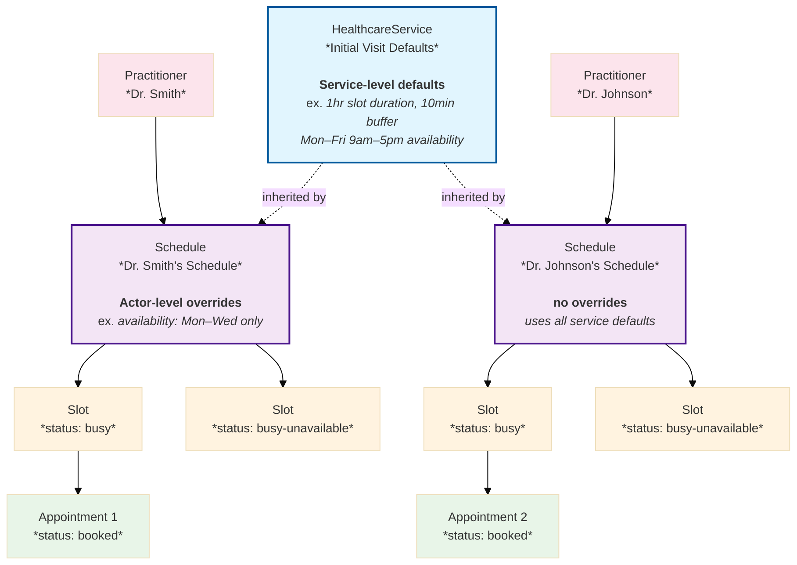
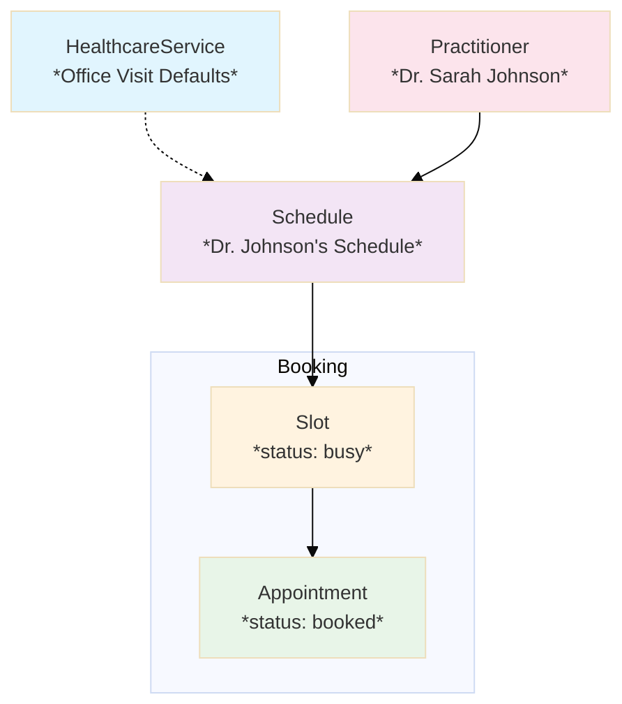
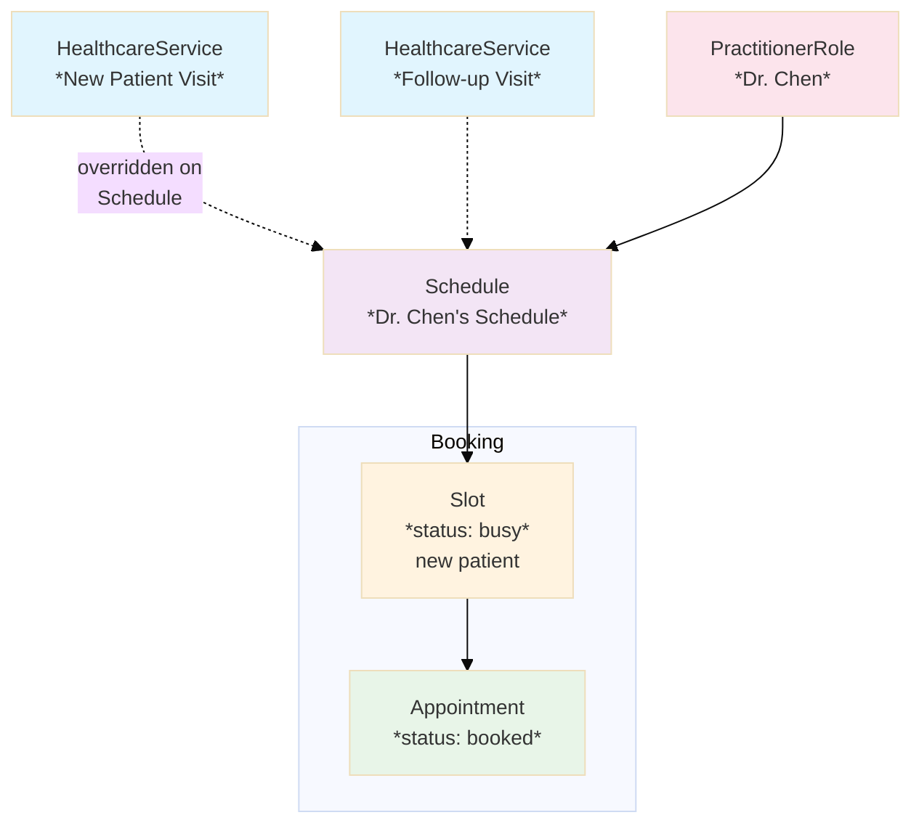
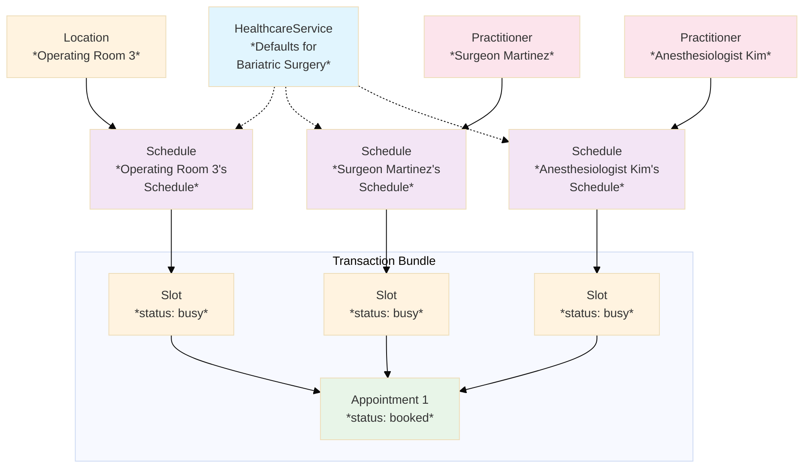
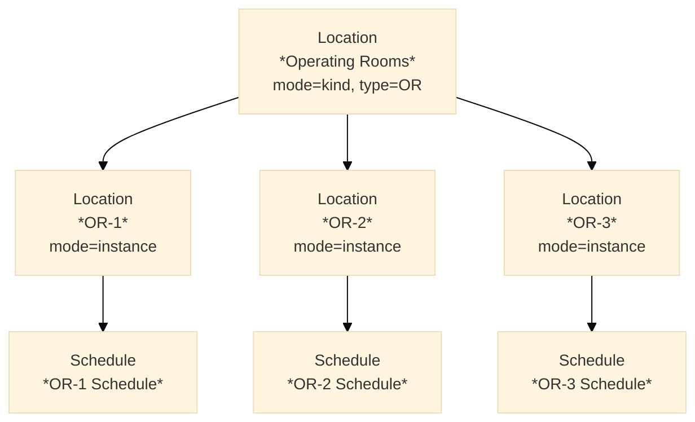

# Defining Availability

:::info[Beta]

Medplum Scheduling APIs are currently in [beta](/docs/compliance/alpha-beta).

:::

This guide covers how to configure availability using the `SchedulingParameters` extension — at both the actor level (per Schedule) and the service type level (via HealthcareService). It covers scheduling constraints, field-level inheritance, override behavior, timezone handling, and multi-resource scheduling patterns.

Parameters may be defined on a HealthcareService and shared amongst all Schedules that book that type
of appointment. Each Schedule may also override these parameters to define behaviors specific to that
schedule as needed.

The diagram below shows how availability can be defined at both
- The [actor level](/docs/scheduling/defining-availability#actor-level-availability) (via Schedule)
- The [service level](/docs/scheduling/defining-availability#service-level-availability) (via HealthcareService)


```mermaid
%%{init: {'theme':'base', 'themeVariables': {'fontSize':'14px'}, 'flowchart': {'useMaxWidth': false, 'htmlLabels': true}}}%%
graph TD
    C1[Practitioner<br/>*Dr. Smith*] --> B1
    A[HealthcareService<br/>*Initial Visit Defaults*<br/><br/><b>Service-level defaults</b><br/>ex. <i>1hr slot duration, 10min buffer</i><br/><i>Mon–Fri 9am–5pm availability</i>] -.->|inherited by| B1[Schedule<br/>*Dr. Smith's Schedule*<br/><br/><b>Actor-level overrides</b><br/>ex. <i>availability: Mon–Wed only</i>]
    A -.->|inherited by| B2[Schedule<br/>*Dr. Johnson's Schedule*<br/><br/><b>no overrides</b><br/><i>uses all service defaults</i>]
    C2[Practitioner<br/>*Dr. Johnson*] --> B2

    B1 --> D1[Slot<br/>*status: busy*]
    B1 --> D2[Slot<br/>*status: busy-unavailable*]
    B2 --> D3[Slot<br/>*status: busy*]
    B2 --> D4[Slot<br/>*status: busy-unavailable*]

    D1 --> E1[Appointment 1<br/>*status: booked*]
    D3 --> E2[Appointment 2<br/>*status: booked*]

    style A fill:#e1f5fe,stroke:#01579b,stroke-width:2px
    style B1 fill:#f3e5f5,stroke:#4a148c,stroke-width:2px
    style B2 fill:#f3e5f5,stroke:#4a148c,stroke-width:2px
    style C1 fill:#fce4ec
    style C2 fill:#fce4ec
    style D1 fill:#fff3e0
    style D2 fill:#fff3e0
    style D3 fill:#fff3e0
    style D4 fill:#fff3e0
    style E1 fill:#e8f5e8
    style E2 fill:#e8f5e8
```

## The Scheduling Parameters Extension

All scheduling constraints are managed through a single consolidated extension: `SchedulingParameters`. This extension can appear on both [HealthcareService](/docs/api/fhir/resources/healthcareservice) (for shared configuration) and [Schedule](/docs/api/fhir/resources/schedule).

To use scheduling APIs for a Schedule and HealthcareService, at least one of them must define the `duration` attribute (used to set how long the scheduled appointment will last). There must be a `timezone` attribute, which may also be defined on the Schedule's actor. (See [Timezone Resolution](#timezone-resolution))

When using scheduling APIs to interact with multiple `Schedule` resources at once, they must be configured with matching `duration`, `alignmentInterval`, `alignmentTimezone`, and `alignmentOffset` parameters. For this reason, Medplum recommends that these parameters only be set on `HealthcareService` resources.

#### Extension Fields

| Url                 | Type                                                        | Default Value                               | Description                                                                                                                                                             | `HealthcareService` usage notes                               | `Schedule` usage notes                                    |
| ------------------- | ----------------------------------------------------------- | ------------------------------------------- | ----------------------------------------------------------------------------------------------------------------------------------------------------------------------- | ------------------------------------------------------------- | --------------------------------------------------------- |
| `duration`          | [Duration](/docs/api/fhir/datatypes/duration)               | *none*                                      | Determines how long the time increments for a Slot are                                                                                                                  |                                                               | Recommended to prefer setting this on `HealthcareService` |
| `timezone`          | Code                                                        | *none*                                      | Specifies the timezone (IANA timezone identifier, e.g., `America/New_York`) for interpreting availability. When not set, falls back to the `Schedule.actor`'s timezone. |                                                               |                                                           |
| `bufferBefore`      | [Duration](/docs/api/fhir/datatypes/duration)               | 0 minutes (no buffer needed)                | Sets prep-time needed before appointment start. It must be free at booking time, and will be reserved with a Slot.                                                      |                                                               |                                                           |
| `bufferAfter`       | [Duration](/docs/api/fhir/datatypes/duration)               | 0 minutes (no buffer needed)                | Sets cleanup time needed after appointment end. It must be free at booking time, and will be reserved with a Slot.                                                      |                                                               |                                                           |
| `alignmentInterval` | [Duration](/docs/api/fhir/datatypes/duration)               | 60 minutes (appointments start on-the-hour) | Start times must align to this interval (e.g., every 15 minutes)                                                                                                        |                                                               | Recommended to prefer setting this on `HealthcareService` |
| `alignmentOffset`   | [Duration](/docs/api/fhir/datatypes/duration)               | 0 minutes                                   | Shifts allowed start times by this offset (e.g., with a 15-minute alignmentInterval and a 5-minute alignmentOffset, valid starts are :05, :20, :35, :50)                |                                                               | Recommended to prefer setting this on `HealthcareService` |
| `alignmentTimezone` | Code                                                        | 'Etc/UTC'                                   | Anchors the alignment grid to local midnight of the given timezone, keeping start times stable across DST transitions.                                                  |                                                               | Recommended to prefer setting this on `HealthcareService` |
| `service`           | `Reference(HealthcareService)`                              | *none*                                      | Pointer to the `HealthcareService` that these parameters  should override.                                                                                              | Not permitted                                                 |                                                           |
| `availability`      | [Nested Extension](#availability-extension)                 | Always available                            | Weekly recurring availability windows. When set, appointments must fit inside these windows.                                                                            | Not permitted (use `HealthcareService.availableTime` instead) |                                                           |

<details>
<summary>Example of the `SchedulingParameters` extension on a `HealthcareService`</summary>

```tsx
{
  "url": "https://medplum.com/fhir/StructureDefinition/SchedulingParameters",
  "extension": [
    // Recommended: duration determines how long the time increments for a Slot are.
    // If not set here, must be defined on all related Schedules. To book on multiple
    // schedules at once, they must all match in this dimension.
    {
      "url": "duration",
      "valueDuration": {
        "value": 1,
        "unit": "h"
      }
    },

    // Recommended: Time alignment interval (appointment start time boundaries)
    // To book on multiple schedules at once, they must all match in this dimension.
    {
      "url": "alignmentInterval",
      "valueDuration": {
        "value": 15,
        "unit": "min",
        "system": "http://unitsofmeasure.org",
        "code": "min"
      }
    },

    // Recommended: Time alignment offset (shift from interval boundaries)
    // To book on multiple schedules at once, they must all match in this dimension.
    {
      "url": "alignmentOffset",
      "valueDuration": {
        "value": 0,
        "unit": "min",
        "system": "http://unitsofmeasure.org",
        "code": "min"
      }
    },

    // Optional: Timezone for anchoring the alignment grid to local midnight
    // Independent of `timezone`, which controls availability window interpretation
    {
      "url": "alignmentTimezone",
      "valueCode": "America/New_York"
    },

    // Optional: specify time zone for availability interpretation
    // Falls back to Schedule's actor time zone if not specified
    {
      "url": "timezone",
      "valueCode": "America/Los_Angeles"
    },


    // Optional: Buffer time required before appointment
    {
      "url": "bufferBefore",
      "valueDuration": {
        "value": 15,
        "unit": "min",
        "system": "http://unitsofmeasure.org",
        "code": "min"
      }
    },

    // Optional: Buffer time required after appointment
    {
      "url": "bufferAfter",
      "valueDuration": {
        "value": 10,
        "unit": "min",
        "system": "http://unitsofmeasure.org",
        "code": "min"
      }
    }
  ]
}
```
</details>


<details>
<summary>Example of the `SchedulingParameters` extension on a `Schedule`</summary>

```tsx
{
  "url": "https://medplum.com/fhir/StructureDefinition/SchedulingParameters",
  "extension": [
    // Required on Schedule: you must specify what type of appointment these parameters apply to
    {
      "url": "service",
      "valueReference": {
        "reference": "HealthcareService/5d02acfd-fbe8-4537-84e4-31f5116be105",
        "display": "Bariatric Surgery"
      }
    },

    // Optional: specify time zone for availability interpretation
    // Falls back to Schedule's actor time zone if not specified
    {
      "url": "timezone",
      "valueCode": "America/Los_Angeles"
    },

    // Optional: duration determines how long the time increments for a Slot are.
    // If not set here, must be defined on the related HealthcareService
    {
      "url": "duration",
      "valueDuration": {
        "value": 1,
        "unit": "h"
      }
    },

    // Recurring availability (Schedule only)
    {
      "url": "availability",
      "extension": [
        {
          "url": "availableTime",
          "extension": [
            { "url": "daysOfWeek", "valueCode": "mon" },
            { "url": "daysOfWeek", "valueCode": "wed" },
            { "url": "daysOfWeek", "valueCode": "fri" },
            { "url": "availableStartTime", "valueTime": "09:00:00" },
            { "url": "availableEndTime", "valueTime": "17:00:00" }
          ]
        }
      ]
    },

    // Buffer time before appointment
    {
      "url": "bufferBefore",
      "valueDuration": {
        "value": 15,
        "unit": "min",
        "system": "http://unitsofmeasure.org",
        "code": "min"
      }
    },

    // Buffer time after appointment
    {
      "url": "bufferAfter",
      "valueDuration": {
        "value": 10,
        "unit": "min",
        "system": "http://unitsofmeasure.org",
        "code": "min"
      }
    },

    // Time alignment interval (appointment start time boundaries)
    {
      "url": "alignmentInterval",
      "valueDuration": {
        "value": 15,
        "unit": "min",
        "system": "http://unitsofmeasure.org",
        "code": "min"
      }
    },

    // Time alignment offset (shift from interval boundaries)
    {
      "url": "alignmentOffset",
      "valueDuration": {
        "value": 0,
        "unit": "min",
        "system": "http://unitsofmeasure.org",
        "code": "min"
      }
    },

    // Timezone for anchoring the alignment grid to local midnight
    // Independent of `timezone`, which controls availability window interpretation
    {
      "url": "alignmentTimezone",
      "valueCode": "America/New_York"
    }
  ]
}
```

</details>

### Alignment grid

Medplum Scheduling APIs generate possible appointments by projecting a repeating daily grid. These parameters control that grid:

| Parameter           | Description                            | Default    |
| ------------------- | -------------------------------------- | ---------- |
| `alignmentInterval` | How frequently slot start times occur  | 60 minutes |
| `alignmentOffset`   | Shifts slot start times by this amount | 0 minutes  |
| `alignmentTimezone` | What timezone the grid is anchored to  | `Etc/UTC`  |

#### `alignmentInterval`

Sets how frequently appointments may begin. For back-to-back scheduling without gaps, set this value to match the `duration` parameter.

#### `alignmentOffset`

Example: to align your appointments starting at 9:15, 10:15, ..., set `alignmentOffset` to 15 minutes (with a 60-minute `alignmentInterval`).

#### `alignmentTimezone`

When clocks change for DST, slots appear to shift by an hour in local time — for example, a 9:00am slot may appear at 8:00am or 10:00am. Setting `alignmentTimezone` anchors the grid to local midnight instead, keeping slot times consistent year-round.

**Relationship to `timezone`:** The two fields serve distinct purposes and can be set independently:
- `timezone` — which timezone to use when reading `availableStartTime`/`availableEndTime` values
- `alignmentTimezone` — which timezone's midnight to use as the alignment grid anchor

The rare case in which they differ: a provider whose availability hours and appointment grid are managed in different timezones.

## Actor Level Availability

### The Concept of Implicit Availability

Medplum's scheduling model uses **implicit availability**: time is assumed to be free by default. You define availability rules using extensions that specify when resources are available based on recurring patterns. [`Slot`](/docs/api/fhir/resources/slot) resources are only used for explicit overrides—either to mark time as busy (when an appointment is booked) or to block out unavailable time.

This approach avoids the need to pre-generate thousands of Slot resources for every possible time slot. Instead, the system calculates available windows dynamically based on the availability rules you define.

### The Schedule Resource

The [`Schedule`](/docs/api/fhir/resources/schedule) resource is the foundation for defining actor-level availability for a provider, location, or device.

The Schedule resource should define the service types that it is capable of acting on in its `serviceType` attribute.

Here is an example of a [Schedule](/docs/api/fhir/resources/schedule) resource that defines availability for a [Practitioner](/docs/api/fhir/resources/practitioner).

```tsx
{
  "resourceType": "Schedule",
  "id": "dr-smith-schedule",
  "actor": [{"reference": "Practitioner/dr-smith"}],
  "serviceType": [
    {
      "text": "Office Visit",
      "coding": [
        { "code": "office-visit" }
      ],
      "extension": [
        {
          "url": "https://medplum.com/fhir/service-type-reference",
          "valueReference": {
            "reference": "HealthcareService/23c3f1cc-4f55-4990-9775-511b02487e7e",
            "display": "Office Visit"
          }
        }
      ]
    }
  ],
  "extension": [{
    "url": "https://medplum.com/fhir/StructureDefinition/SchedulingParameters",
    "extension": [
      {
        "url": "service",
        "valueReference": {
            "reference": "HealthcareService/23c3f1cc-4f55-4990-9775-511b02487e7e",
            "display": "Office Visit"
        }
      },
      {
        "url": "duration",
        "valueDuration": {
          "value": 1,
          "unit": "h"
        }
      },
      {
        "url": "availability",
        "extension": [
          {
            "url": "availableTime",
            "extension": [
              { "url": "availableStartTime", "valueTime": "09:00:00" },
              { "url": "availableEndTime", "valueTime": "17:00:00" },
              { "url": "daysOfWeek", "valueCode": "mon" },
              { "url": "daysOfWeek", "valueCode": "tue" },
              { "url": "daysOfWeek", "valueCode": "wed" },
              { "url": "daysOfWeek", "valueCode": "thu" },
              { "url": "daysOfWeek", "valueCode": "fri" },
            ]
          }
        ]
      }
    ]
  }]
  //...
}
```

### `availability` Extension

The `availability` sub-extension mirrors the FHIR R5+ [`Availability`](https://hl7.org/fhir/R5/metadatatypes.html#Availability) datatype shape.  It is encoded using nested R4 extensions (because R4 does not have a native `Availability` data type).  This is close to the R4 definition of `HealthcareService.availabileTime`, which is another possible source of scheduling availability data. If this sub-extension is not present, availability is constrained only by the presence of existing `Slot` resources for the schedule.

| Sub-extension         | Type          | Description                                          | Repeatable |
| --------------------- | ------------- | ---------------------------------------------------- | ---------- |
| `availableTime`       | (nested)      | One entry per availability window                    | Yes        |
| ↳ `daysOfWeek`        | `valueCode`   | One entry per day (`mon`–`sun`)                      | Yes        |
| ↳ `allDay`            | `valueBoolean`| If `true`, window spans the full day                 | No         |
| ↳ `availableStartTime`| `valueTime`   | Opening time (not allowed  when `allDay` is present) | No         |
| ↳ `availableEndTime`  | `valueTime`   | Closing time (not allowed  when `allDay` is present) | No         |
| `notAvailableTime`    | (nested)      | Typed for future use; not yet processed              | Yes        |

```tsx
{
  "resourceType": "Schedule",
  "id": "dr-smith-schedule",
  "actor": [{"reference": "Practitioner/dr-smith"}],
  "serviceType": [
    {
      "text": "Office Visit",
      "coding": [
        { "code": "office-visit" }
      ],
      "extension":[
        {
          "url": "https://medplum.com/fhir/service-type-reference",
          "valueReference": {
            "reference": "HealthcareService/23c3f1cc-4f55-4990-9775-511b02487e7e",
            "display": "Office Visit"
          }
        }
      ]
    }
  ],
  "extension": [{
    "url": "https://medplum.com/fhir/StructureDefinition/SchedulingParameters",
    "extension": [
      {
        "url": "service",
        "valueReference": {
            "reference": "HealthcareService/23c3f1cc-4f55-4990-9775-511b02487e7e",
            "display": "Office Visit"
        }
      },
      {
        "url": "duration",
        "valueDuration": {"value": 1, "unit": "h"}
      },
      {
        "url": "availability",
        "extension": [
          {
            "url": "availableTime",
            "extension": [
              { "url": "daysOfWeek", "valueCode": "mon" },
              { "url": "daysOfWeek", "valueCode": "tue" },
              { "url": "daysOfWeek", "valueCode": "wed" },
              { "url": "daysOfWeek", "valueCode": "thu" },
              { "url": "daysOfWeek", "valueCode": "fri" },
              { "url": "availableStartTime", "valueTime": "09:00:00" },
              { "url": "availableEndTime",   "valueTime": "17:00:00" }
            ]
          }
        ]
      }
    ]
  }]
}
```

## Service Level Availability

### Service Types and HealthcareService

A [HealthcareService](/docs/api/fhir/resources/healthcareservice) gives a mechanism to define common scheduling parameters for an appointment type, which can then be used by multiple [Practitioner](/docs/api/fhir/resources/practitioner)'s [Schedules](/docs/api/fhir/resources/schedule). This allows you to define standard appointment durations, buffer times, and grid alignment settings once and apply them across multiple providers.

For a `Schedule` to use the `HealthcareService`'s scheduling parameters, the `Schedule.serviceType` must include a reference to the HealthcareService in its extensions.

```tsx
{
  "resourceType": "HealthcareService",
  "id": "23c3f1cc-4f55-4990-9775-511b02487e7e",
  "type": [{
    "text": "Office Visit",
    "coding": [{
      "system": "http://example.org/appointment-types",
      "code": "office-visit"
    }]
  }],
  "availableTime": [
    "daysOfWeek": ["mon", "tue", "wed", "thu", "fri"],
    "availableStartTime": "09:00:00",
    "availableEndTime": "17:00:00"
  ],
  //...
  "extension": [{
    "url": "https://medplum.com/fhir/StructureDefinition/SchedulingParameters",
    "extension": [
      {
        "url": "duration",
        "valueDuration": {
          "value": 1,
          "unit": "h"
        }
      }
    ]
  }]
}
```

```tsx
{
  "resourceType": "Schedule",
  "id": "dr-smith-schedule",
  "actor": [{"reference": "Practitioner/dr-smith"}],
  "serviceType": [
    {
      "text": "Office Visit",
      "coding": [
        { "code": "office-visit" }
      ],
      "extension":[
        {
          "url": "https://medplum.com/fhir/service-type-reference",
          "valueReference": {
            "reference": "HealthcareService/23c3f1cc-4f55-4990-9775-511b02487e7e",
            "display": "Office Visit"
          }
        }
      ]
    }
  ]
  //...
}
```

### Override Behavior

A [Practitioner](/docs/api/fhir/resources/practitioner)'s [Schedule](/docs/api/fhir/resources/schedule) can override individual scheduling parameters for a specific service type by adding a `SchedulingParameters` extension that references that service. **Only the fields explicitly set on the Schedule override the HealthcareService defaults** — all other fields are inherited.

This means you only need to specify what differs. For example, to restrict availability to Tuesday and Thursday mornings while keeping all other parameters (duration, buffers, alignment) from the HealthcareService:

```tsx
{
  "resourceType": "Schedule",
  "id": "dr-chen-schedule",
  "active": true,
  "actor": [{"reference": "Practitioner/dr-chen"}],
  "serviceType": [
    {
      "coding": [{"code": "new-patient-visit"}],
      "extension": [{
        "url": "https://medplum.com/fhir/service-type-reference",
        "valueReference": {
          "reference": "HealthcareService/f44bbf25-bf57-4263-8f10-be060cc91672",
          "display": "New Patient Visit"
        }
      }]
    }
  ],
  "extension": [
    {
      "url": "https://medplum.com/fhir/StructureDefinition/SchedulingParameters",
      "extension": [
        {
          "url": "service",
          "valueReference": {
            "reference": "HealthcareService/f44bbf25-bf57-4263-8f10-be060cc91672",
            "display": "New Patient Visit"
          }
        },
        // Only availability is overridden; duration, buffers, and alignment are inherited from HealthcareService
        {
          "url": "availability",
          "extension": [
            {
              "url": "availableTime",
              "extension": [
                { "url": "daysOfWeek", "valueCode": "tue" },
                { "url": "daysOfWeek", "valueCode": "thu" },
                { "url": "availableStartTime", "valueTime": "09:00:00" },
                { "url": "availableEndTime", "valueTime": "13:00:00" }
              ]
            }
          ]
        }
      ]
    }
  ]
}
```

**Field-level inheritance**: When a Schedule has a `SchedulingParameters` extension for a service, each field is resolved independently using this priority order (highest to lowest):

1. The field value from the Schedule's `SchedulingParameters` extension for that service
2. The field value from the HealthcareService's `SchedulingParameters` extension
3. The system default (0 for buffers and offset; 60 minutes for alignment interval; always-available for availability)
4. Per-actor timezone information (via `Schedule.actor`; only for `timezone` attribute)

If a Schedule has **no** `SchedulingParameters` extension at all, all parameters are inherited from this chain.

### Blocking Time by Service Type

Here is an example of a [Slot](/docs/api/fhir/resources/slot) resource that blocks time for a specific service type.

```tsx
{
  "resourceType": "Slot",
  "schedule": {"reference": "Schedule/dr-johnson-schedule"},
  "status": "busy-unavailable",
  "start": "2025-12-24T08:00:00Z",
  "end": "2025-12-27T07:59:59Z",
  "comment": "Holiday vacation",
  "serviceType": [{"coding": [{"code": "office-visit"}]}]
}
```

- **With serviceType**: Blocks only that specific service
- **Without serviceType**: Blocks all services

## Timezone Resolution

### Timezone per Scheduling Parameters Entry

The `timezone` parameter allows you to specify different timezones for different service types within the same Schedule. This is useful when a provider needs to define availability in different timezones for different services (e.g., a doctor who provides cardiac surgery where they might travel to in one time zone and call center availability in another time zone).

**Fallback Logic:** If no time zone is specified in the `scheduling-parameters` extension, then the availability will be interpreted in the time zone defined on the Schedule's actor reference (Practitioner, Location, or Device). It looks for the FHIR sanctioned time zone extension:

:::tip[Adding a Timezone to an Actor]

There is no native timezone field on [`Practitioner`](/docs/api/fhir/resources/practitioner), [`Location`](/docs/api/fhir/resources/location), or [`Device`](/docs/api/fhir/resources/device), so you must add it via the FHIR timezone extension:

```ts
{
  resourceType: 'Practitioner',
  // ...
  extension: [
    {
      url: "http://hl7.org/fhir/StructureDefinition/timezone",
      valueCode: "America/Los_Angeles"
    }
  ]
}
```

:::


**Timezone Resolution Order:**

1. If `timezone` is specified in the `scheduling-parameters` extension, use that time zone
2. Otherwise, fall back to the time zone defined on the Schedule's actor reference (Practitioner, Location, or Device)

**Important Notes:**

- The time zone value should be an IANA time zone identifier (e.g., `America/New_York`, `America/Los_Angeles`, `America/Miami`)
- When `timezone` is specified, all Time values in the `availability` extension are interpreted in that time zone

Here is an example of a Schedule with multiple service types, each with its own time zone:

```tsx
{
  "resourceType": "Schedule",
  "id": "dr-smith-schedule",
  "actor": [{"reference": "Practitioner/dr-smith"}],
  "serviceType": [
    {
      "text": "Cardiac Surgery",
      "coding": [
        { "code": "cardiac-surgery" }
      ]
    },
    {
      "text": "Call Center Availability",
      "coding": [
        { "code": "call-center-availability" }
      ]
    }
  ],
  "extension": [
    {
      "url": "https://medplum.com/fhir/StructureDefinition/SchedulingParameters",
      "extension": [
        {
          "url": "service",
          "valueReference": {
            "reference": "HealthcareService/a8f88a98-2578-4644-b408-7ba73f104298",
            "display": "Cardiac Surgery"
          }
        },
        {
          "url": "timezone",
          "valueCode": "America/Los_Angeles"
        },
        {
          "url": "duration",
          "valueDuration": {
            "value": 1,
            "unit": "h"
          }
        },
        {
          "url": "availability",
          "extension": [
            {
              "url": "availableTime",
              "extension": [
                { "url": "daysOfWeek", "valueCode": "mon" },
                { "url": "daysOfWeek", "valueCode": "tue" },
                { "url": "daysOfWeek", "valueCode": "wed" },
                { "url": "availableStartTime", "valueTime": "11:00:00" }, // Interpreted in America/Los_Angeles
                { "url": "availableEndTime", "valueTime": "15:00:00" } // Interpreted in America/Los_Angeles
              ]
            }
          ]
        }
      ]
    },
    {
      "url": "https://medplum.com/fhir/StructureDefinition/SchedulingParameters",
      "extension": [
        {
          "url": "timezone",
          "valueCode": "America/New_York"
        },
        {
          "url": "service",
          "valueReference": {
            "reference": "HealthcareService/0dbe6bf1-40b8-4204-a406-f78b5a0e59d0"
            "display": "Call Center Availability"
          }
        },
        {
          "url": "duration",
          "valueDuration": {
            "value": 1,
            "unit": "h"
          }
        },
        {
          "url": "availability",
          "extension": [
            {
              "url": "availableTime",
              "extension": [
                { "url": "daysOfWeek", "valueCode": "mon" },
                { "url": "daysOfWeek", "valueCode": "tue" },
                { "url": "daysOfWeek", "valueCode": "wed" },
                { "url": "availableStartTime", "valueTime": "09:00:00" }, // Interpreted in America/New_York
                { "url": "availableEndTime", "valueTime": "17:00:00" } // Interpreted in America/New_York
              ]
            }
          ]
        }
      ]
    }
  ]
}
```

In this example:

- Cardiac surgery availability is defined in `America/Los_Angeles` time zone (Mon-Wed 11am-3pm America/Los Angeles)
- Call Center availability is defined in `America/New_York` time zone (Mon-Wed 9am-5pm Eastern)
- Each service type's availability times are interpreted independently based on their respective timezones

## Examples

### Example 1: Simple Primary Care Office with Appointment Type Defaults

This example shows how to define availability for a simple primary care office where Practitioner's Schedules inherit default scheduling parameters from an HealthcareService.

<details>
<summary>HealthcareService: Office Visit Defaults</summary>

This HealthcareService defines default scheduling parameters for a 30-minute office visit with 5-minute buffers and 15-minute alignment intervals.

```tsx
{
  "resourceType": "HealthcareService",
  "id": "office-visit",
  "type": [{
    "text": "Office Visit",
    "coding": [{
      "system": "http://example.org/appointment-types",
      "code": "office-visit",
      "display": "Office Visit"
    }]
  }],
  "extension": [{
    "url": "https://medplum.com/fhir/StructureDefinition/SchedulingParameters",
    "extension": [
      {
        "url": "duration",
        "valueDuration": {
          "value": 30,
          "unit": "min"
        }
      },
      {
        "url": "bufferBefore",
        "valueDuration": {"value": 5, "unit": "min"}
      },
      {
        "url": "bufferAfter",
        "valueDuration": {"value": 5, "unit": "min"}
      },
      {
        "url": "alignmentInterval",
        "valueDuration": {"value": 15, "unit": "min"}
      },
      {
        "url": "alignmentOffset",
        "valueDuration": {"value": 0, "unit": "min"}
      }
    ]
  }]
}
```

</details>

<details>
<summary>Schedule: Practitioner's Schedule without Overrides</summary>

This Schedule shows Dr. Johnson's availability (Mon-Fri 9am-5pm) that inherits all default parameters from the HealthcareService without any service-specific overrides.

```tsx
{
  "resourceType": "Schedule",
  "id": "dr-johnson-schedule",
  "active": true,
  "actor": [{
    "reference": "Practitioner/dr-johnson",
    "display": "Dr. Sarah Johnson"
  }],
  "planningHorizon": {
    "start": "2025-01-01T00:00:00Z",
    "end": "2025-12-31T23:59:59Z"
  },
  "serviceType": [
    // This entry will allow using the office-visit shared HealthcareService definitions
    {
      "text": "Office Visit",
      "coding": [
        { "code": "office-visit" }
      ]
    }
  ],
  "extension": [
    // No values here, everything is inherited from shared definitions
  ]
}
```

</details>

**Result**: Dr. Johnson's schedule inherits all the default parameters from the HealthcareService for an office visit:

- $find called with `service-type=office-visit`: For office visits, available to start every 15 minutes (:00, :15, :30, :45) with 5-minute buffers **[from HealthcareService]**


```mermaid
%%{init: {'theme':'base', 'themeVariables': {'fontSize':'14px'}, 'flowchart': {'useMaxWidth': false, 'htmlLabels': true}}}%%
graph TD
    A[HealthcareService<br/>*Office Visit Defaults*] -.-> B[Schedule<br/>*Dr. Johnson's Schedule*]
    C[Practitioner<br/>*Dr. Sarah Johnson*] --> B

    B --> D[Slot<br/>*status: busy*]

    subgraph "Booking"
        D --> E[Appointment<br/>*status: booked*]
    end

    style A fill:#e1f5fe
    style B fill:#f3e5f5
    style C fill:#fce4ec
    style D fill:#fff3e0
    style E fill:#e8f5e8
```

### Example 2: Multi-Service Provider with Multiple Appointment Types and Overrides

A provider who offers different appointment types with varying availability and constraints. Overrides the default scheduling parameters for new patient visits.

<details>
<summary>HealthcareService: New Patient Visit</summary>

This HealthcareService defines a 60-minute new patient visit with 15-minute buffers and 30-minute alignment intervals.

```tsx
{
  "resourceType": "HealthcareService",
  "id": "new-patient-visit",
  "type": [{
    "text": "New Patient Visit",
    "coding": [{
      "system": "http://example.org/appointment-types",
      "code": "new-patient-visit",
      "display": "New Patient Visit"
    }]
  }],
  "extension": [{
    "url": "https://medplum.com/fhir/StructureDefinition/SchedulingParameters",
    "extension": [
      {"url": "duration", "valueDuration": { "value": 1, "unit": "h" }},
      {"url": "bufferBefore", "valueDuration": {"value": 15, "unit": "min"}},
      {"url": "bufferAfter", "valueDuration": {"value": 15, "unit": "min"}},
      {"url": "alignmentInterval", "valueDuration": {"value": 30, "unit": "min"}}
    ]
  }]
}
```

</details>

<details>
<summary>HealthcareService: Follow-up Visit</summary>

This HealthcareService defines a 20-minute follow-up visit with 5-minute buffers and 10-minute alignment intervals for more frequent scheduling.

It defines default availability of Monday-Friday, 9am-5pm.

```tsx
{
  "resourceType": "HealthcareService",
  "id": "follow-up-visit",
  "type": {
    "text": "Follow-up Visit",
    "coding": [{
      "system": "http://example.org/appointment-types",
      "code": "follow-up",
      "display": "Follow-up Visit"
    }]
  },
  "availableTime": [{
    "daysOfWeek": ["mon","tue","wed","thu","fri"],
    "availableStartTime": "09:00:00",
    "availableEndTime": "17:00:00",
  }],
  "extension": [{
    "url": "https://medplum.com/fhir/StructureDefinition/SchedulingParameters",
    "extension": [
      {"url": "duration", "valueDuration": { "value": 20, "unit": "min" }},
      {"url": "bufferBefore", "valueDuration": {"value": 5, "unit": "min"}},
      {"url": "bufferAfter", "valueDuration": {"value": 5, "unit": "min"}},
      {"url": "alignmentInterval", "valueDuration": {"value": 10, "unit": "min"}}
    ]
  }]
}
```

</details>

<details>
<summary>Schedule: Multi-Service with Overrides</summary>

This schedule declares in its `serviceType` array that it can be booked for New Patient visits and Follow-Up visits.

This Schedule uses the shared availability from the "Follow-Up" service (Mon-Fri 9am-5pm). It overrides "New Patient Visit" appointment type to only be available on Tuesday and Thursday mornings (9am-1pm).

```tsx
{
  "resourceType": "Schedule",
  "id": "dr-chen-schedule",
  "active": true,
  "actor": [{"reference": "PractitionerRole/dr-chen"}],
  "planningHorizon": {
    "start": "2025-01-01T00:00:00Z",
    "end": "2025-12-31T23:59:59Z"
  },
  "serviceType": [
    {
      "text": "New Patient Visit",
      "coding": [
        {
          "system": "http://example.org/appointment-types",
          "code": "new-patient-visit"
        }
      ],
      "extension": [
        "url": "https://medplum.com/fhir/service-type-reference",
        "valueReference": {
          "reference": "HealthcareService/new-patient-visit",
          "display": "New Patient Visit"
        }
      ]
    },
    {
      "text": "Follow-up Visit",
      "coding": [
        {
          "system": "http://example.org/appointment-types",
          "code": "follow-up"
        }
      ],
      "extension": [
        "url": "https://medplum.com/fhir/service-type-reference",
        "valueReference": {
          "reference": "HealthcareService/follow-up",
          "display": "Follow-up Visit"
        }
      ]
    }
  ],
  "extension": [
    // New patient visits only on Tuesday and Thursday mornings
    {
      "url": "https://medplum.com/fhir/StructureDefinition/SchedulingParameters",
      "extension": [
        {
          "url": "service",
          "valueReference": {
            "reference": "HeathcareService/new-patient-visit",
            dislpay: "New Patient Visit"
          }
        },
        {
          "url": "availability",
          "extension": [
            {
              "url": "availableTime",
              "extension": [
                { "url": "daysOfWeek", "valueCode": "tue" },
                { "url": "daysOfWeek", "valueCode": "thu" },
                { "url": "availableStartTime", "valueTime": "09:00:00" },
                { "url": "availableEndTime", "valueTime": "13:00:00" }
              ]
            }
          ]
        }
      ]
    }
  ]
}
```

</details>

**Result**:

- **New patient visits (ie. `$find` with the "New patient visit" HealthcareService)**: Tue/Thu 9am-1pm only, 60 minutes, can start every 30 minutes, 15-min buffers
- **Follow-ups (ie. `$find` called with the "Follow-up visit" HealthcareService)**: Mon-Fri 9am-5pm, 20 minutes, can start every 10 minutes, 5-min buffers


```mermaid
%%{init: {'theme':'base', 'themeVariables': {'fontSize':'14px'}, 'flowchart': {'useMaxWidth': false, 'htmlLabels': true}}}%%
graph TD
    A1[HealthcareService<br/>*New Patient Visit*] -. overridden on<br/>Schedule .-> B[Schedule<br/>*Dr. Chen's Schedule*]
    A2[HealthcareService<br/>*Follow-up Visit*] -.-> B
    C[PractitionerRole<br/>*Dr. Chen*] --> B

    B --> D1[Slot<br/>*status: busy*<br/>new patient]

    subgraph "Booking"
        D1 --> E1[Appointment<br/>*status: booked*]
    end

    style A1 fill:#e1f5fe
    style A2 fill:#e1f5fe
    style B fill:#f3e5f5
    style C fill:#fce4ec
    style D1 fill:#fff3e0
    style E1 fill:#e8f5e8
```

### Example 3: Location-Specific Complex Surgical Scheduling

A bariatric surgery requiring surgeon, OR room, and anesthesiologist coordination.

<details>
<summary>HealthcareService: Bariatric Surgery</summary>

This HealthcareService defines scheduling for a 120-minute surgical procedure with 45/30-minute buffers.

```tsx
{
  "resourceType": "HealthcareService",
  "id": "bariatric-surgery",
  "type": [{
    "coding": [{
      "system": "http://snomed.info/sct",
      "code": "287809009",
      "display": "Bariatric Surgery"
    }]
  }],
  "extension": [{
    "url": "https://medplum.com/fhir/StructureDefinition/SchedulingParameters",
    "extension": [
      {"url": "duration", "valueDuration": { "value": 120, "unit": "min" }},
      {"url": "bufferBefore", "valueDuration": {"value": 45, "unit": "min"}},
      {"url": "bufferAfter", "valueDuration": {"value": 30, "unit": "min"}},
      {"url": "alignmentInterval", "valueDuration": {"value": 30, "unit": "min"}}
    ]
  }]
}
```

</details>

<details>
<summary>Schedule: Surgeon Availability</summary>

This Schedule shows Dr. Martinez's availability for bariatric surgeries, limited to Tuesday and Thursday mornings (8am-4pm).

```tsx
{
  "resourceType": "Schedule",
  "id": "surgeon-martinez-schedule",
  "active": true,
  "serviceType": [
    {
      "coding": [{"system": "http://snomed.info/sct", "code": "287809009"}]
      "extension": [{
        "url": "https://medplum.com/fhir/service-type-reference",
        "valueReference": { "reference": "HealthcareService/bariatric-surgery" }
      }]
    }
  ],
  "actor": [{
    "reference": "PractitionerRole/surgeon-martinez",
    "display": "Dr. Maria Martinez - Bariatric Surgeon"
  }],
  "extension": [{
    "url": "https://medplum.com/fhir/StructureDefinition/SchedulingParameters",
    "extension": [
      {
        "url": "service",
        "valueReference": { "reference": "HealthcareService/bariatric-surgery" }
      },
      {
        "url": "duration",
        "valueDuration": {
          "value": 1,
          "unit": "h"
        }
      },
      {
        "url": "availability",
        "extension": [
          {
            "url": "availableTime",
            "extension": [
              { "url": "daysOfWeek", "valueCode": "tue" },
              { "url": "daysOfWeek", "valueCode": "thu" },
              { "url": "availableStartTime", "valueTime": "08:00:00" },
              { "url": "availableEndTime", "valueTime": "16:00:00" }
            ]
          }
        ]
      }
    ]
  }]
}
```

</details>

<details>
<summary>Schedule: Operating Room Availability</summary>

This Schedule shows Operating Room 3's availability for surgical procedures, available weekdays 7am-7pm with extended 12-hour blocks.

```tsx
{
  "resourceType": "Schedule",
  "id": "or-3-schedule",
  "active": true,
  "actor": [{
    "reference": "Location/or-3",
    "display": "Operating Room 3"
  }],
  "serviceType": [
    {
      "coding": [{"system": "http://snomed.info/sct", "code": "287809009"}]
      "extension": [{
        "url": "https://medplum.com/fhir/service-type-reference",
        "valueReference": { "reference": "HealthcareService/bariatric-surgery" }
      }]
    }
  ],
  "extension": [{
    "url": "https://medplum.com/fhir/StructureDefinition/SchedulingParameters",
    "extension": [
      {
        "url": "service",
        "valueReference": { "reference": "HealthcareService/bariatric-surgery" }
        }
      },
      {
        "url": "duration",
        "valueDuration": {
          "value": 1,
          "unit": "h"
        }
      },
      {
        "url": "availability",
        "extension": [
          {
            "url": "availableTime",
            "extension": [
              { "url": "daysOfWeek", "valueCode": "mon" },
              { "url": "daysOfWeek", "valueCode": "tue" },
              { "url": "daysOfWeek", "valueCode": "wed" },
              { "url": "daysOfWeek", "valueCode": "thu" },
              { "url": "daysOfWeek", "valueCode": "fri" },
              { "url": "availableStartTime", "valueTime": "07:00:00" },
              { "url": "availableEndTime", "valueTime": "19:00:00" }
            ]
          }
        ]
      }
    ]
  }]
}
```

</details>

<details>
<summary>Schedule: Anesthesiologist Availability</summary>

This Schedule shows Dr. Kim's availability for surgical procedures, covering weekdays 7am-5pm (10-hour blocks).

```tsx
{
  "resourceType": "Schedule",
  "id": "anesthesiologist-kim-schedule",
  "active": true,
  "serviceType": [
    {
      "coding": [{"system": "http://snomed.info/sct", "code": "287809009"}]
      "extension": [{
        "url": "https://medplum.com/fhir/service-type-reference",
        "valueReference": { "reference": "HealthcareService/bariatric-surgery" }
      }]
    }
  ],
  "actor": [{
    "reference": "PractitionerRole/anesthesiologist-kim",
    "display": "Dr. James Kim - Anesthesiologist"
  }],
  "extension": [{
    "url": "https://medplum.com/fhir/StructureDefinition/SchedulingParameters",
    "extension": [
      {
        "url": "service",
        "valueReference": { "reference": "HealthcareService/bariatric-surgery" }
      },
      {
        "url": "duration",
        "valueDuration": {
          "value": 1,
          "unit": "h"
        }
      },
      {
        "url": "availability",
        "extension": [
          {
            "url": "availableTime",
            "extension": [
              { "url": "daysOfWeek", "valueCode": "mon" },
              { "url": "daysOfWeek", "valueCode": "tue" },
              { "url": "daysOfWeek", "valueCode": "wed" },
              { "url": "daysOfWeek", "valueCode": "thu" },
              { "url": "daysOfWeek", "valueCode": "fri" },
              { "url": "availableStartTime", "valueTime": "07:00:00" },
              { "url": "availableEndTime", "valueTime": "17:00:00" }
            ]
          }
        ]
      }
    ]
  }]
}
```

</details>

**Result**: When booking a bariatric surgery, the system queries all three schedules, calculates the intersection of availability, and creates atomic transaction bundles to book all required resources simultaneously.


```mermaid
%%{init: {'theme':'base', 'themeVariables': {'fontSize':'14px'}, 'flowchart': {'useMaxWidth': false, 'htmlLabels': true}}}%%
graph TD
    A[HealthcareService<br/>*Defaults for<br/>Bariatric Surgery*] -.-> B1[Schedule<br/>*Operating Room 3's<br/>Schedule*]
    A -.-> B2[Schedule<br/>*Surgeon Martinez's<br/>Schedule*]
    A -.-> B3[Schedule<br/>*Anesthesiologist Kim's<br/>Schedule*]

    C1[Location<br/>*Operating Room 3*] --> B1
    C2[Practitioner<br/>*Surgeon Martinez*] --> B2
    C3[Practitioner<br/>*Anesthesiologist Kim*] --> B3

    B1 --> D1[Slot<br/>*status: busy*]
    B2 --> D2[Slot<br/>*status: busy*]
    B3 --> D3[Slot<br/>*status: busy*]

    subgraph "Transaction Bundle"
        D1 --> E1[Appointment 1<br/>*status: booked*]
        D2 --> E1
        D3 --> E1
    end

    style A fill:#e1f5fe
    style B1 fill:#f3e5f5
    style B2 fill:#f3e5f5
    style B3 fill:#f3e5f5
    style C1 fill:#fff3e0
    style C2 fill:#fce4ec
    style C3 fill:#fce4ec
    style D1 fill:#fff3e0
    style D2 fill:#fff3e0
    style D3 fill:#fff3e0
    style E1 fill:#e8f5e8
```

## Location Modeling

### Location Hierarchy Pattern

```
Organization (Surgery Center)
  └─ Location (Building) [mode=kind]
       ├─ Location (Operating Rooms) [mode=kind, type=OR]
       │    ├─ Location (OR-1) [mode=instance]
       │    ├─ Location (OR-2) [mode=instance]
       │    └─ Location (OR-3) [mode=instance]
       └─ Location (Recovery Rooms) [mode=kind, type=RR]
            ├─ Location (Recovery-A) [mode=instance]
            └─ Location (Recovery-B) [mode=instance]
```

### Specific vs. "Any Available" Room

**Specific room required:**

- Query `Schedule?actor=Location/or-3`

**Any OR room acceptable:**

- Query: `Schedule?actor:Location.partof:Location.type=OR`


```mermaid
%%{init: {'theme':'base', 'themeVariables': {'fontSize':'14px'}, 'flowchart': {'useMaxWidth': false, 'htmlLabels': true}}}%%
graph TD
    A[Location<br/>*Operating Rooms*<br/>mode=kind, type=OR] --> B1[Location<br/>*OR-1*<br/>mode=instance]
    A --> B2[Location<br/>*OR-2*<br/>mode=instance]
    A --> B3[Location<br/>*OR-3*<br/>mode=instance]

    B1 --> C1[Schedule<br/>*OR-1 Schedule*]
    B2 --> C2[Schedule<br/>*OR-2 Schedule*]
    B3 --> C3[Schedule<br/>*OR-3 Schedule*]
```

### Best Practices

#### 1. Set Defaults on HealthcareService, Override Only What Differs on Schedule

Define `duration`, buffers, and alignment once on the HealthcareService. Only add a `SchedulingParameters` extension to a Schedule when that actor's availability or parameters differ from the service defaults. Omit any field that should be inherited.

#### 2. Minimize Pre-Generated Slots

Only create Slot resources for:

- Booked appointments (status: busy)
- Blocked time (status: busy-unavailable)

Let `$find` calculate available windows dynamically.

#### 3. Transaction Bundles for Multi-Resource Booking

Always use [FHIR transaction bundles](/docs/fhir-datastore/fhir-batch-requests#batches-vs-transactions) when booking appointments that require multiple resources to ensure atomicity.

## Beta Limitations

The Scheduling API is under active development. This [beta](/docs/compliance/alpha-beta) release of the scheduling API is expected to gain additional capabilities.

- `bookingLimit` - An upcoming scheduling parameter that will allow you to express how often a given service type may be added to a schedule. This is not yet implemented.
