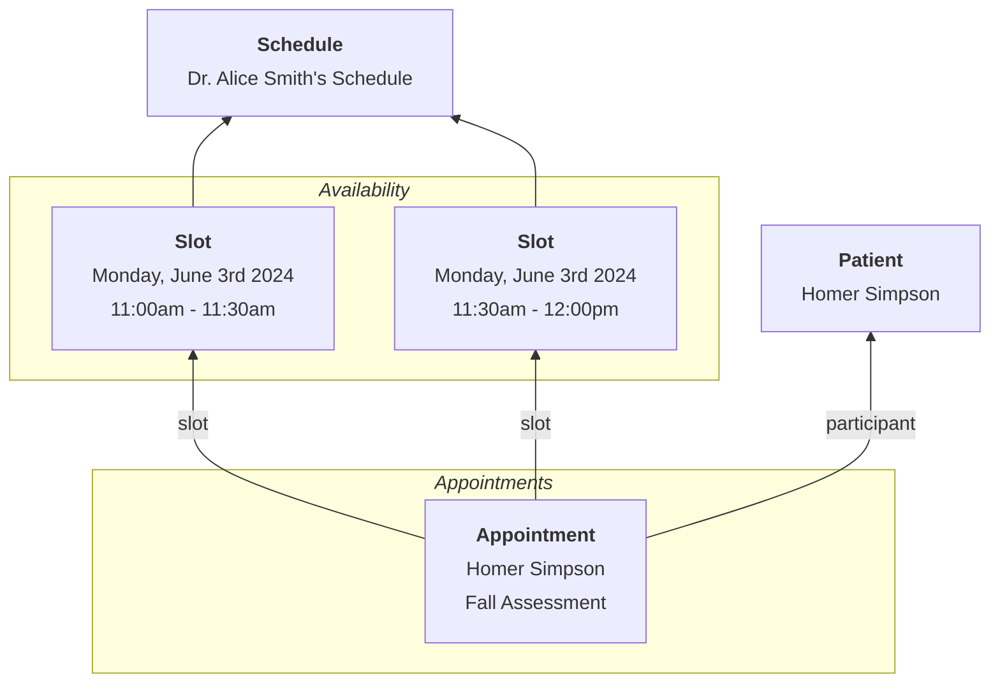

# Scheduling

Scheduling is a common workflow and correct use of the FHIR spec supports many complex scheduling workflows.

## Key Resources

| **Resource**                                          | **Description**                                                                                                                                                                                                                                                                                             |
| ----------------------------------------------------- | ----------------------------------------------------------------------------------------------------------------------------------------------------------------------------------------------------------------------------------------------------------------------------------------------------------- |
| [`Slot`](/docs/api/fhir/resources/slot)               | Defines a unit of availability for a provider. It can be assigned different appointment and service types.                                                                                                                                                                                                  |
| [`Schedule`](/docs/api/fhir/resources/schedule)       | A gropuing resource to collect a set of [`Slots`](/docs/api/fhir/resources/slot). Schedules can be assigned to [`Practitioner`](/docs/api/fhir/resources/practitioner), [`Location`](/docs/api/fhir/resources/location) (facilities or rooms), and [`Patient`](/docs/api/fhir/resources/patient) resources. |
| [`Appointment`](/docs/api/fhir/resources/appointment) | A tracking resources to define a booked [`Slot`](/docs/api/fhir/resources/slot) that may result in one or more [`Encounters`](/docs/api/fhir/resources/encounter).                                                                                                                                          |

## Managing Availability

To manage provider availability, workflows include a [`Schedule`](/docs/api/fhir/resources/schedule) resource, which has one or more [`Slots`](/docs/api/fhir/resources/slot) of availability.

The [`Schedule` usage documentation](/docs/api/fhir/resources/schedule?section=usage) provides a great overview on how FHIR [`Schedules`](/docs/api/fhir/resources/schedule) can be used to manage availability for different types of actors, including:

- [`Practitioners`](/docs/api/fhir/resources/practitioner)
- [`HealthcareServices`](/docs/api/fhir/resources/healthcareservice)
- specific practice [`Locations`](/docs/api/fhir/resources/location)

## Tracking Appointments

[`Appointments`](/docs/api/fhir/resources/appointment) represent the booked visit between patient and provider.

The [`Appointment` usage documentation](/docs/api/fhir/resources/appointment?section=usage) provides a great starting point for understanding the full appointment booking lifecycle.

More advanced workflows can implement the [Appointment request/response model](/docs/api/fhir/resources/appointment?section=relationships). In this model, participants confirm their availability using [AppointmentResponse](/docs/api/fhir/resources/appointmentresponse) resources. [`Appointments`](/docs/api/fhir/resources/appointment) can also be linked to specific [Location](/docs/api/fhir/resources/location), and [Bots](/docs/bots) can be used to enforce other business logic.

## See Also

- [Scheduling Features and Fixes](https://github.com/medplum/medplum/pulls?q=is%3Apr+label%3Ascheduling) on Github, with sample data included.
- [Schedules](https://app.medplum.com/Schedule) on the Medplum App
- [Scheduling React Component](https://storybook.medplum.com/?path=/docs/medplum-scheduler--basic)
