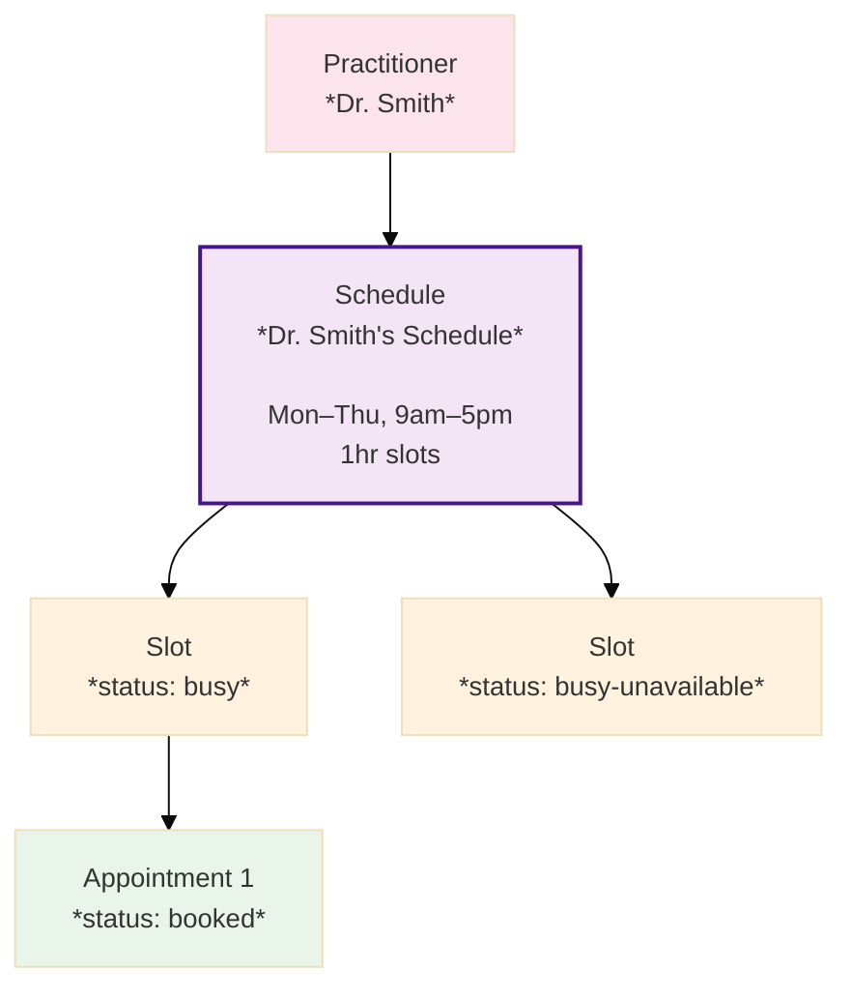

import ExampleCode from '!!raw-loader!@site/../examples/src/scheduling/index.ts';
import MedplumCodeBlock from '@site/src/components/MedplumCodeBlock';

# Scheduling

:::info
Medplum Scheduling is currently in alpha.
:::

Welcome to the Medplum Scheduling documentation. We currently support a range of scheduling operations that are available via the FHIR API. The following sections walk through the FHIR resources that are used to model scheduling and how the operations interact with them.

**We like to separate scheduling into four main steps:**

---

## Step 1: Defining Service Types

Decide what types of appointments you would like to offer. Create a [HealthcareService](/docs/api/fhir/resources/healthcareservice) resource for each type. Set a SchedulingParameters extension on each to define attributes like the length of the visit.

Mark which [Schedule](/docs/api/fhir/resources/schedule) resources should be able to schedule appointments of that type by setting a reference to the HealthcareService in the Schedule.serviceType attribute.

<details>
  <summary>Referencing a HealthcareService</summary>

  In future FHIR revisions, Schedule.serviceType will have type `CodeableReference(HealthcareService)`. In Medplum's R4 implementation, this is achieved by including an extension on a `CodeableConcept` in that attribute.

  <MedplumCodeBlock language="ts" selectBlocks="scheduleServiceTypeLink">
    {ExampleCode}
  </MedplumCodeBlock>
</details>


## Step 2: [Defining Availability](/docs/scheduling/defining-availability)

The resources used to model availability for a provider, location, or device and the different service-specific scheduling parameters that can be defined.

The simplest version is a single schedule with a single practitioner and a single service type:


```mermaid
%%{init: {'theme':'base', 'themeVariables': {'fontSize':'14px'}, 'flowchart': { 'htmlLabels': true}}}%%
graph TD
    C1[Practitioner<br/>*Dr. Smith*] --> B1[Schedule<br/>*Dr. Smith's Schedule*<br/><br/>Mon–Thu, 9am–5pm<br/>1hr slots]

    B1 --> D1[Slot<br/>*status: busy*]
    B1 --> D2[Slot<br/>*status: busy-unavailable*]

    D1 --> E1[Appointment 1<br/>*status: booked*]

    style B1 fill:#f3e5f5,stroke:#4a148c,stroke-width:2px
    style C1 fill:#fce4ec
    style D1 fill:#fff3e0
    style D2 fill:#fff3e0
    style E1 fill:#e8f5e8
```

- **[Defining availability at the actor level](/docs/scheduling/defining-availability#actor-level-availability)** — When a provider, location, or device is available via Schedule.
- **[Defining availability at the service level](/docs/scheduling/defining-availability#service-level-availability)** — Default duration, buffers, and alignment per appointment type via HealthcareService.

---

## Step 2: Matching Availability

Based on the availability defined in the previous step, we can now find available appointment slots. This is done via the `$find` operation.


| Operation | Description | Status |
| --------- | ----------- | ------ |
| [`$find`](/docs/scheduling/schedule-find) | Find available appointment slots | **Alpha** |

---

## Step 3: Consuming Availability

Once a desired slot has been found, the appointment booking process can be handled in several steps.

| Operation | Description | Status |
| --------- | ----------- | ------ |
| [`$book`](/docs/scheduling/appointment-book) | Book an appointment | **Alpha** |
| `$hold` | Temporarily hold a slot | **In Development** |
| `$cancel` | Cancel an appointment | **In Development** |

---

## Key FHIR Resources

| Resource | Purpose |
| -------- | ------- |
| [`Schedule`](/docs/api/fhir/resources/schedule) | Represents a provider's, room's, or device's availability. Each Schedule belongs to exactly one actor. |
| [`Slot`](/docs/api/fhir/resources/slot) | A specific time block on a Schedule. Only exists in the datastore for booked or blocked time — free slots are computed on demand. |
| [`Appointment`](/docs/api/fhir/resources/appointment) | A confirmed booking linking one or more Slots to a patient and provider. |
| [`HealthcareService`](/docs/api/fhir/resources/healthcareservice) | Defines default scheduling parameters (duration, buffers, alignment) for a service type, shared across multiple providers. |


## Medplum Scheduling FHIR Model Design Decisions

Scheduling can be built in FHIR in many different ways. The key design decisions in Meduplum's specific scheduling FHIR model are:

- **Recurring availability does not require pre-generated slots**: Synthetic[`Slot`](/docs/api/fhir/resources/slot) resources are **computed on-demand** by [`$find`](/docs/scheduling/schedule-find) as drafted resources that are not persisted in the datastore until an Appointment is booked. This means you don't need to maintain a bulk set of Slot resources across a planning horizon.
:::note
Available Slots can still be persisted for one time availability.
:::

- **One-to-one actor–Schedule relationship**: Medplum's scheduling system requires each [`Schedule`](/docs/api/fhir/resources/schedule) to have **exactly one actor**. While the FHIR spec allows `Schedule.actor` to hold multiple references, Medplum enforces a single-actor constraint so that availability can be unambiguously resolved per resource. See [Defining Availability](/docs/scheduling/defining-availability) for the full model.

- **Actors must have a timezone**: Every actor referenced by a Schedule — whether a [`Practitioner`](/docs/api/fhir/resources/practitioner), [`PractitionerRole`](/docs/api/fhir/resources/practitionerrole), [`Location`](/docs/api/fhir/resources/location), or [`Device`](/docs/api/fhir/resources/device) must have a timezone set via the FHIR timezone extension:

```ts
{
  url: 'http://hl7.org/fhir/StructureDefinition/timezone',
  valueCode: 'America/New_York'
}
```
