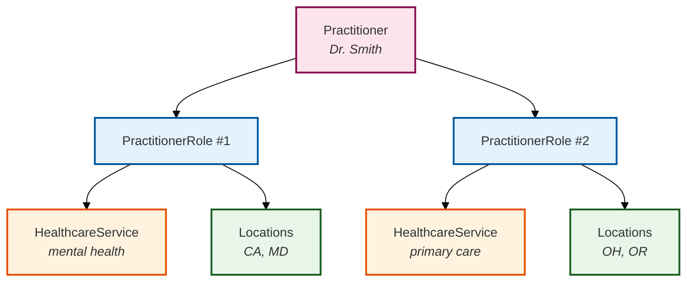

# Matching Patients to Providers by State-by-State Licensure

:::info Scheduling operations do not enforce licensure

Medplum Scheduling is intentionally designed to allow business specific use cases like state-by-state licensure, program enrollment, and “which providers may this patient book?” to be handled **outside** Medplum’s scheduling operations. [`$find`](/docs/scheduling/schedule-find) does not take a patient, a license, or a state; it only computes free slots for a **single** [Schedule](/docs/api/fhir/resources/schedule) you already identified.

**Bake that business logic into which Schedules you pass into `$find`.** Typical flow: run your rules (PractitionerRole search, patient address, compartments, access policy, and so on) to build the list of allowed Schedule resource IDs, then call `$find` once per Schedule you want to offer in the UI (and merge or present results however your product requires).

:::

### Background

A single [Practitioner](/docs/api/fhir/resources/practitioner) may deliver more than one kind of care service.

For this model, each care service is modeled as a [HealthcareService](/docs/api/fhir/resources/healthcareservice) offering (for example registered nurse care management and dietitian services). Licensure is usually **per service and per jurisdiction**: the same person might be licensed as an RN in California and Maryland, and as a dietitian in Ohio and Oregon.

You still need a clear way to answer *who is allowed to provide this service to this patient in this state?*—but that answer is **input to Schedule selection**, not something `$find` infers for you.

### Model each care service as a PractitionerRole

Use one [PractitionerRole](/docs/api/fhir/resources/practitionerrole) per HealthcareService (or per service line) the practitioner is enrolled to provide. Each role record carries:

- Which **HealthcareService** they can provide (`PractitionerRole.healthcareService`)
- Which **Location(s)** represent states or jurisdictions where they are licensed for that service (`PractitionerRole.location`), typically one Location per state with a stable identifier (for example state code)
- A link back to the **Practitioner** (`PractitionerRole.practitioner`)



<details>
<summary>Example PractitionerRole (conceptual JSON)</summary>

```json
{
  "resourceType": "PractitionerRole",
  "id": "dr-smith-mental-health",
  "practitioner": { "reference": "Practitioner/dr-smith" },
  "healthcareService": [{ "reference": "HealthcareService/mental-health" }],
  "location": [
    { "reference": "Location/us-ca" },
    { "reference": "Location/us-md" }
  ],
  "active": true
}
```

</details>

## Searchability

FHIR R4 defines search parameters on PractitionerRole including [`location`](https://hl7.org/fhir/R4/practitionerrole-search.html#search) and [`service`](https://hl7.org/fhir/R4/practitionerrole-search.html#search) (the HealthcareService reference). You can chain into related resources—for example, match on identifiers you store on Location and HealthcareService:

```http
GET PractitionerRole?location:Location.identifier=NY&service:HealthcareService.identifier=primary-care
```

From each matching PractitionerRole, read `PractitionerRole.practitioner` to obtain the [Practitioner](/docs/api/fhir/resources/practitioner) (or use the role itself if your [Schedule](/docs/api/fhir/resources/schedule) actors are [PractitionerRole](/docs/api/fhir/resources/practitionerrole)). Then resolve **only those actors’ Schedules** and pass each allowed `Schedule/id` into [`$find`](/docs/scheduling/schedule-find). This layer supports:

- Finding every practitioner (or role) licensed for a given service in given state(s)
- Building the exact set of Schedules your booking UI should query—**before** any `$find` calls

:::note
Exact chaining and which reference parameters your server indexes should be verified against your [search parameters](/docs/search/basic-search) and profiles. If a chain is not available, filter client-side or use a custom SearchParameter aligned with your identifier strategy.
:::

### Should this practitioner be allowed to see this patient?

1. Start with the [Practitioner](/docs/api/fhir/resources/practitioner) and [Patient](/docs/api/fhir/resources/patient).
2. For each of the practitioner’s [PractitionerRole](/docs/api/fhir/resources/practitionerrole) resources:
   1. Determine whether the patient is associated with that role’s HealthcareService—for example, your app may require that the patient’s `meta.compartment` (or your enrollment model) includes the same HealthcareService referenced on the role.
   2. If that holds, check whether **any** `PractitionerRole.location` resolves to the same jurisdiction as the patient (for example `Patient.address.state` matches a Location identifier or partOf hierarchy you use for states).
3. If **any** role satisfies both conditions, treat the provider as allowed to see or schedule that patient for that service (subject to your broader access-control and consent rules). When the question is booking, map that allowed actor to the correct [Schedule](/docs/api/fhir/resources/schedule) resources and **only** run `$find` on those Schedules.
