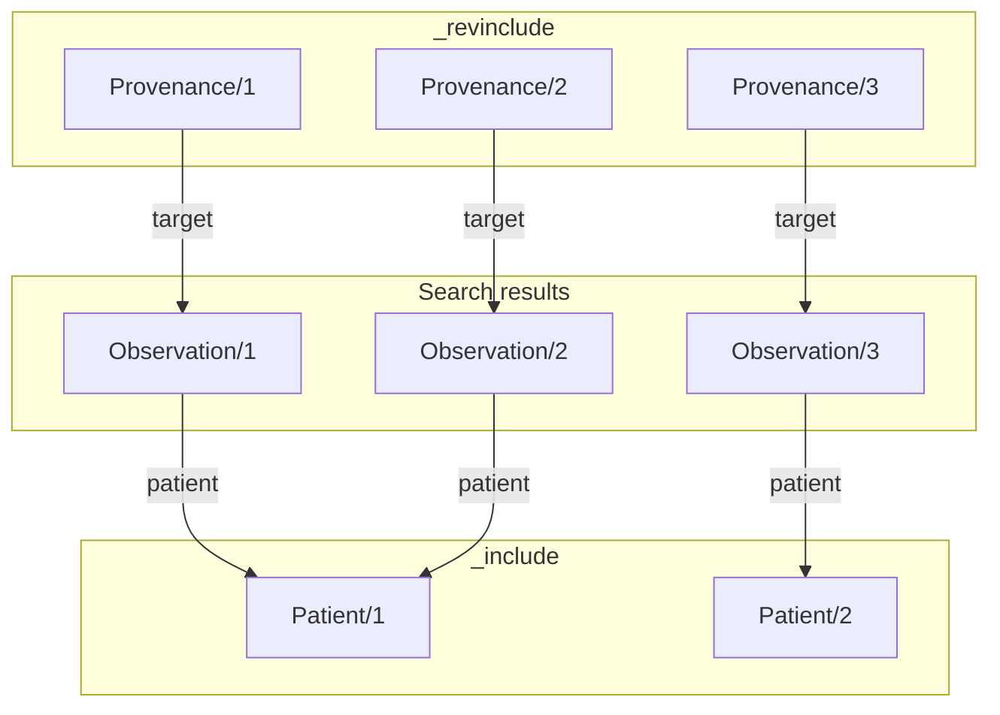
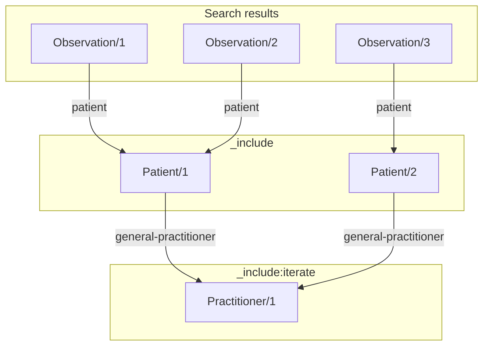
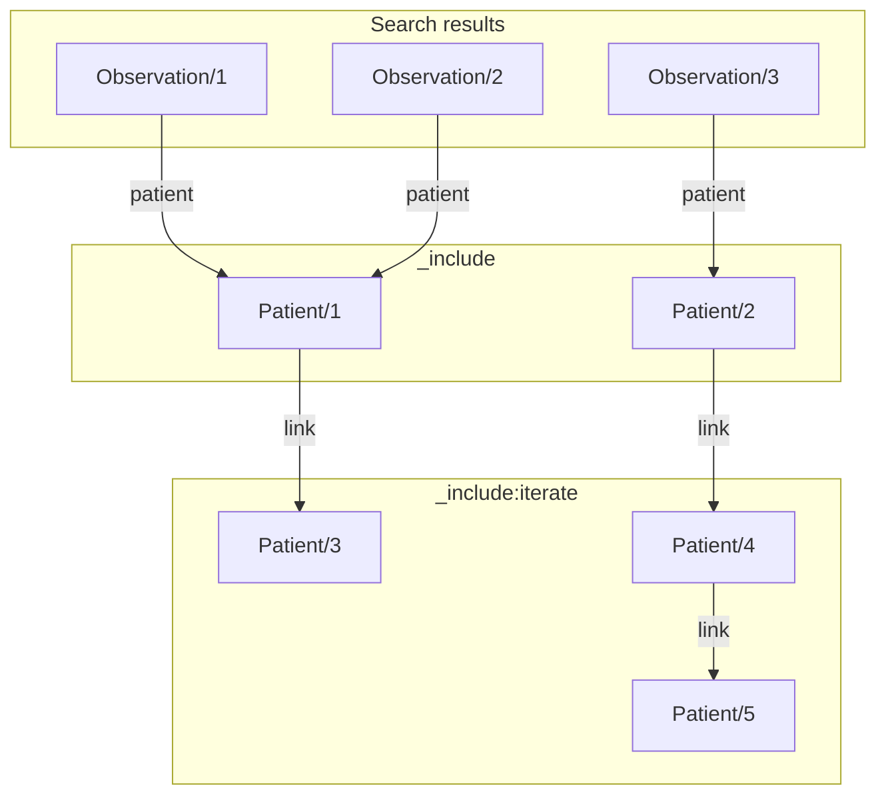

---
---

import ExampleCode from '!!raw-loader!@site/../examples/src/search/includes.ts';
import MedplumCodeBlock from '@site/src/components/MedplumCodeBlock';

# Including Linked Resources

In many cases, your application may need to search for not just one resource type, but also some of the related
resources that those resources reference. For example, one might need to search for Observations with a certain code,
but also the Patients on whom the observations were made, and the Provenance of the Observations as well. Using basic
search requests, this would require many different search API calls. However, Medplum offers powerful tools to
include related resources in the same search request. The [FHIR GraphQL API](./graphql) is suitable for retrieving
linked resources when you only need to traverse a few hops in the resource graph and know the exact fields on
each resource that you need. For more general search queries that return full resources, you can use the
[`_include` and `_revinclude`][include-params] search parameters.

## \_include and \_revinclude

The `_include` and `_revinclude` search parameters allow you to include resources linked to the results of your
search to be returned alongside the results, in the same Bundle.

For example, the search query described above for Observations, Patients, and Provenance would look like this:

```http
GET /fhir/R4/Observation?code=http://loinc.org|78012-2&_include=Observation:patient&_revinclude=Provenance:target
```

:::caution Note

The values of the `_include` and `_revinclude` parameters are not paths into the resource, but search parameters.

:::

The `_include=Observation:patient` parameter adds to the search results all Patient resources referenced by the
`Observation.subject` field of any of the original search results. Similarly, the `_revinclude` parameter
adds any Provenance resources whose `target` field references one of the original search results. The full
graph of resources returned in the search result [Bundle](/docs/api/fhir/resources/bundle) could look something like this:



[include-params]: https://www.hl7.org/fhir/search.html#_include

## `:iterate` Modifier

By default, the `_include` and `_revinclude` only include resources one hop away from resources in the search results.
In order to traverse subsequent reference links, add the `:iterate` modifier to the `_include` or `_revinclude`
parameter. This will cause the inclusion to apply recursively, until no more resources are found. For example,
to search for Observations, plus the Patient resources they refer to, plus those patients' associated general
practitioner, you might use a search API call like this:

```http
GET /fhir/R4/Observation?code=http://loinc.org|78012-2&_include=Observation:patient&_include:iterate=Patient:general-practitioner
```

This query would return a Bundle containing all the resources from a linked graph like the following:



:::tip Recursive application

The `:iterate` modifier applies recursively, and can return multiple levels of results. For example,
all results in the graph shown below would be returned in the results for the following search API request:

```http
GET /fhir/R4/Patient?_id=1&_include:iterate=Patient:link
```



:::

## Usage

You can specify inclusion parameters with search requests using the TypeScript SDK:

<MedplumCodeBlock language="ts" selectBlocks="search">
  {ExampleCode}
</MedplumCodeBlock>
