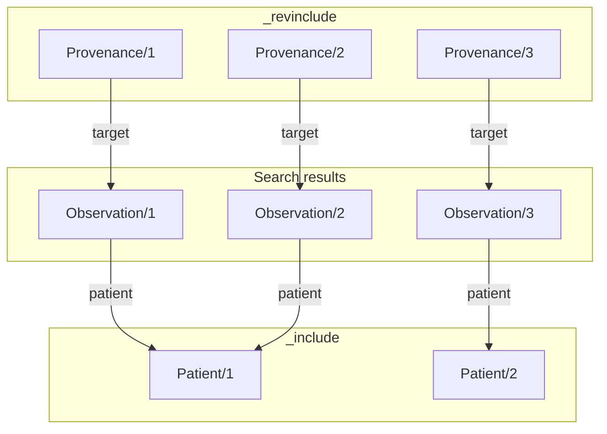
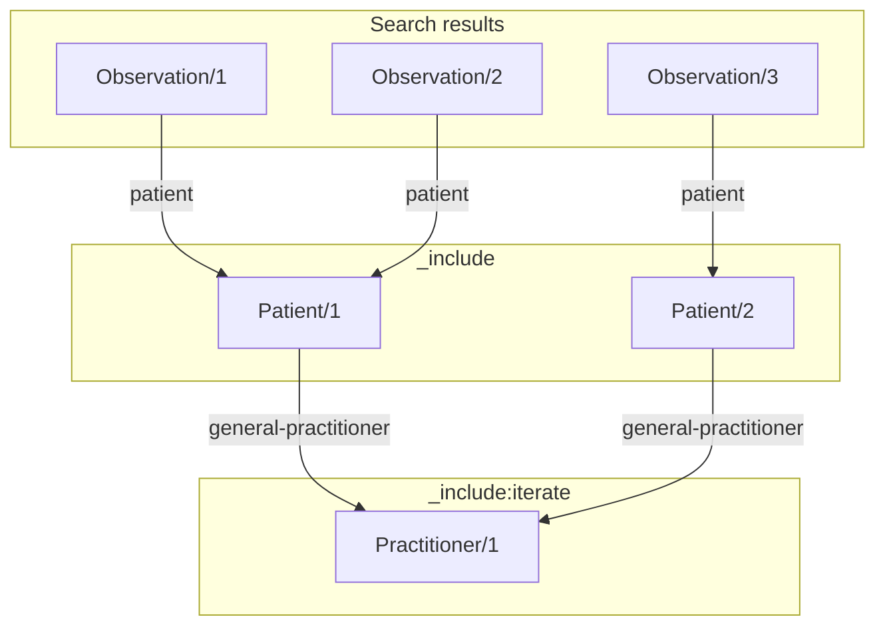
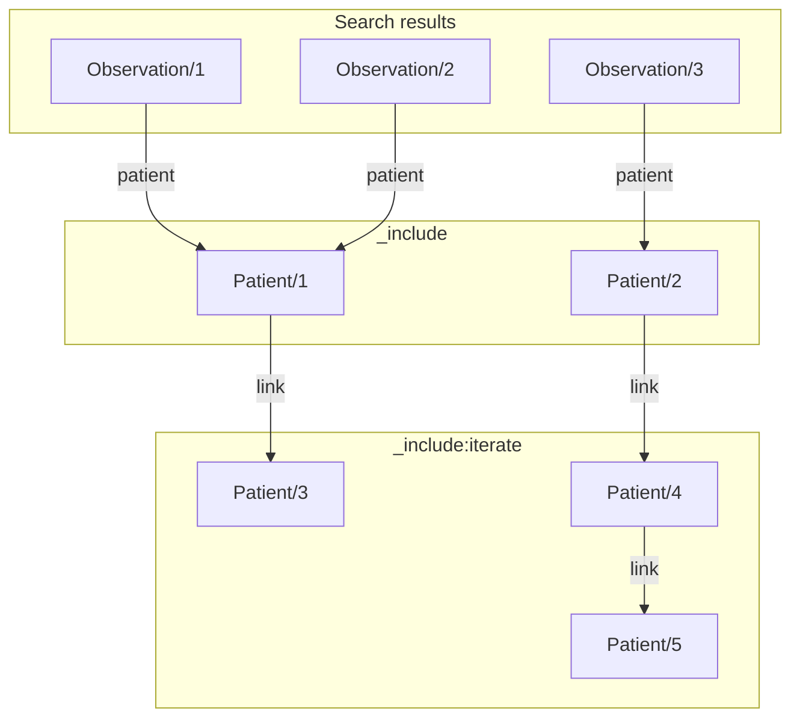

---
---

import ExampleCode from '!!raw-loader!@site/../examples/src/search/includes.ts';
import MedplumCodeBlock from '@site/src/components/MedplumCodeBlock';
import Tabs from '@theme/Tabs';
import TabItem from '@theme/TabItem';

# Including Linked Resources

In many cases, your application may need to search for not just one resource type, but also some of the related
resources that those resources reference. For example, one might need to search for `Observation` resources with a
certain code, but also the `Patient` resources on whom the observations were made, and the `Provenance` for the
`Observation` resources as well. Using basic search requests, this would require many different API calls. The FHIR
specification contains special `_include` and `_revinclude` search parameters, which return resources linked to the
results of your search alongside in the same Bundle.

## Comparison with GraphQL

In addition to these search parameters, Medplum also offers a [FHIR GraphQL API](./graphql) that is suitable for
retrieving linked resources when you only need to traverse a few hops in the resource graph and know the exact fields on
each resource that you need. The major differences between the `_(rev)include` parameters and GraphQL are summarized below:

| `_(rev)include`                                           | GraphQL                                                         |
| --------------------------------------------------------- | --------------------------------------------------------------- |
| Returns full resource JSON                                | Returns only specified resource fields                          |
| Traverses resource references via search parameters       | Traverses references through special `Reference.resource` field |
| Can traverse up from a resource to one that references it | Can only traverse down from a resource to one it references     |

## \_include and \_revinclude

For example, the search query described above for `Observation`, `Patient`, and `Provenance` resources would look like this:

<Tabs groupId="language">
  <TabItem value="ts" label="TypeScript">
    <MedplumCodeBlock language="ts" selectBlocks="searchIncludes">
      {ExampleCode}
    </MedplumCodeBlock>

  </TabItem>

  <TabItem value="curl" label="cURL">
    <MedplumCodeBlock language="bash" selectBlocks="searchIncludesCurl">
      {ExampleCode}
    </MedplumCodeBlock>
  </TabItem>
</Tabs>

<details>
  <summary>
    Example response
  </summary>

  <MedplumCodeBlock language="ts" selectBlocks="includesResponse">
    {ExampleCode}
  </MedplumCodeBlock>
</details>

:::caution Note

The values of the `_include` and `_revinclude` parameters are not paths into the resource, but search parameters.

:::

The `_include=Observation:patient` parameter adds to the search results all `Patient` resources referenced by the
`Observation.subject` field of any of the original search results. Similarly, the `_revinclude` parameter
adds any `Provenance` resources whose `target` field references one of the original search results. The full
graph of resources returned in the search result [`Bundle`](/docs/api/fhir/resources/bundle) could look something like this:



[include-params]: https://www.hl7.org/fhir/search.html#_include

## `:iterate` Modifier

By default, the `_include` and `_revinclude` only include resources one hop away from resources in the search results.
In order to traverse subsequent reference links, add the `:iterate` modifier to the `_include` or `_revinclude`
parameter. This will cause the inclusion to apply recursively, until no more resources are found. For example,
to search for `Observation` resources, plus the `Patient` resources they refer to, plus those patients' associated
`Practitioner`, you might use a search API call like this:

<Tabs groupId="language">
  <TabItem value="ts" label="TypeScript">
    <MedplumCodeBlock language="ts" selectBlocks="searchIncludeIterate">
      {ExampleCode}
    </MedplumCodeBlock>

  </TabItem>

  <TabItem value="curl" label="cURL">
    <MedplumCodeBlock language="bash" selectBlocks="searchIncludeIterateCurl">
      {ExampleCode}
    </MedplumCodeBlock>
  </TabItem>
</Tabs>

<details>
  <summary>
    Example response
  </summary>

  <MedplumCodeBlock language="ts" selectBlocks="iterateResponse">
    {ExampleCode}
  </MedplumCodeBlock>
</details>

This query would return a Bundle containing all the resources from a linked graph like the following:



:::tip Recursive application

The `:iterate` modifier applies recursively, and can return multiple levels of results. For example,
all results in the graph shown below would be returned in the results for the following search API request:

```http
GET /fhir/R4/Patient?_id=1&_include:iterate=Patient:link
```



:::
