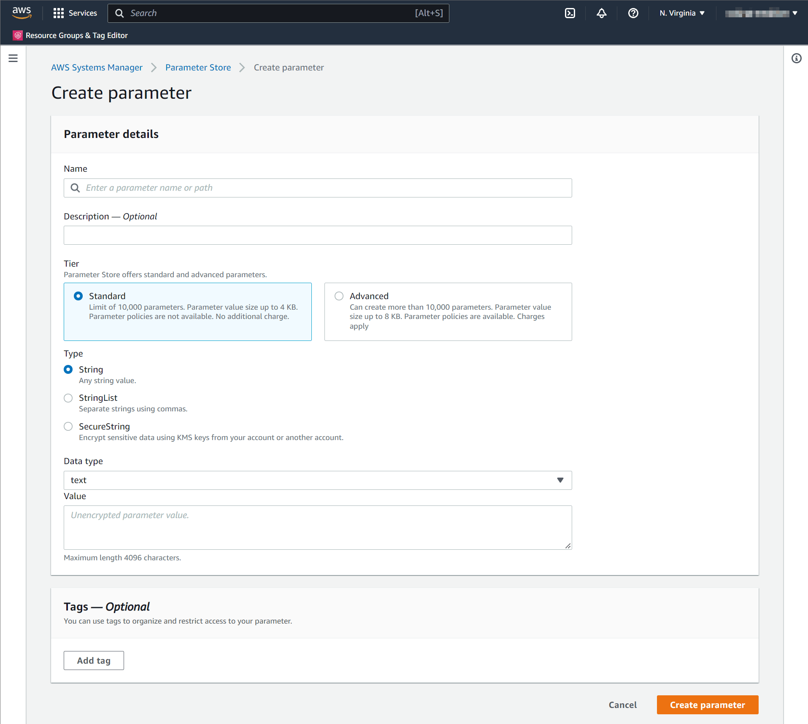

# Config Settings

Medplum uses config settings to control various aspects of the running service. This page includes details about those config settings.

There are two distinct config files:

1. CDK config - settings that define AWS infrastructure
2. Server config - settings that define the Medplum API server runtime

The recommended way to author these config settings is the CDK infra `init` tool. See [Install on AWS](/docs/self-hosting/install-on-aws) for more details.

## CDK config

This is a JSON file that contains all of the custom infrastructure configuration settings of the new environment. Note that this is distinct from the server config file (see next section).

Here is a full example. See the table below for details on each setting.

| Key                          | Description                                                                                                                                                                                                                                                                                       |
| ---------------------------- | ------------------------------------------------------------------------------------------------------------------------------------------------------------------------------------------------------------------------------------------------------------------------------------------------- |
| `name`                       | The short name of your environment. This should be unique among your Medplum deployments. This will be used as part of Parameter Store path and CloudWatch Logs path. For example, `prod` or `staging`.                                                                                           |
| `stackName`                  | The long name of your environment. This will be included in many of the AWS resource names created by CDK. For example, `MyMedplumStack` or `MedplumStagingStack`.                                                                                                                                |
| `accountNumber`              | Your AWS account number. A 12-digit number, such as 123456789012, that uniquely identifies an AWS account. Account IDs are not considered sensitive information.                                                                                                                                  |
| `region`                     | The AWS region where you want to deploy.                                                                                                                                                                                                                                                          |
| `domainName`                 | The domain name that represents your Route 53 Hosted Zone. For example, `medplum.com` or `my-med-app.io`.                                                                                                                                                                                         |
| `vpcId`                      | Optional preexisting VPC ID. Use this to import an existing VPC. If this setting is not present or empty, a new VPC will be created.                                                                                                                                                              |
| `apiDomainName`              | The domain name of the API server. This should be a subdomain of `domainName`. For example, `api.medplum.com` or `api.staging.medplum.com`.                                                                                                                                                       |
| `apiPort`                    | The port number that the API server binds to inside the Docker image. By default, you should use `8103`. In some cases, you may need to use `5000`.                                                                                                                                               |
| `apiSslCertArn`              | The ARN of the ACM Certificate for the API server domain that you registered before.                                                                                                                                                                                                              |
| `appDomainName`              | The domain name of the app server. This should be a subdomain of `domainName`. For example, `app.medplum.com` or `app.staging.medplum.com`.                                                                                                                                                       |
| `appSslCertArn`              | The ARN of the ACM Certificate for the app server domain that you registered before.                                                                                                                                                                                                              |
| `storageBucketName`          | The name of the S3 bucket for file storage that you created before.                                                                                                                                                                                                                               |
| `storageDomainName`          | The domain name that will be used to access the file storage using presigned URLs. For example, `storage.medplum.com`.                                                                                                                                                                            |
| `storageSslCertArn`          | The ARN of the ACM Certificate for the storage server domain that you registered before.                                                                                                                                                                                                          |
| `storagePublicKey`           | The contents of the public key file that you created before. By default, the file name is `public.pem`. The contents should start with `-----BEGIN PUBLIC KEY-----`.                                                                                                                              |
| `maxAzs`                     | The maximum number of availability zones to use. If you want to use all availability zones, choose a large number such as 99. If you want to restrict the number, for example to manage EIP limits, then choose a small number such as 1 or 2.                                                    |
| `rdsInstances`               | The number of running RDS instances. Use `1` for a single instance, or `2` for a hot failover on standby.                                                                                                                                                                                         |
| `rdsInstanceType`            | Optional [AWS RDS Aurora instance type](https://docs.aws.amazon.com/AmazonRDS/latest/AuroraUserGuide/Concepts.DBInstanceClass.html). Default value is the CDK default value (t3.medium).                                                                                                          |
| `rdsSecretsArn`              | Optional override to provide custom database connection secrets. If `rdsSecretsArn` is provided, then no RDS resources will be instantiated. The secrets at `rdsSecretsArn` must conform to the same secrets format as secrets created by CDK (`host`, `port`, `dbname`, `username`, `password`). |
| `desiredServerCount`         | The number of running ECS/Fargate instances in steady state. Use `1` when getting started, and increase as necessary or for high availability.                                                                                                                                                    |
| `serverImage`                | The DockerHub server image to deploy. Use `medplum/medplum-server:latest` for the most recent version published by the Medplum team. Or use your own repository if you need to deploy a custom instance.                                                                                          |
| `serverMemory`               | The amount (in MiB) of memory used by the ECS/Fargate instance. For example, 512, 1024, 2048, 4096, etc. See [Task size](https://docs.aws.amazon.com/AmazonECS/latest/developerguide/task_definition_parameters.html#task_size).                                                                  |
| `serverCpu`                  | The number of cpu units used by the task. For example, 512, 1024, 2048, 4096, etc. See [Task size](https://docs.aws.amazon.com/AmazonECS/latest/developerguide/task_definition_parameters.html#task_size).                                                                                        |
| `loadBalancerLoggingEnabled` | Boolean flag to [Enable Access Logs to ELB](https://docs.aws.amazon.com/elasticloadbalancing/latest/application/enable-access-logging.html)                                                                                                                                                       |
| `loadBalancerLoggingBucket`  | The logging bucket that you created before.                                                                                                                                                                                                                                                       |
| `loadBalancerLoggingPrefix`  | A directory prefix to use for the S3 logs. For example, `elb`.                                                                                                                                                                                                                                    |
| `clamscanEnabled`            | Boolean flag to enable [Serverless ClamScan antivirus](https://github.com/awslabs/cdk-serverless-clamscan)                                                                                                                                                                                        |
| `clamscanLoggingBucket`      | The logging bucket that you created before.                                                                                                                                                                                                                                                       |
| `clamscanLoggingPrefix`      | A directory prefix to use for the S3 logs. For example, `clamscan`.                                                                                                                                                                                                                               |
| `skipDns`                    | Optional flag to skip all DNS entries. Use this option if you do not use Route 53, or if the Route 53 hosted zone is in a different AWS account.                                                                                                                                                  |

Here is the server configuration for the Medplum staging environment:

```json
{
  "name": "staging",
  "stackName": "MedplumStagingStack",
  "accountNumber": "647991932601",
  "region": "us-east-1",
  "domainName": "medplum.com",
  "apiDomainName": "api.staging.medplum.com",
  "apiPort": 5000,
  "apiSslCertArn": "arn:aws:acm:us-east-1:647991932601:certificate/159b257b-a180-49c6-b188-4dc962d8e708",
  "appDomainName": "app.staging.medplum.com",
  "appSslCertArn": "arn:aws:acm:us-east-1:647991932601:certificate/b0d65b27-2ea8-4377-82e1-c41aa067655b",
  "storageBucketName": "medplum-staging-storage",
  "storageDomainName": "storage.staging.medplum.com",
  "storageSslCertArn": "arn:aws:acm:us-east-1:647991932601:certificate/2205bb8c-7da9-4992-b8ec-c2c79b43b586",
  "storagePublicKey": "-----BEGIN PUBLIC KEY-----\nMIIBIjANBgkqhkiG9w0BAQEFAAOCAQ8AMIIBCgKCAQEA3cnmD3HQbJU7WTGT2ZSO\nLt71c+xQ91m5FAzdFagfkQAG0CeyzHq8VzjLPinLDlOWCwQXfunjoBMP7iyVt/pE\n46ngR55In3UlzsMySHpUAi740u6oh0VeJOZA1x/FrVRYsxFx4XFJ92gcs5VvdT66\nwWTX7KznaIrxIvTWz384ogqXfg41QeoIISM2YUjqSMkyx7wY3xGrFvG5UuAAivbr\ni/ZZkkM2q9frpidpJx4evIuaHZS8fstbHFDbbFFqDMyuk7eAJRea1KH5TsjCHvTK\n5ANRyzq+mty47TKrI+2AQsxjH4mel2lC/at3udgtmfz1MTT7daFWfDKsVn8h3DsA\nJwIDAQAB\n-----END PUBLIC KEY-----",
  "maxAzs": 2,
  "rdsInstances": 1,
  "desiredServerCount": 1,
  "serverImage": "medplum/medplum-server:latest",
  "serverMemory": 512,
  "serverCpu": 256,
  "loadBalancerLoggingEnabled": true,
  "loadBalancerLoggingBucket": "medplum-logs-us-east-1",
  "loadBalancerLoggingPrefix": "elb-staging",
  "clamscanEnabled": true,
  "clamscanLoggingBucket": "medplum-logs-us-east-1",
  "clamscanLoggingPrefix": "clamscan"
}
```

## Server config

When running Medplum server on a local developer machine, Medplum server typically loads config settings from a JSON config file. By default, it loads config settings from `medplum.config.json`.

When running in AWS, Medplum server loads config settings from AWS Parameter Store, a feature of AWS Systems Manager (SSM).

Some configuration settings are created automatically by the CDK deployment (for example, database and redis connection details). Other settings must be created manually before the first deploy.

Learn more in the [Create a Systems Manager parameter](https://docs.aws.amazon.com/systems-manager/latest/userguide/parameter-create-console.html) AWS user guide.



When creating a parameter in AWS Parameter Store, you will be prompted for the parameter **Name**. The parameter **Name** uses the convention `/medplum/{environmentName}/{key}`.

For example, if your environment name is "prod", then the "baseUrl" parameter name is `/medplum/prod/baseUrl`.

You will also be prompted for a parameter "Type". The default option is "String". Medplum supports both "String" and "SecureString". "SecureString" is recommended for security and compliance purposes.

| Key                    | Description                                                                                                                                                                                           | Required | Created by | Default                             |
| ---------------------- | ----------------------------------------------------------------------------------------------------------------------------------------------------------------------------------------------------- | -------- | ---------- | ----------------------------------- |
| `port`                 | The port number that the API server binds to inside the Docker image. By default, you should use `8103`. In some cases, you may need to use `5000`.                                                   | yes      | `init`     | `8103`                              |
| `baseUrl`              | The fully qualified base URL of the API server including a trailing slash. For example, `https://api.example.com/`.                                                                                   | yes      | `init`     |                                     |
| `issuer`               | The JWK issuer. By default, Medplum server uses built in OAuth, so `issuer` should be the same as `baseUrl`.                                                                                          |          |            | `baseUrl`                           |
| `jwksUrl`              | The JWKS URL. By default, Medplum server uses built in OAuth, so `jwksUrl` should be `baseUrl` + `.well-known/jwks.json`.                                                                             |          |            | `baseUrl` + `.well-known/jwks.json` |
| `authorizeUrl`         | The OAuth authorize URL. By default, Medplum server uses built in OAuth, so `authorizeUrl` should be `baseUrl` + `oauth2/authorize`.                                                                  |          |            | `baseUrl` + `oauth2/authorize`      |
| `tokenUrl`             | The OAuth token URL. By default, Medplum server uses built in OAuth, so `tokenUrl` should be `baseUrl` + `oauth2/token`.                                                                              |          |            | `baseUrl` + `oauth2/token`          |
| `userInfoUrl`          | The OAuth userinfo URL. By default, Medplum server uses built in OAuth, so `userInfoUrl` should be `baseUrl` + `oauth2/userinfo`.                                                                     |          |            | `baseUrl` + `oauth2/userinfo`       |
| `appBaseUrl`           | The fully qualified URL of the user-facing app. This is used for CORS and system generated emails. For example, `https://app.example.com/`.                                                           | yes      | `init`     |                                     |
| `binaryStorage`        | Where to store binary contents. This should be the CDK config `storageBucketName` with `s3:` prefix. For example, `s3:medplum-storage`.                                                               | yes      | `init`     |                                     |
| `storageBaseUrl`       | The fully qualified base URL of the binary storage. This should be the CDK config `storageDomainName` with `https://` prefix. For example, `https://storage.medplum.com/binary/`.                     | yes      | `init`     |                                     |
| `signingKeyId`         | The AWS key ID of the CloudFront signing key that you created before.                                                                                                                                 | yes      | `cdk`      |                                     |
| `signingKey`           | The private key of the CloudFront signing key.                                                                                                                                                        | yes      | `init`     |                                     |
| `signingKeyPassphrase` | The passphrase of the CloudFront signing key.                                                                                                                                                         | yes      | `init`     |                                     |
| `allowedOrigins`       | Optional comma separated list of allowed origins for [Cross-Origin Resource Sharing (CORS)](https://developer.mozilla.org/en-US/docs/Web/HTTP/CORS) requests. `appBaseUrl` is included automatically. |          |            |                                     |
| `supportEmail`         | The email address to use when sending system generated messages. This email address must be registered in AWS SES.                                                                                    | yes      | `init`     |                                     |
| `googleClientId`       | If using Google Authentication, this is the Google Client ID.                                                                                                                                         |          |            |                                     |
| `googleClientSecret`   | If using Google Authentication, this is the Google Client Secret.                                                                                                                                     |          |            |                                     |
| `recaptchaSiteKey`     | If using reCAPTCHA, this is the reCAPTCHA site key.                                                                                                                                                   |          |            |                                     |
| `recaptchaSecretKey`   | If using reCAPTCHA, this is the reCAPTCHA secret key.                                                                                                                                                 |          |            |                                     |
| `botLambdaRoleArn`     | If using Medplum Bots, this is the ARN of the [Lambda execution role](https://docs.aws.amazon.com/lambda/latest/dg/lambda-intro-execution-role.html).                                                 |          | `cdk`      |                                     |
| `botLambdaLayerName`   | If using Medplum Bots, this is the name of the [Lambda layer](https://docs.aws.amazon.com/lambda/latest/dg/invocation-layers.html). For example, `medplum-bot-layer`.                                 |          |            | `medplum-bot-layer`                 |
| `database`             | The database connection details (created automatically).                                                                                                                                              |          | `cdk`      |                                     |
| `redis`                | The redis connection details (created automatically).                                                                                                                                                 |          | `cdk`      |                                     |
| `logAuditEvents`       | Optional flag to log `AuditEvent` resources for all auth and RESTful operations.                                                                                                                      |          |            | `false`                             |
| `auditEventLogGroup`   | Optional AWS CloudWatch Log Group name for `AuditEvent` logs. If not specified, `AuditEvent` logs use the default logger.                                                                             |          |            |                                     |
| `auditEventLogStream`  | Optional AWS CloudWatch Log Stream name for `AuditEvent` logs. Only applies if `auditEventLogGroup` is set. Uses `os.hostname()` as the default.                                                      |          |            | `os.hostname()`                     |
| `registerEnabled`      | Optional flag whether new user registration is enabled.                                                                                                                                               |          |            | `true`                              |
