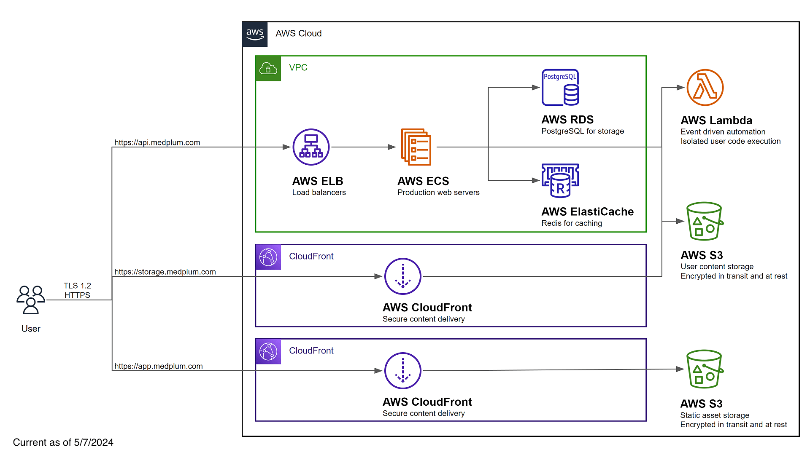

# Install on AWS

This guide will perform a complete production-ready installation in your AWS environment using [AWS CDK](https://aws.amazon.com/cdk/).

:::caution

This is a complex multi step process, and requires high proficiency with AWS, Node.js, and command line tools.

Medplum strives to make this as easy as possible, but despite our best efforts, it is still challenging.

If you have any questions, please [contact us](mailto:hello@medplum.com) or [join our Discord](https://discord.gg/medplum).

:::

:::tip

If you are new to AWS CDK, we strongly recommend reading [Getting started with the AWS CDK](https://docs.aws.amazon.com/cdk/v2/guide/getting_started.html).

:::

At a high level, the process of installing Medplum on AWS includes:

1. Prerequisites
   1. Setting up IAM permissions
   2. Setting up an SES account
2. Creating a config repo
   1. Setting up CDK
   2. Setting up Medplum CDK
   3. Running the Medplum init tool
3. Deploying the CDK stack
   1. Boostrapping
   2. Synth
   3. Deploy
4. Deploying the Medplum app
   1. Building the Medplum app with your config
   2. Deploying the Medplum app to AWS

The resulting AWS configuration will look like the following:



## Prerequisites

### AWS Permissions

You will need permission to access the following AWS services:

| Service                              | Details                                                                               |
| ------------------------------------ | ------------------------------------------------------------------------------------- |
| Elastic Compute Cloud (EC2)          | Create a Virtual Private Cloud (VPC) and related security groups                      |
| Elasticache                          | Create a hosted Redis cluster for caching and task queue                              |
| Elastic Load Balancing (ELB)         | Create a load balancer for server redundancy and high availability                    |
| Identity and Access Management (IAM) | Create service roles for the API server and bot lambdas                               |
| CloudFront                           | Securely deliver content with low latency and high transfer speeds                    |
| CloudWatch Logs                      | Create and manage log groups for server logs                                          |
| Relational Database Service (RDS)    | Create a hosted Postgres Aurora database                                              |
| Route 53                             | Create DNS entries for the services                                                   |
| Simple Storage Service (S3)          | Host static web content, store and retrieve dynamic user content for file attachments |
| Secrets Manager                      | Store encrypted secret configuration details such as database credentials             |
| Systems Manager (SSM)                | Store configuration details                                                           |
| Web Application Firewall (WAF)       | Protect your web applications or APIs against common web exploits and bots            |

You will also need to setup your [AWS credential file](https://docs.aws.amazon.com/cli/latest/userguide/cli-configure-files.html).

### Setup SES

It is **strongly** recommended to setup an SES email address with production access, meaning that it can send email to any email recipient. Email is used to verify identities, send login instructions, and handle password reset requests.

Follow the [Creating and verifying identities in Amazon SES](https://docs.aws.amazon.com/ses/latest/dg/creating-identities.html) guide to register an email address for system generated emails.

## Setup a config repo

### Create your config repo

Medplum recommends creating a separate git repository and npm project to manage your CDK infra-as-code. This repository will only contain JSON configuration files.

```bash
mkdir my-medplum-cdk-config
cd my-medplum-cdk-config
npm init -y
```

Medplum recommends pushing this git repository to your source control provider such as GitHub or GitLab.

### Add CDK dependencies

If you have not already done so, add the common AWS CDK dependencies. This includes all of the base CDK capabilities and constructs.

```bash
npm i aws-cdk-lib cdk constructs
```

### Add Medplum CDK dependency

Add the Medplum CDK dependency. This includes the Medplum CDK construct.

```bash
npm i @medplum/cdk
```

### Add cdk.json

Create a new file called `cdk.json` with the following contents:

```json
{
  "app": "node node_modules/@medplum/cdk/dist/cjs/index.cjs"
}
```

### Run the init tool

Most AWS resources are automatically created using CDK, but some either cannot or are not recommended. Use the `medplum-cdk-init` tool to setup those resources and build the Medplum CDK config file.

```bash
npx medplum-cdk-init
```

Then follow the prompts.

Upon completion, the tool will:

1. Generate a Medplum CDK config file (i.e., medplum.demo.config.json)
2. Optionally generate an AWS CloudFront signing key
3. Optionally request SSL certificates from AWS Certificate Manager
4. Optionally write server config settings to AWS Parameter Store

Make note of the CDK config file name.

See [Config Settings](/docs/self-hosting/config-settings) for more details on each of the individual configuration settings.

### CDK Bootstrap

Bootstrapping is the process of provisioning resources for the AWS CDK before you can deploy AWS CDK apps into an AWS environment.

Run CDK bootstrap:

```bash
npx cdk bootstrap -c config=my-config.json
```

Learn more about bootstrapping: <https://docs.aws.amazon.com/cdk/latest/guide/bootstrapping.html>

### CDK Synth

The `synth` step catches logical errors in defining your AWS resources.

Run CDK synth:

```bash
npx cdk synth -c config=my-config.json
```

### CDK Deploy

When you are ready to actually execute the CDK configuration, use the `deploy` command.

Run CDK deploy:

```bash
npx cdk deploy -c config=my-config.json
```

### CDK Diff

If you make changes to the CDK config, you can use the `diff` command to see how it will change your AWS resources.

Run CDK diff:

```bash
npx cdk diff -c config=my-config.json
```

## Deploy

Now let's switch back to the main Medplum repo. If you have not done so already, see [Clone the repo](/docs/contributing/clone-the-repo).

### Setup your app

Add a `.env` file in `packages/app` with your deployment details:

```
MEDPLUM_BASE_URL=https://api.medplum.example.com/
GOOGLE_CLIENT_ID=***Your google client ID for Google auth***
RECAPTCHA_SITE_KEY=***Your reCAPTCHA site key for user verification***
```

> **_TODO:_** Update the build to pull from a centralized config file rather than environment variable.

### Build the app

From the root of the Medplum repo, run:

```bash
npm run build -- --filter=@medplum/app
```

See the [Build](/docs/contributing/run-the-stack#build) page for more details.

### Deploy the app

After the AWS infrastructure is setup, you need to deploy the front-end web application.

Use the `deploy-app.sh` script with a `APP_BUCKET` environment variable:

> **_TODO:_** Update the script to pull from a centralized config file rather than environment variable.

```bash
export APP_BUCKET=app.example.com
./scripts/deploy-app.sh
```

or

```bash
APP_BUCKET=app.example.com ./scripts/deploy-app.sh
```

## Advanced

### Bot Lambda Layer

**Optional:** If you intend to use Medplum Bots, you will need an [AWS Lambda Layer](https://docs.aws.amazon.com/lambda/latest/dg/gettingstarted-concepts.html#gettingstarted-concepts-layer).

You can use the `deploy-bot-layer.sh` script to automate this process:

```bash
./scripts/deploy-bot-layer.sh
```

See the [Creating and sharing Lambda layers](https://docs.aws.amazon.com/lambda/latest/dg/configuration-layers.html) guide to learn more.

## Ongoing

### Upgrade the server

If using a custom Docker image, first build and deploy your image:

```bash
# Build and push using normal Docker commands
docker build . -t "$DOCKER_REPOSITORY:$TAG"
docker push "$DOCKER_REPOSITORY:$TAG"
```

To deploy the latest version to your AWS Fargate cluster, use the AWS CLI:

```bash
# Update the Medplum Fargate service
aws ecs update-service \
  --region "$AWS_REGION" \
  --cluster "$ECS_CLUSTER" \
  --service "$ECS_SERVICE" \
  --force-new-deployment
```

## Troubleshooting

### Cannot assume role

You may receive a warning such as:

```bash
current credentials could not be used to assume 'arn:aws:iam::[ACCOUNT_ID]:role/cdk-hnb659fds-file-publishing-role-[ACCOUNT_ID]-us-west-2',
but are for the right account. Proceeding anyway.
```

First, make sure that the specified role exists in your AWS account. If it does not exist, make sure that you ran the `cdk bootstrap` command.

Next, make sure that your AWS account has permission to assume the role via `sts:AssumeRole`. You may need to add an IAM policy to add permission.

```json
{
  "Sid": "assumerole",
  "Effect": "Allow",
  "Action": ["sts:AssumeRole", "iam:PassRole"],
  "Resource": ["arn:aws:iam::*:role/cdk-*"]
}
```

:::tip

"IAM Full Access" is not enough! The IAM Full Access policy does not include `sts:AssumeRole`.

:::

### Try verbose mode

All CDK operations support verbose logging by adding the `--verbose` flag. Verbose logging can often reveal hints about confusing behavior.

```bash
npx cdk synth --verbose -c config=my-config.json
```
