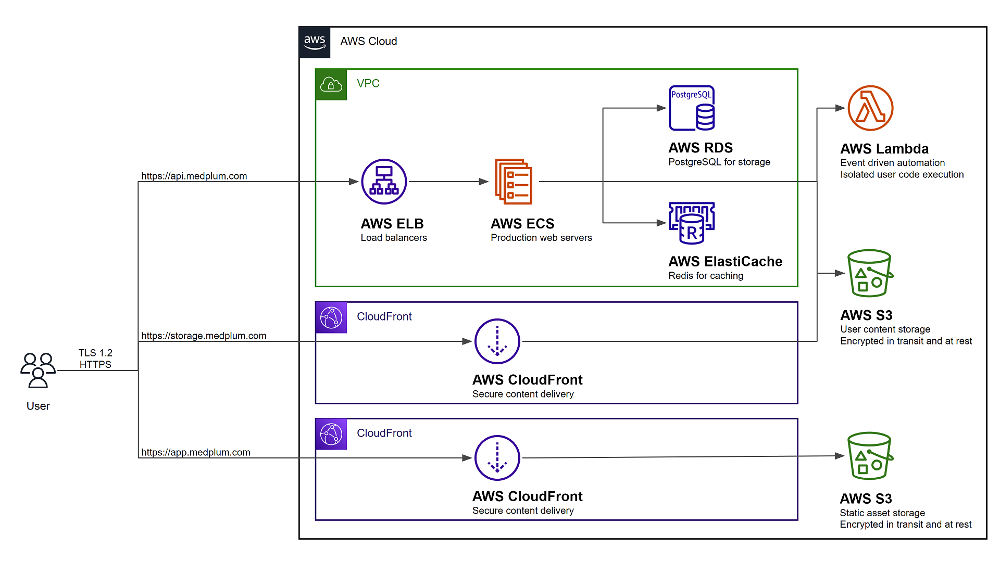

# Install on AWS

This guide will perform a complete production-ready installation in your AWS environment using [AWS CDK](https://aws.amazon.com/cdk/).

The resulting AWS configuration should look like the following:



## Prerequisites

You will need permission to access the following AWS services:

| Service                              | Details                                                                               |
| ------------------------------------ | ------------------------------------------------------------------------------------- |
| Elastic Compute Cloud (EC2)          | Create a Virtual Private Cloud (VPC) and related security groups                      |
| Elasticache                          | Create a hosted Redis cluster for caching and task queue                              |
| Elastic Load Balancing (ELB)         | Create a load balancer for server redundancy and high availability                    |
| Identity and Access Management (IAM) | Create service roles for the API server and bot lambdas                               |
| CloudFront                           | Securely deliver content with low latency and high transfer speeds                    |
| CloudWatch Logs                      | Create and manage log groups for server logs                                          |
| Relational Database Service (RDS)    | Create a hosted Postgres Aurora database                                              |
| Route 53                             | Create DNS entries for the services                                                   |
| Simple Storage Service (S3)          | Host static web content, store and retrieve dynamic user content for file attachments |
| Secrets Manager                      | Store encrypted secret configuration details such as database credentials             |
| Systems Manager (SSM)                | Store configuration details                                                           |
| Web Application Firewall (WAF)       | Protect your web applications or APIs against common web exploits and bots            |

You will also need to setup your [AWS credential file](https://docs.aws.amazon.com/cli/latest/userguide/cli-configure-files.html).

## Create an SES email address

It is **strongly** recommended to setup an SES email address with production access, meaning that it can send email to any email recipient. Email is used to verify identities, send login instructions, and handle password reset requests.

Follow the [Creating and verifying identities in Amazon SES](https://docs.aws.amazon.com/ses/latest/dg/creating-identities.html) guide to register an email address for system generated emails.

## Deploy Bot Lambda Layer

**Optional:** If you intend to use Medplum Bots, you will need an [AWS Lambda Layer](https://docs.aws.amazon.com/lambda/latest/dg/gettingstarted-concepts.html#gettingstarted-concepts-layer).

You can use the `deploy-bot-layer.sh` script to automate this process:

```bash
./scripts/deploy-bot-layer.sh
```

See the [Creating and sharing Lambda layers](https://docs.aws.amazon.com/lambda/latest/dg/configuration-layers.html) guide to learn more.

## Run the `init` tool

Most AWS resources are automatically created using CDK, but some either cannot or are not recommended. Use the Medplum `init` tool to setup those resources and build the config file.

```bash
cd packages/infra
npm run init
```

Then follow the prompts.

Upon completion, the tool will:

1. Generate a Medplum CDK config file (i.e., medplum.demo.config.json)
2. Optionally generate an AWS CloudFront signing key'
3. Optionally request SSL certificates from AWS Certificate Manager
4. Optionally write server config settings to AWS Parameter Store

Make note of the CDK config file name.

See [Config Settings](/docs/self-hosting/config-settings) for more details on each of the individual configuration settings.

## CDK Synth

The `synth` step catches logical errors in defining your AWS resources.

Run CDK synth:

```bash
npx cdk synth -c config=my-config.json
```

## CDK Bootstrap

Bootstrapping is the process of provisioning resources for the AWS CDK before you can deploy AWS CDK apps into an AWS environment.

Run CDK bootstrap:

```bash
npx cdk bootstrap -c config=my-config.json
```

Learn more about bootstrapping: <https://docs.aws.amazon.com/cdk/latest/guide/bootstrapping.html>

## CDK Deploy

When you are ready to actually execute the CDK configuration, use the `deploy` command.

Run CDK deploy:

```bash
npx cdk deploy -c config=my-config.json
```

## CDK Diff

If you make changes to the CDK config, you can use the `diff` command to see how it will change your AWS resources.

Run CDK diff:

```bash
npx cdk diff -c config=my-config.json
```

## Deploy the app

After the AWS infrastructure is setup, you need to deploy the front-end web application.

Use the `deploy-app.sh` script with a `APP_BUCKET` environment variable:

> **_TODO:_** Update the script to pull from a centralized config file rather than environment variable.

```bash
export APP_BUCKET=app.example.com
./scripts/deploy-app.sh
```

or

```bash
APP_BUCKET=app.example.com ./scripts/deploy-app.sh
```

## Upgrade the server

If using a custom Docker image, first build and deploy your image:

```bash
# Build and push using normal Docker commands
docker build . -t "$DOCKER_REPOSITORY:$TAG"
docker push "$DOCKER_REPOSITORY:$TAG"
```

To deploy the latest version to your AWS Fargate cluster, use the AWS CLI:

```bash
# Update the Medplum Fargate service
aws ecs update-service \
  --region "$AWS_REGION" \
  --cluster "$ECS_CLUSTER" \
  --service "$ECS_SERVICE" \
  --force-new-deployment
```
