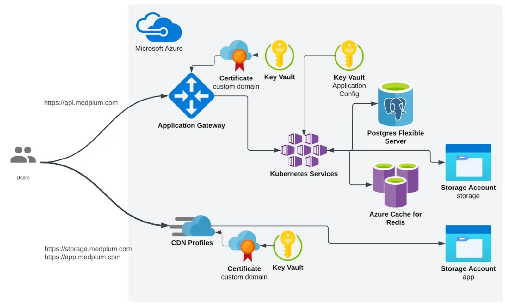
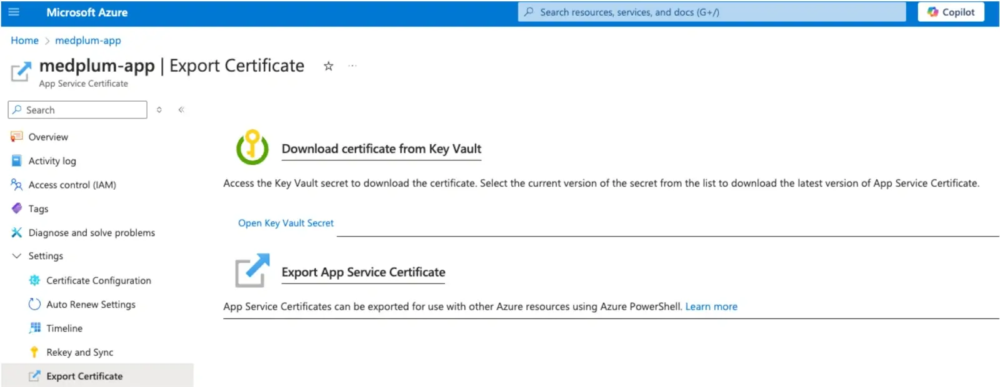

# Install on Azure

This document is intended to guide users through the deployment of Medplum on Azure using Terraform. It provides detailed instructions and configurations necessary to set up essential components such as a Virtual Network (Vnet), Azure Kubernetes Services (AKS) cluster, PostgreSQL database, Storage accounts, CDN, and Redis instances. The purpose is to ensure a smooth and efficient deployment process tailored to Medplum’s specific requirements, facilitating scalability, security, and high availability within their cloud environment.

:::caution

This deployment option has been validated for production use and offers a robust foundation for your implementation. However, it provides a less-automated setup and requires significant operational expertise.

This is a complex multi-step process, and requires high proficiency with Azure, Terraform, Node.js, and command line tools.

Medplum strives to make this as easy as possible, but despite our best efforts, it is still challenging.

If you have any questions, please [contact us](mailto:hello@medplum.com) or [join our Discord](https://discord.gg/medplum).

:::

## High-level overview {#high-level-overview}

To deploy Medplum in Azure, the process is divided into two parts:

- Static Infrastructure (using terraform)
- Medplum App (helm chart)

This division allows a fully customizable deployment, for example: if a customer wants to use an existing K8s cluster, they can just deploy the helm chart to it.

The Medplum application is configured using a secret in Azure KeyVault.  
See [Generate Configuration Secret](#generate-configuration-secret)

### Azure Architecture {#azure-architecture}



### Infrastructure summary {#infrastructure-summary}

- The Medplum backend (API) container runs in Kubernetes.
  - The API is exposed using an Application Gateway, which is created in terraform
  - Azure AppService managed certificates are used. (they need to be created and exported to a KeyVault)
- We use a managed Redis cache and PostgreSQL flexible servers
- CDN profiles are used to expose the frontend (app)

### High-level deployment process {#high-level-deployment-process}

1. Create a KeyVault for certificates. Generate the certificates and make them available in the KV.
2. Deploy static infrastructure using terraform (VNET, AKS, PostgreSQL, Redis, Storage Accounts, Application Gateway)
3. With the values from Step 2, create the Medplum app configuration
4. With the values from Step 2, point the DNS records
5. Deploy the backend application using the helm chart
6. Copy the frontend files to the CDN storage, using the script

## Azure Deployment {#azure-deployment}

### Prepare Certificates {#prepare-certificates}

You may choose another way of generating the certificates, ie: LetsEncrypt, but in this case, we have used all Azure services.

You can generate managed certificates using AppService:

[https://learn.microsoft.com/en-us/azure/app-service/configure-ssl-app-service-certificate?tabs=portal](https://learn.microsoft.com/en-us/azure/app-service/configure-ssl-app-service-certificate?tabs=portal)

After the validation, you can export the certificates to a KeyVault from the certificates UI in Azure.



**This step is required before deploying the terraform code because the CDN requires the certificate to be generated for using custom domains.**

### Infrastructure Deployment {#infrastructure-deployment}

The `terraform` folder contains **Terraform** configurations for deploying infrastructure on **Azure.** The setup includes:

- Azure Resource Group
- AKS
- Log Analytics Workspace
- KMS, DES and KeyVault for AKS
- CDN profile
- Azure PostgreSQL Flexible Server
- Redis cache
- Azure Storage Accounts (for app and storage)
- Application Gateway (API entry point)

#### Prerequisites {#prerequisites}

- [Terraform](https://www.terraform.io/downloads.html) installed on your local machine.
- An Azure subscription with billing enabled.
- **Azure CLI** installed and authenticated with your Azure account.

### Deployment Steps {#deployment-steps}

#### Clone the Repository {#clone-the-repository}

Run:

```
git clone https://github.com/medplum/medplum
cd terraform/azure/
```

#### Configure Backend (Optional) {#configure-backend-(optional)}

If you want to use a [remote backend](https://developer.hashicorp.com/terraform/language/backend) to store the Terraform state, uncomment and configure the `backend.tf` file.

#### Initialize Terraform {#initialize-terraform}

Modify the `terraform.tfvars` file to enter your project-specific values:

```
# Azure project configuration - Change these values to use your own project, region, and zone
project_id = "your-project-id"
region     = "your-region"
zone       = "your-zone"

# Common enforced labels - Change these values to use your own labels
labels = {
  env     = "your-environment"  # e.g., "dev", "staging", "prod"
  purpose = "your-purpose"      # e.g., "gke", "web", "database"
  owner   = "your-owner"        # e.g., "team-name", "project-owner"
}

# Azure
resource_group_name = "medplum" 	# Name of the RG to be created
location            = "eastus2"	# Infra region
tags = { 				# Tags that will be applied to all resources
  app = "medplum"
}
app_domain                = "app.azure.medplum.dev"  # CDN Custom domain
app_certificate_secret_id = "https://medplum-certs.vault.azure.net/certificates/medplum-appb0836994-69fff284f95" # The exported Certificate URI (See step 1)
```

#### Initialize Terraform {#initialize-terraform-1}

Initialize the Terraform working directory to download the necessary provider plugins and modules:

```
terraform init
```

#### Plan the Deployment {#plan-the-deployment}

Generate and review an execution plan to ensure the configuration is correct:

```
terraform plan
```

#### Apply the Configuration {#apply-the-configuration}

Apply the Terraform configuration to create the resources in Azure:

```
terraform apply
```

#### Terraform will output values needed for the next steps {#terraform-will-output-values-needed-for-the-next-steps}

(Some values redacted)

```
api_ip = "201.429.43.229"
cdn_endpoint = "medplumapp7d8c-endpoint-cv01.azurefd.net"
medplum_server_identity_client_id = "7f61-4b27-ae90d7ee8"
medplum_server_identity_name = "e93eec1b510a2d7f-medplum-server"
oidc_issuer_url = "https://eastus2.oic.prod-aks.azure.com/befe7abf94d5/b7-4516-b42a32/"
postgresql_dns_record = "medplum.postgres.database.azure.com"
redis_hostname = "medplum.redis.cache.windows.net"
postgresql_password = (sensitive value)
```

Use `terraform output postgresql_password` to retrieve the PostgreSQL password

### Generate configuration secret {#generate-configuration-secret}

The configuration secret holds the Medplum application configuration, and it contains the connection strings to the rest of the infrastructure that we deployed before using terraform.

**1\. Use an existing or create a new KeyVault in Azure**

**2\. Prepare the Secret Data**  
Create a JSON file containing your secret data. Save it as secret_data.json.

```
{
    "port": 8103,
    "baseUrl": "http://localhost:8103/",
    "issuer": "http://localhost:8103/",
    "audience": "http://localhost:8103/",
    "jwksUrl": "http://localhost:8103/.well-known/jwks.json",
    "authorizeUrl": "http://localhost:8103/oauth2/authorize",
    "tokenUrl": "http://localhost:8103/oauth2/token",
    "userInfoUrl": "http://localhost:8103/oauth2/userinfo",
    "appBaseUrl": "http://localhost:3000/",
    "binaryStorage": "file:./binary/",
    "storageBaseUrl": "http://localhost:8103/storage/",
    "supportEmail": "\"Medplum\" <support@medplum.com>",
    "googleClientId": "397236612778-c0b5tnjv98frbo1tfuuha5vkme3cmq4s.apps.googleusercontent.com",
    "googleClientSecret": "",
    "recaptchaSiteKey": "6LfHdsYdAAAAAC0uLnnRrDrhcXnziiUwKd8VtLNq",
    "recaptchaSecretKey": "6LfHdsYdAAAAAH9dN154jbJ3zpQife3xaiTvPChL",
    "botLambdaRoleArn": "",
    "botLambdaLayerName": "medplum-bot-layer",
    "vmContextBotsEnabled": true,
    "defaultBotRuntimeVersion": "vmcontext",
    "allowedOrigins": "*",
    "introspectionEnabled": true,
    "database": {
      "host": "YOUR_DB_HOST",
      "port": 5432,
      "dbname": "medplum",
      "username": "medplumadmin",
      "password": "YOUR_DB_PASSWORD"
    },
    "redis": {
      "host": "YOUR_REDIS_HOST",
      "port": 6380,
      "password": "YOUR_REDIS_PASSWORD",
      "tls": true
    },
    "bullmq": {
      "removeOnFail": { "count": 1 },
      "removeOnComplete": { "count": 1 }
    },
    "shutdownTimeoutMilliseconds": 30000,
    "chainedSearchWithReferenceTables": true
  }
```

- Replace **YOUR_DB_HOST** and **YOUR_REDIS_HOST** with your database's hostnames or IP addresses and Redis instances.
- Ensure the JSON content is correctly formatted and that any variables or placeholders are replaced with actual values.
- See [/docs/self-hosting/presigned-urls] to setup presigned URLs

**3\. Create a secret in the KeyVault:**  
Use the az cli to add the secret data to your secret.

```
az keyvault secret set --vault-name "my-keyvault" --name "medplum-config" --file "secret_data.json"
```

### Configure DNS {#configure-dns}

After deploying the infrastructure, you need to point your domains to the infrastructure created by Terraform.

- **From the terraform output:**  
  Retrieve the external IP address of the Application Gateway, and the CDN endpoint

```
api_ip = "201.429.43.229"
cdn_endpoint = "medplumapp7d8c-endpoint-cv01.azurefd.net"
```

- **Update DNS Records:**  
  In your DNS provider’s management console, create an A record pointing to the IP address, and a CNAME record pointing to the CDN address:
- **For** `api.medplum.com`**:**
  - Create an A record for api.medplum.com pointing to `201.429.43.229`
- **For** `app.medplum.com`**:**
  - Create a CNAME record for app.medplum.com pointing to `medplumapp-endpoint-cv01.azurefd.net`

### Deploy the APP Using Helm {#deploy-the-app-using-helm}

The Helm chart is a package containing `yaml` templates representing Kubernetes Objects.

The helm chart can be found in the `helm` directory.

**It will deploy:**

- Deployment
- Horizontal Pod Autoscaler
- Service
- Ingress with Azure Application Gateway
  - The ingress is optional. Users can choose to expose the API with other methods
- Service Account

#### Deploy your backend API to the AKS cluster using Helm {#deploy-your-backend-api-to-the-aks-cluster-using-helm}

#### Configure kubectl {#configure-kubectl}

Get credentials for your GKE cluster:

```
az aks get-credentials --resource-group MY_RESOURCE_GROUP --name AKS_NAME --overwrite-existing --admin
```

#### Navigate to Your Helm Chart Directory {#navigate-to-your-helm-chart-directory}

```
cd medplum/helm
```

#### Edit the values.yaml File {#edit-the-values.yaml-file}

Edit the `values.yaml` file to override default values, specifying your cloud provider, project_id and config_sicret_id:

```
global:
  cloudProvider: azure
  azure:
    keyVaultURL: [MY_KEYVAULT_URL] # Your Azure Key Vault URL
    secretName: [MY_CONFIG_SECRET_NAME] # The configuration secret Name in Azure

```

Replace `[MY_KEYVAULT_URL]` with the key vault URL where the configuration secret is.  
Replace [`[`](#generate-configuration-secret)`MY_CONFIG_SECRET_NAME]` with the secret name created in the step before.

#### Edit service account values {#edit-service-account-values}

```
serviceAccount:
  annotations:
    azure.workload.identity/client-id: "MY_AZURE_MANAGED_IDENTITY_ID" # Azure Managed Identity Client ID

```

    Replace `[MY_AZURE_MANAGED_IDENTITY_ID]` with the managed entity ID from the terraform output:

```
medplum_server_identity_client_id = "7f61-4b27-ae90d7ee8"
```

**Edit ingress values:**

(ingress is optional; customers can choose to use whatever method they like to expose the app)

```
ingress:
  deploy: true
  domain: [MY_DOMAIN] # Your domain name
  tlsSecretName: [TLS_SECRET_NAME] # Azure only
```

    Replace `MY_DOMAIN` and `TLS_SECRET_NAME` with your actual domain and certificate secret name

**Create a K8s secret from the KeyVault certificate:**

In the Step 1, we prepared a certificate for `api.medplum.com` and exported it to a KeyVault. Now we need to download that certificate and create a kubernetes secret with it:

```
# download cert
az keyvault secret show \
    --vault-name $KEYVAULT_NAME \
    --name $CERT_SECRET_NAME \
    --query value -o tsv \
   | base64 -d > mycert.pfx
# export public certificate
openssl pkcs12 -in mycert.pfx -clcerts -nokeys -out mycert.crt -passin pass:

# export private key
openssl pkcs12 -in mycert.pfx -nocerts -nodes -out mycert.key -passin pass:

# Create the secret in the cluster
kubectl create secret tls api-certificate \
  --namespace medplum \
  --cert=mycert.crt \
  --key=mycert.key
```

Replace the variables. (this will create a secret called `api-certificate` in namespace `medplum`)

**Install the Application:**

```
helm install medplum-server . -n medplum --create-namespace -f values.yaml
```

Note: "." is the `./path-to-your-helm-chart.` The `values.yaml` is in the same directory as helm chart

### Deploy the frontend (App) {#deploy-the-frontend-(app)}

Serve your frontend application through Cloud Storage and the CDN-enabled load balancer.

- **Upload to CDN storage account:**  
  Use the `deploy-app-azure.sh` to deploy the frontend static contents to the CDN storage account
  **Important**: ensure that you have built the APP code with the proper API domain.

### Clean Up Resources (Optional) {#clean-up-resources-(optional)}

If you need to tear down the infrastructure, use:

```
terraform destroy
```

**Note:** This will destroy all resources created by Terraform, including the AKS cluster and static IP addresses

## Notes {#notes}

For any issues or questions, please refer to the [Terraform documentation](https://www.terraform.io/docs/index.html) or the [Azure documentation](https://learn.microsoft.com/en-us/azure/).
