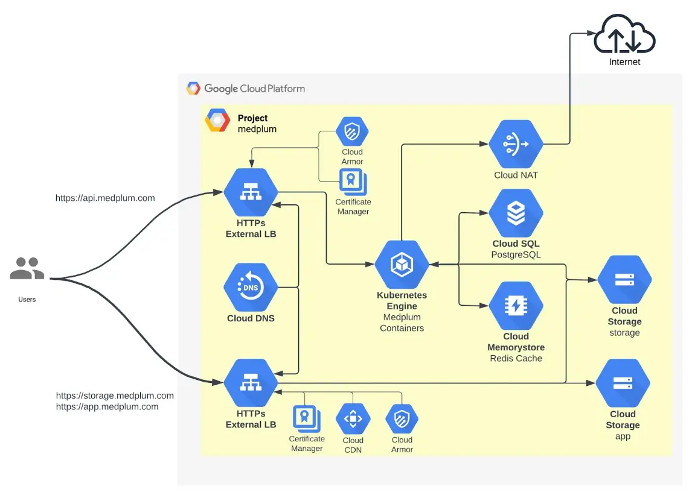

# Install on GCP

This document is intended to guide Medplum through the deployment of a comprehensive infrastructure on Google Cloud Platform (GCP) using Terraform. It provides detailed instructions and configurations necessary to set up essential components such as a Virtual Private Cloud (VPC), Google Kubernetes Engine (GKE) cluster, Cloud SQL database, Cloud Storage buckets, and Redis instances. The purpose is to ensure a smooth and efficient deployment process tailored to Medplum’s specific requirements, facilitating scalability, security, and high availability within their cloud environment.

:::caution

This deployment option has been validated for production use and offers a robust foundation for your implementation. However, it provides a less-automated setup and requires significant operational expertise.

This is a complex multi-step process, and requires high proficiency with GCP, Terraform, Node.js, and command line tools.

Medplum strives to make this as easy as possible, but despite our best efforts, it is still challenging.

If you have any questions, please [contact us](mailto:hello@medplum.com) or [join our Discord](https://discord.gg/medplum).

:::

## High-level overview {#high-level-overview}

To deploy Medplum in GCP, the process is divided into two parts:

- Static Infrastructure (using terraform)
- Medplum App (helm chart)

This division allows a fully customizable deployment, for example: if a customer wants to use an existing GKE cluster, they can just deploy the helm chart to it.

The Medplum application is configured using a secret in GCP Secrets Manager.
See [Generate Configuration Secret](#generate-configuration-secret)

### GCP Architecture



### Infrastructure summary

- The Medplum backend (API) container runs in GKE.
  - The API is exposed using Ingress, which creates a GCP Load Balancer
  - The Load balancer has a WAF (Cloud Armor)
  - Google-managed certificates are used
- We use managed Redis (Memorystore) and Cloud SQL for cache and PostgreSQL
- All outbound connections go through a Cloud NAT (fixed IP)
- There bottom Load Balancer is deployed using terraform, and it is used to expose the frontend (app) and storage buckets, using Google CDN
  - The Load balancer has a WAF (Cloud Armor)
  - Google-managed certificates are used

### High-level deployment process {#high-level-deployment-process}

1. Deploy static infrastructure (GKE, CloudSQL, Redis, Storage Buckets, LB)
2. With the values from Step 1, create the Medplum app configuration
3. With the values from Step 1, point the DNS records
4. Deploy the backend application using the helm chart
5. Copy the frontend files to the CDN bucket

## GCP Deployment {#gcp-deployment}

### Infrastructure Deployment (Terraform) {#infrastructure-deployment}

The `terraform` folder contains **Terraform** configurations for deploying infrastructure on **Google Cloud Platform (GCP)**. The setup includes a **Virtual Private Cloud (VPC)**, **Google Kubernetes Engine (GKE) cluster**, **Cloud SQL**, **Cloud Storage Buckets**, **Redis**, and more.

#### Prerequisites {#prerequisites}

- [Terraform](https://www.terraform.io/downloads.html) installed on your local machine.
- A **GCP** account with the necessary permissions to create resources.
- A **GCP** project where the resources will be deployed.
- **Google Cloud SDK** installed and authenticated with your GCP account.

#### Clone the Repository {#clone-the-repository}

Run:

```bash
git clone https://github.com/medplum/medplum
cd terraform/gcp/
```

#### Configure Backend (Optional) {#configure-backend}

If you want to use a [remote backend](https://developer.hashicorp.com/terraform/language/backend) for storing the Terraform state, uncomment and configure the backend.tf file.

#### **Initialize Terraform** {#initialize-terraform}

Modify the `terraform.tfvars` file to enter your project-specific values:

```
# GCP project configuration - Change these values to use your own project, region, and zone
project_id = "your-project-id"
region     = "your-region"
zone       = "your-zone"

# Common enforced labels - Change these values to use your own labels
labels = {
  env     = "your-environment"  # e.g., "dev", "staging", "prod"
  purpose = "your-purpose"      # e.g., "gke", "web", "database"
  owner   = "your-owner"        # e.g., "team-name", "project-owner"
}
```

#### Initialize Terraform {#initialize-terraform-1}

Initialize the Terraform working directory to download the necessary provider plugins and modules:

```bash
terraform init
```

#### Plan the Deployment {#plan-the-deployment}

Generate and review an execution plan to ensure the configuration is correct:

```bash
terraform plan
```

#### Apply the Configuration {#apply-the-configuration}

Apply the Terraform configuration to create the resources in GCP:

```bash
terraform apply
```

### Generate configuration secret {#generate-configuration-secret}

The configuration secret holds the Medplum application configuration and it contains the connection strings to the rest of the infrastructure that we deployed before, using terraform.

**1\. Create the Secret in Secret Manager:**

Use the gcloud secrets create command to create a new secret with automatic replication and labels.

```bash
gcloud secrets create config-secret --replication-policy="automatic"
```

**2\. Prepare the Secret Data:**

Create a JSON file containing your secret data. Save it as secret_data.json.

```bash
cat <<EOF > secret_data.json
{
  "port": 8103,
  "baseUrl": "http://localhost:8103/",
  "issuer": "http://localhost:8103/",
  "audience": "http://localhost:8103/",
  "jwksUrl": "http://localhost:8103/.well-known/jwks.json",
  "authorizeUrl": "http://localhost:8103/oauth2/authorize",
  "tokenUrl": "http://localhost:8103/oauth2/token",
  "userInfoUrl": "http://localhost:8103/oauth2/userinfo",
  "appBaseUrl": "http://localhost:3000/",
  "binaryStorage": "file:./binary/",
  "storageBaseUrl": "http://localhost:8103/storage/",
  "supportEmail": "\"Medplum\" <support@medplum.com>",
  "googleClientId": "397236612778-c0b5tnjv98frbo1tfuuha5vkme3cmq4s.apps.googleusercontent.com",
  "googleClientSecret": "",
  "recaptchaSiteKey": "6LfHdsYdAAAAAC0uLnnRrDrhcXnziiUwKd8VtLNq",
  "recaptchaSecretKey": "6LfHdsYdAAAAAH9dN154jbJ3zpQife3xaiTvPChL",
  "botLambdaRoleArn": "",
  "botLambdaLayerName": "medplum-bot-layer",
  "vmContextBotsEnabled": true,
  "defaultBotRuntimeVersion": "vmcontext",
  "allowedOrigins": "*",
  "introspectionEnabled": true,
  "database": {
    "host": "YOUR_DB_HOST",
    "port": 5432,
    "dbname": "medplum",
    "username": "medplum",
    "password": "medplum"
  },
  "redis": {
    "host": "YOUR_REDIS_HOST",
    "port": 6379
  },
  "bullmq": {
    "removeOnFail": { "count": 1 },
    "removeOnComplete": { "count": 1 }
  },
  "shutdownTimeoutMilliseconds": 30000,
  "chainedSearchWithReferenceTables": true
}
EOF
```

- Replace **YOUR_DB_HOST** and **YOUR_REDIS_HOST** with the actual hostnames or IP addresses of your database and Redis instances.
- Ensure the JSON content is correctly formatted and that any variables or placeholders are replaced with actual values.
- See [/docs/self-hosting/presigned-urls] to setup presigned URLs

**3\. Add a New Secret Version with the Secret Data:**

Use the gcloud secrets versions add command to add the secret data to your secret.

```bash
gcloud secrets versions add config-secret --data-file=secret_data.json
```

### Configure DNS {#configure-dns}

After deploying the infrastructure, you need to point your domains to the external load balancer created by Terraform.

**Obtain Load Balancer IP Address:**

Retrieve the external IP address of the CDN external load balancer:

```bash
gcloud compute addresses list --global --filter="name=('medplum-elb')"
```

Note the IP address associated with medplum-elb.

- **Update DNS Records:** In your DNS provider’s management console, create A records pointing your domains to the load balancer’s IP address:
- **For `storage.example.com`:** Create an A record for storage.example.com pointing to the load balancer’s IP.
- **For `app.example.com`:** Create an A record for app.example.com pointing to the same load balancer’s IP.

This ensures that traffic to these domains is routed through the CDN-enabled load balancer, which serves content from your backend buckets configured in Terraform.

### Deploy APP Using Helm {#deploy-app-using-helm}

The Helm chart is a package that contains `yaml` templates that represents Kubernetes Objects.

The helm chart can be found in the `helm` directory.

**It will deploy:**

- Deployment
- Horizontal Pod Autoscaler
- Service
- Ingress with GCP Managed Certificate and Backend Config (Cloud Armor)
  - The ingress is optional. Users can choose to expose the API with other methods
- Service Account

#### **Deploy your backend API to the GKE cluster using Helm:**

#### Configure kubectl {#configure-kubectl}

Get credentials for your GKE cluster:

```bash
gcloud container clusters get-credentials medplum-gke --region your-region --project your-project-id
```

Replace your-region and your-project-id with your actual values.

**Note:** Ensure your local machine’s public IP address is included in the master_authorized_networks in your Terraform GKE configuration to allow access to the cluster. To find your public IP address:

```bash
curl ifconfig.me
```

Update the master_authorized_networks in your terraform.tfvars configuration accordingly:

```
master_authorized_networks = [
  {
    cidr_block   = "your-public-ip/32"
    display_name = "Your Machine"
  },
]
```

Reapply the Terraform configuration if you make changes:

```bash
terraform apply
```

#### Navigate to Your Helm Chart Directory {#navigate-to-your-helm-chart-directory}

```bash
cd medplum/helm
```

#### Edit the values.yaml File {#edit-the-values.yaml-file}

Edit the values.yaml file to override default values, specifying your cloud provider, project_id and config_sicret_id:

```yaml
global:
  cloudProvider: gcp # Supported values: gcp. # roadmap: aws, azure
  gcp:
    projectId: [MY_PROJECT_ID] # Your Google Cloud Platform project ID
    secretId: [MY_CONFIG_SECRET_ID] # The secret ID for configuration in Google Cloud Platform
```

Replace `[MY_PROJECT_ID]` with your actual GCP project id.
Replace [`[MY_CONFIG_SECRET_ID]`](#generate-configuration-secret) with the secret name created the step before.

#### Edit service account values {#edit-service-account-values}

```yaml
serviceAccount:
  annotations:
    iam.gke.io/gcp-service-account: [MY_GCP_SERVICE_ACCOUNT] # Your Google Cloud Platform service account e.i: medplum-server@[MY_PROJECT_ID].iam.gserviceaccount.com
```

    Replace `[MY_GCP_SERVICE_ACCOUNT]` with your actual GCP service account which was created by terraform and its name is `medplum-server@[MY_PROJECT_ID].iam.gserviceaccount.com`

**Edit ingress values:**

(ingress is optional, customers can choose to use whatever method they like to expose the app)

```yaml
ingress:
  deploy: true
  domain: api.yourdomain.com
```

    Replace `api.yourdomain.com` with your actual domain.

**Install the Application:**

```bash
helm install medplum-server . -n medplum --create-namespace -f values.yaml
```

Note: “.” is the `./path-to-your-helm-chart.` The `values.yam`l is in the same directory as helm chart

- **Update DNS Records:**

Obtain the IP address of the Ingress:

```bash
kubectl get ingress medplum-server --namespace medplum

NAME             CLASS    HOSTS                     ADDRESS        PORTS   AGE
medplum-server   <none>   api.yourdomain.com        34.8.101.254   80      18h
```

Update your DNS records to point api.yourdomain.com to the Ingress IP address.

This is the backend API endpoint.

## Deploy the frontend (App) {#deploy-the-frontend-(app)}

Serve your frontend application through Cloud Storage and the CDN-enabled load balancer.

- **Upload to Cloud Storage:** Use the `deploy-app-gcp.sh` to deploy the frontend static contents to the CDN bucket
- **Content Delivery via CDN:** The CDN external load balancer serves content from the backend buckets (medplum-static-assets and medplum-user-content) associated with app.yourdomain.com and storage.yourdomain.com. Ensure your content is uploaded to the correct buckets for the CDN to serve.
- **Update DNS Records (If Necessary):** Ensure that app.yourdomain.com points to the load balancer’s IP address (already configured in step 7).

#### Post-Deployment Verification {#post-deployment-verification}

**Check Backend API:**

Test the API endpoint:

```
curl https://api.yourdomain.com/health
```

You should receive a successful response indicating the API is operational.

**Check Frontend Application:**

Visit https://app.example.com in a web browser to ensure it’s serving correctly and interacting with the backend API.

## Clean Up Resources (Optional) {#clean-up-resources}

If you need to tear down the infrastructure, use:

```bash
terraform destroy
```

**Note:** This will destroy all resources created by Terraform, including the GKE cluster and load balancer.

#### By following these steps, you will

- **Deploy Your Backend API** to a secure, private GKE cluster using Helm, as expected.
- **Configure Access** to your GKE cluster by updating master_authorized_networks.
- **Use Helm** to manage your Kubernetes deployments efficiently.
- **Serve Your Frontend Application** via Cloud Storage and the CDN-enabled load balancer.
- **Leverage the ELB Configuration** to efficiently deliver content through CDN.

## Important Notes

**Public IP Address:** Ensure your local machine’s public IP is included in the master_authorized_networks to access the GKE cluster.

```
master_authorized_networks = [
  {
    cidr_block   = "your-public-ip/32"
    display_name = "Your Machine"
  },
]
```

    •	**Replace Placeholder Values:** Ensure all placeholder values (e.g., your-project-id, your-region, yourdomain.com, your-public-ip) are replaced with your actual project-specific values.

## References

- **Terraform Documentation:** [https://www.terraform.io/docs/](https://www.terraform.io/docs/)
- **Google Cloud Documentation:** [https://cloud.google.com/docs](https://cloud.google.com/docs)
- **Kubernetes Documentation:** [https://kubernetes.io/docs/](https://kubernetes.io/docs/)
- **Helm Documentation:** [https://helm.sh/docs/](https://helm.sh/docs/)

## Used Terraform Modules

**VPC Module**
• **Path**: terraform/gcp/network.tf
• **Description**: Creates a **Virtual Private Cloud (VPC)** with subnets and secondary IP ranges. Configures private service access and network peering.

**Cloud NAT Module**
• **Path**: terraform/gcp/network.tf
• **Description**: Configures **Cloud NAT** for the GKE cluster, allowing outbound Internet access for private nodes.

**Cloud SQL Module**
• **Path**: terraform/gcp/cloud-sql.tf
• **Description**: Deploys a **PostgreSQL** instance with high availability settings, private IP configuration, and backup settings.

**GKE Module**
• **Path**: terraform/gcp/gke.tf
• **Description**: Sets up a private **GKE** cluster in autopilot mode, enabling features like horizontal pod autoscaling and HTTP load balancing.

**Redis Module**
• **Path**: terraform/gcp/redis.tf
• **Description**: Deploys a **Redis** cluster using **Memorystore** with specified node and shard configurations.

**Storage Buckets Module**
• **Path**: terraform/gcp/storage.tf
• **Description**: Creates **Google Cloud Storage** buckets with specific configurations, including versioning, lifecycle rules, and IAM bindings.

**External Load Balancer Module**
• **Path**: terraform/gcp/external-loadbalancer.tf
• **Description**: Configures an external **HTTP(S)** load balancer with **CDN** capabilities for serving static content.

**Service Accounts Module**
• **Path**: terraform/gcp/service-accounts.tf
• **Description**: Creates service accounts with specific roles for accessing GCP services like **Redis** and **Cloud SQL**.

**Project Services Module**
• **Path**: terraform/gcp/project-services.tf
• **Description**: Enables necessary GCP APIs for the project, such as **Compute Engine**, **Kubernetes Engine**, and more.

### Variables {#variables}

The configuration uses variables defined in variables.tf and terraform.tfvars. Ensure they are correctly set for your environment.

### Outputs {#outputs}

The configuration outputs sensitive information like the SQL database password, which is marked as sensitive in outputs.tf.

### Notes {#notes}

- Ensure that the **GCP project ID** and other variables are correctly set in terraform.tfvars.
- Review the **IAM** roles and permissions to ensure they align with your security policies.

For any issues or questions, please refer to the [Terraform documentation](https://www.terraform.io/docs/index.html) or the [GCP documentation](https://cloud.google.com/docs).
