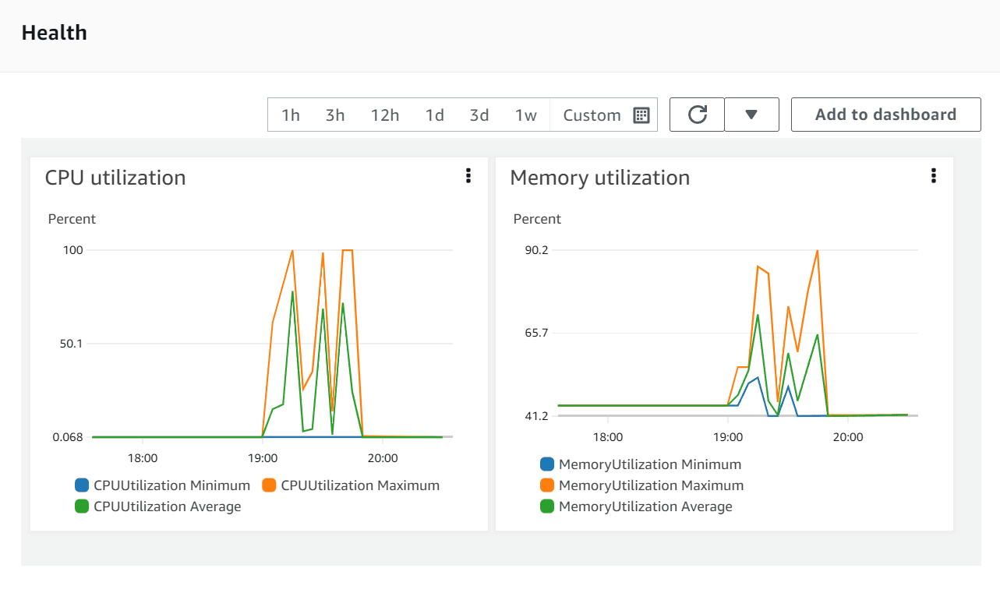
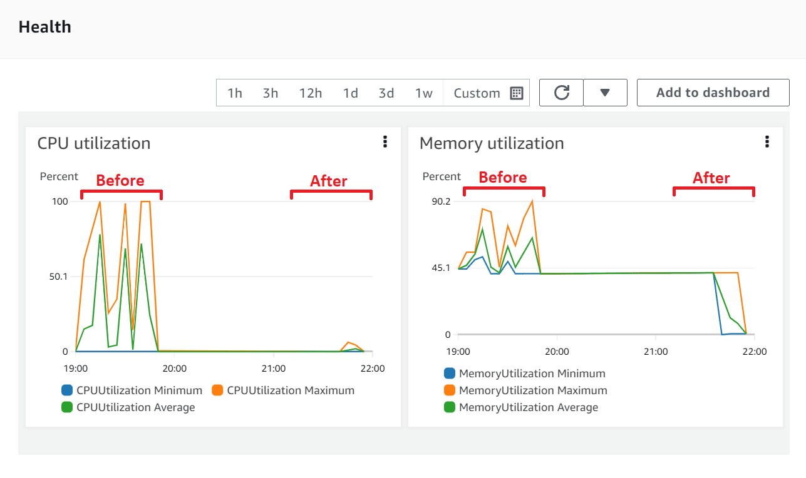
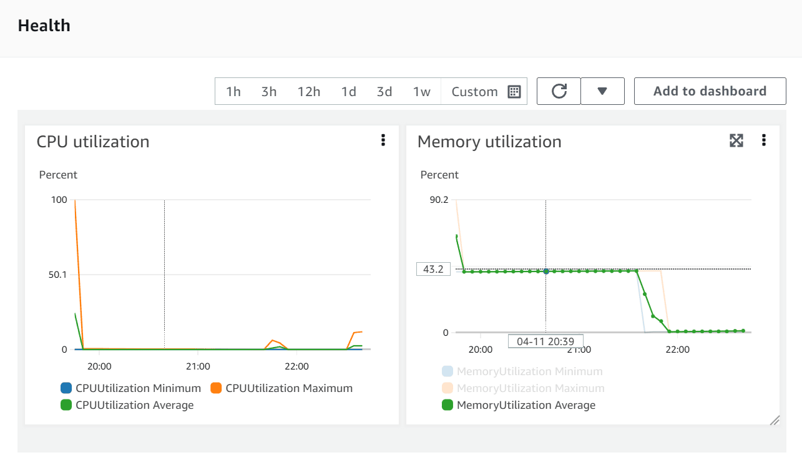
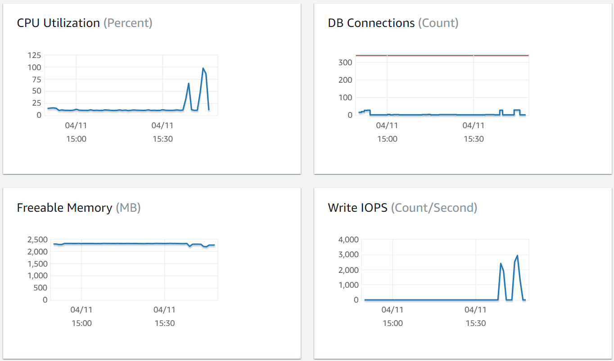
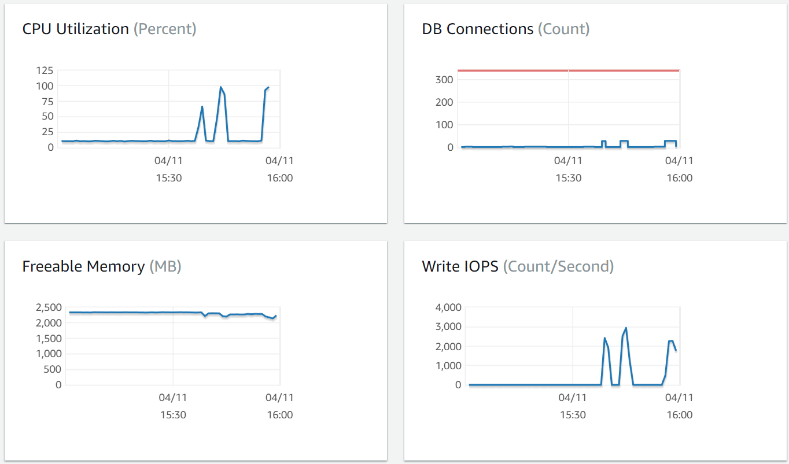

# Load Testing

Medplum is designed to be a critical component of system architecture. It is important that Medplum server is robust, performant, and scalable. But no matter how well designed, the capacity of the server will eventually be limited by the hardware it runs on. Therefore, it is also important to understand how Medplum server responds under extreme load, such as how and when the server will break.

This document describes how the Medplum team performs load testing using [Artillery](https://www.artillery.io).

We will demonstrate **"Load Testing"** (how the system functions under the projected number of concurrent users) and **"Stress Testing"** (how to find the upper limits of the system by testing it under extreme loads).

## Intro to Artillery

[Artillery](https://www.artillery.io) is a free and [open source](https://github.com/artilleryio/artillery) load testing utility.

Install the Artillery CLI to get started:

```bash
npm install -g artillery@latest
```

Read the [Artillery Docs](https://www.artillery.io/docs) for more details on Artillery.

## Scenarios

Artillery Scenarios define the steps you want the virtual users to go through during your tests. Here are two sample scenarios.

### Healthcheck Testing

One of the most basic Medplum server endpoints is the healtcheck at `/healthcheck`. This endpoint is unauthenticated. It connects to the Postgres database and Redis cache to verify connectivity. The healthcheck endpoint is used by load balancers to determine if the server instance is healthy.

Here is a sample Artillery configuration for testing the healthcheck endpoint:

```yml
# healthcheck.yml

config:
  target: 'https://api.staging.medplum.com'
  phases:
    - duration: 10
      arrivalRate: 10
      name: Warm up
    - duration: 300
      arrivalRate: 10
      rampTo: 100
      name: Ramp up load

scenarios:
  - name: 'Healthcheck'
    flow:
      - loop:
          - get:
              url: '/healthcheck'
        count: 10
```

The key points:

- Targeting the Medplum staging environment at [https://api.staging.medplum.com](https://api.staging.medplum.com)
- 10 second warmup with 10 virtual users with loops of 10 requests (100 requests per second)
- 5 minute ramp up to 100 virtual users with loops of 10 requests (1000 requests per second)
- Note that we use a blend of virtual users and loops to generate load without oversaturating our own host system

We can now run Artillery:

```bash
artillery run healthcheck.yml
```

Here is a sample report. Note that it was run on a laptop in California against the Medplum staging environment in AWS `us-east-1`.

```
All VUs finished. Total time: 5 minutes, 15 seconds

--------------------------------
Summary report @ 12:34:22(-0700)
--------------------------------

http.codes.200: ................................................ 165993
http.codes.502: ................................................ 7
http.request_rate: ............................................. 266/sec
http.requests: ................................................. 166000
http.response_time:
  min: ......................................................... 49
  max: ......................................................... 1661
  median: ...................................................... 82.3
  p95: ......................................................... 190.6
  p99: ......................................................... 391.6
http.responses: ................................................ 166000
vusers.completed: .............................................. 16600
vusers.created: ................................................ 16600
vusers.created_by_name.Healthcheck: ............................ 16600
vusers.failed: ................................................. 0
vusers.session_length:
  min: ......................................................... 1019.9
  max: ......................................................... 5141.8
  median: ...................................................... 1107.9
  p95: ......................................................... 2515.5
  p99: ......................................................... 3605.5
```

Hm, interesting

Good news: 99.99% of requests succeeded (165993 / 166000) and median response time was 82 ms. Our best response time was 49 ms, which is pretty close the [theoretical minimum of 40 ms due to speed of light](https://serverfault.com/a/137364/807396).

Bad news: We had a few failures (7 `http.codes.502`), p95 is underwhelming (190 ms), and p99 is disappointing (391 ms). We can do better for a production system.

Let's look at AWS ECS Health Metrics to help understand what happened.



At the time of that run, the Medplum staging server was configured with the bare minimum configuration:

| Key                  | Value      | Description                                                                                                                                                                                                                      |
| -------------------- | ---------- | -------------------------------------------------------------------------------------------------------------------------------------------------------------------------------------------------------------------------------- |
| `rdsInstanceType`    | t4g.medium | Optional [AWS RDS Aurora instance type](https://docs.aws.amazon.com/AmazonRDS/latest/AuroraUserGuide/Concepts.DBInstanceClass.html). Default value is the CDK default value (t3.medium).                                         |
| `desiredServerCount` | 1          | The number of running ECS/Fargate instances in steady state. Use `1` when getting started, and increase as necessary or for high availability.                                                                                   |
| `serverMemory`       | 512        | The amount (in MiB) of memory used by the ECS/Fargate instance. For example, 512, 1024, 2048, 4096, etc. See [Task size](https://docs.aws.amazon.com/AmazonECS/latest/developerguide/task_definition_parameters.html#task_size). |
| `serverCpu`          | 256        | The number of cpu units used by the task. For example, 512, 1024, 2048, 4096, etc. See [Task size](https://docs.aws.amazon.com/AmazonECS/latest/developerguide/task_definition_parameters.html#task_size).                       |

(See full documentation on [CDK config settings](/docs/self-hosting/config-settings))

That's a single server with 512 MiB of RAM and 0.25 vCPU.

Let's update those values to something more appropriate for a production environment: 3 servers each with 16 GiB of RAM and 4 vCPU.

| Key                  | Value      |
| -------------------- | ---------- |
| `rdsInstanceType`    | t4g.medium |
| `desiredServerCount` | 3          |
| `serverMemory`       | 16384      |
| `serverCpu`          | 4096       |

(See our [CDK guide](/docs/self-hosting/install-on-aws) for how to easily update your cluster configuration)

After the CDK ugprade is complete, we can run Artillery again:

```bash
artillery run healthcheck.yml
```

Artillery results:

```
All VUs finished. Total time: 5 minutes, 15 seconds

--------------------------------
Summary report @ 14:53:41(-0700)
--------------------------------

http.codes.200: ................................................ 166000
http.request_rate: ............................................. 554/sec
http.requests: ................................................. 166000
http.response_time:
  min: ......................................................... 63
  max: ......................................................... 481
  median: ...................................................... 82.3
  p95: ......................................................... 87.4
  p99: ......................................................... 98.5
http.responses: ................................................ 166000
vusers.completed: .............................................. 16600
vusers.created: ................................................ 16600
vusers.created_by_name.Healthcheck: ............................ 16600
vusers.failed: ................................................. 0
vusers.session_length:
  min: ......................................................... 1026
  max: ......................................................... 2545.6
  median: ...................................................... 1085.9
  p95: ......................................................... 1176.4
  p99: ......................................................... 1274.3
```

AWS ECS Health Metrics:



100% success rate and p99 sub 100 ms. Much better. Now we're ready to begin real testing.

### Create, Read, and Search

Now that we have completed the basics, we can begin to use the FHIR Datastore API to test real server functionality. The FHIR datastore includes CRUD operations `create`, `read`, `update`, and `delete`. These CRUD operations are authenticated. They connect to the database, execute SQL queries, access Redis, and perform additional logic. They are the bread and butter of what the server does in steady state.

For our test script, each virtual user will do the following:

1. Create a `Patient` with a random name
2. Read the patient by `id`
3. Search for the patient by `name`

Start Artillery:

```bash
artillery run healthcheck.yml
```

```yml
# fhir.yml

config:
  target: 'https://api.staging.medplum.com'
  phases:
    - duration: 10
      arrivalRate: 10
      name: Warm up
    - duration: 60
      arrivalRate: 10
      rampTo: 50
      name: Ramp up load
  variables:
    auth: 'Bearer MY_ACCESS_TOKEN'

scenarios:
  - name: 'FHIR Datastore'
    flow:
      - loop:
          - post:
              url: '/fhir/R4/Patient'
              headers:
                Authorization: '{{ auth }}'
              json:
                resourceType: Patient
                name:
                  - family: '{{ $randomString() }}'
              capture:
                - json: '$.id'
                  as: 'patientId'
                - json: '$.name[0].family'
                  as: 'familyName'
          - get:
              url: '/fhir/R4/Patient/{{ patientId }}'
              headers:
                Authorization: '{{ auth }}'
          - get:
              url: '/fhir/R4/Patient?name={{ familyName }}'
              headers:
                Authorization: '{{ auth }}'
        count: 10
```

(See Artillery docs on [Testing HTTP](https://www.artillery.io/docs/guides/guides/http-reference) for more details)

Results:

```
All VUs finished. Total time: 1 minute, 17 seconds

--------------------------------
Summary report @ 15:39:38(-0700)
--------------------------------

http.codes.200: ................................................ 20000
http.codes.201: ................................................ 10000
http.request_rate: ............................................. 504/sec
http.requests: ................................................. 30000
http.response_time:
  min: ......................................................... 75
  max: ......................................................... 803
  median: ...................................................... 100.5
  p95: ......................................................... 262.5
  p99: ......................................................... 391.6
http.responses: ................................................ 30000
vusers.completed: .............................................. 1000
vusers.created: ................................................ 1000
vusers.created_by_name.FHIR Datastore: ......................... 1000
vusers.failed: ................................................. 0
vusers.session_length:
  min: ......................................................... 2970.3
  max: ......................................................... 7542.9
  median: ...................................................... 3328.3
  p95: ......................................................... 6702.6
  p99: ......................................................... 7117
```

AWS ECS Health Metrics:



This time, we can also look at Postgres and Redis health metrics as well.



Here we can see that the test pushed the database pretty close to the max.

## Stress Testing

Let's run a test similar to "Create, Read, and Search" but a few changes:

1. Increase `duration` from 60 to 300
2. Increase `rampTo` from 50 to 100
3. Increase `loop` `count` from 10 to 20

This is intended to punish the cluster and find where it breaks.

Start Artillery:

```bash
artillery run healthcheck.yml
```

Somewhere in the middle, the number of timeouts spiked, so I terminated Artillery to put the server out of its misery.

```
--------------------------------------
Metrics for period to: 15:58:20(-0700) (width: 9.987s)
--------------------------------------

errors.ETIMEDOUT: .............................................. 347
http.codes.200: ................................................ 1423
http.codes.201: ................................................ 900
http.request_rate: ............................................. 291/sec
http.requests: ................................................. 2807
http.response_time:
  min: ......................................................... 80
  max: ......................................................... 9972
  median: ...................................................... 3134.5
  p95: ......................................................... 9047.6
  p99: ......................................................... 9801.2
http.responses: ................................................ 2323
vusers.completed: .............................................. 1
vusers.created: ................................................ 486
vusers.created_by_name.FHIR Datastore: ......................... 486
vusers.failed: ................................................. 347
vusers.session_length:
  min: ......................................................... 126543.4
  max: ......................................................... 126543.4
  median: ...................................................... 126796.9
  p95: ......................................................... 126796.9
  p99: ......................................................... 126796.9
```

Yikes. Lots of timeouts, p95 and p99 close to 10 seconds.



Confirmed - we maxed out the database.

As mentioned above, `rdsInstanceType` was configured at `t4g.medium` (the smallest available Postgres instance). The next step would be to increase the size of the Postgres instance. While upgrading `desiredServerCount`, `serverMemory`, and `serverCpu` happens fast, upgrading `rdsInstanceType` can take ~30 minutes. Start the CDK upgrade and grab a cup of coffee ☕

Stay tuned for next time with the increased database size.
