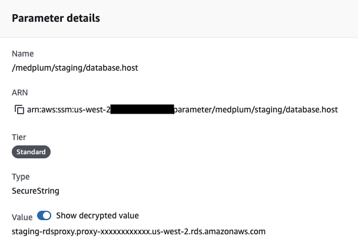
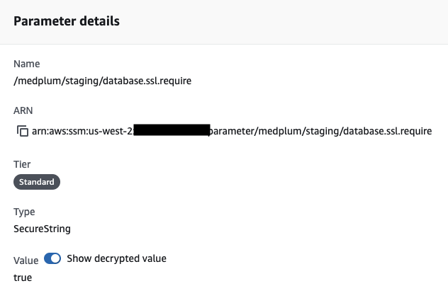
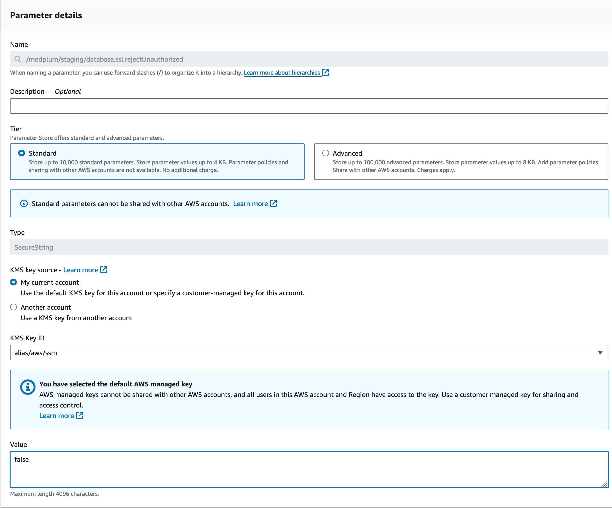
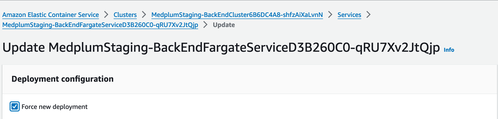

# Update RDS Parameters

Postgres exposes a wide variety of configuration settings that can be tuned to improve database performance. These
settings can be changed via the CDK, which creates and associates the database cluster with an AWS Parameter Group
containing the settings. This process requires a database restart to ensure all settings are applied, necessitating
the special procedures below to avoid any downtime.

:::caution

This is a complex, multi-step process, and requires high proficiency with AWS, Postgres, and command line tools.

Medplum strives to make this as easy as possible, but despite our best efforts, it is still challenging.

If you have any questions, please [contact us](mailto:hello@medplum.com) or [join our Discord](https://discord.gg/medplum).

:::

:::tip

If you are new to AWS CDK, we strongly recommend reading [Getting started with the AWS CDK](https://docs.aws.amazon.com/cdk/v2/guide/getting_started.html).

:::

## Postgres Parameters

The settings contained in the Parameter Group are passed directly to Postgres, so nearly[^1]
any [Postgres configuration parameter][postgres-config] can be set this way.

[postgres-config]: https://docs.aws.amazon.com/AmazonRDS/latest/AuroraUserGuide/AuroraPostgreSQL.Reference.ParameterGroups.html#AuroraPostgreSQL.Reference.Parameters.Cluster

[^1]: Notably, `log_line_prefix` [cannot be changed](https://docs.aws.amazon.com/AmazonRDS/latest/UserGuide/USER_LogAccess.Concepts.PostgreSQL.overview.parameter-groups.html#USER_LogAccess.Concepts.PostgreSQL.Log_Format.log-line-prefix)

### Example: `auto_explain`

As an example, one might wish to configure the `auto_explain` module to automatically log slow database queries and
their execution plans for analysis. The module must be added to the preload list, and configuration values must be added
to control its behavior:

```js
{
  "statement_timeout": "60000",
  "default_transaction_isolation": "REPEATABLE READ",
  // Add auto_explain to any other preloaded libraries in the default config
  "shared_preload_libraries": "pg_stat_statements,auto_explain",
  // Log details in the query plan
  "auto_explain.log_analyze": "true",
  "auto_explain.log_buffers": "true",
  // Log 10% of queries that take longer than 250 ms
  "auto_explain.log_min_duration": "250",
  "auto_explain.sample_rate": "0.1"
}
```

## Prerequisites

This document assumes that you have already created an RDS database instance. If not, see the [Install on AWS](/docs/self-hosting/install-on-aws) documentation. The Medplum server defaults to the following basic configuration:

```js
{
  // Cancel DB statements that run longer than a minute
  "statement_timeout": "60000",
  // Protect against concurrent modifications in transactions
  "default_transaction_isolation": "REPEATABLE READ"
}
```

## Step 1: Confirm multiple database instances

To perform a zero-downtime update, your cluster must have more than one database instance. Check the `rdsInstances`
value in your Medplum CDK config file: if the value is missing or `1`, then you first need to increase the value to `2`
or more.

Then run CDK `diff` and `deploy` to apply the change.

See [Upgrade AWS Infrastructure](/docs/self-hosting/install-on-aws#upgrade-aws-infrastructure) for more details.

## Step 2: Enable RDS Proxy

[RDS Proxy][rds-proxy] is a service that sits between the Medplum server and database cluster, providing additional
resilience and reliability when transient connection errors occur. This is critical to ensure zero downtime when
database instances are restarting, since even in the best case there may be a few seconds of intermittent connectivity
while the database instances fail over and restart.

If your cluster is already using RDS Proxy, skip to the next step.

### Set up RDS Proxy

Create the RDS Proxy and associated AWS resources using the `rdsProxyEnabled` setting in the CDK config file:

```js
{
  // ...

  "rdsInstances": 2,
  "rdsProxyEnabled": true,

  // ...
}
```

Then run CDK `diff` and `deploy` to apply the change. This should create the RDS Proxy service, as well as the
necessary ECS configuration to point the server instances to connect to the database cluster through the proxy instead
of directly.

### Redirect connections through the proxy

First, confirm the `database.host` and `database.ssl.require` settings are created in [AWS Parameter Store](/docs/self-hosting/config-settings#server-config):





Additionally, since the RDS Proxy uses a self-signed TLS certificate and requires TLS by default, set the
`database.ssl.rejectUnauthorized` parameter to `false` in order to ensure connectivity with the proxy:



Next, force a restart of the server ECS instances to pick up the new proxy configuration, and wait for it to complete:



## Step 3: Update cluster database parameters

Add the desired Postgres parameters under `rdsClusterParameters` in the CDK config file:

```js
{
  // ...

  "rdsClusterParameters": {
    "statement_timeout": "60000",
    "default_transaction_isolation": "REPEATABLE READ",
    "shared_preload_libraries": "pg_stat_statements,auto_explain",
    "auto_explain.log_analyze": "true",
    "auto_explain.log_buffers": "true",
    "auto_explain.log_min_duration": "250",
    "auto_explain.sample_rate": "0.1"
  },

  // ...
}
```

Then run CDK `diff` and `deploy` to apply the change.

:::warning

This CDK `deploy` will trigger database restarts.

:::

Once the database instances have all restarted, they should be using the new configuration parameters.

## Step 4: Tear down RDS Proxy

If your cluster does not use RDS Proxy during normal service, you can remove it once the database instance restarts are
complete.

First, revert the changes or delete the `database.host` and `database.ssl.require` server configuration parameters from AWS Parameter Store. Then, force
another restart of the server ECS instances to connect back to the RDS cluster directly, and wait for it to
complete.

After this, RDS Proxy can safely be removed via the CDK by setting `rdsProxyEnabled` to `false` in the CDK
config file, then running CDK `diff` and `deploy` to apply the change.
