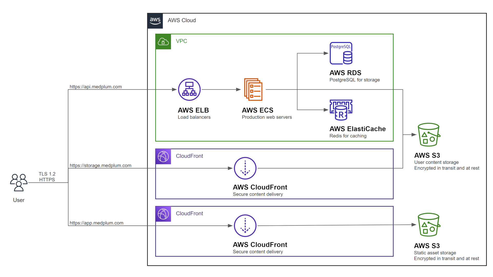

# Install on AWS

This guide will perform a complete production-ready installation in your AWS environment using [AWS CDK](https://aws.amazon.com/cdk/).

The resulting AWS configuration should look like the following:



## Prerequisites

You will need permission to access the following AWS services:
1. ECR
2. ECS
3. RDS
4. S3
5. CloudFront

You will need the ARN for [ACM Certificates](https://docs.aws.amazon.com/acm/latest/userguide/acm-overview.html) for the following hosts:
1. App (i.e., app.example.com)
2. API (i.e., api.example.com)
3. Storage (i.e., storage.example.com)

While CDK can provision certificates, we do not recommend doing so.

## Setup

Create a Medplum CDK config file.

## Synth

Run CDK synth:

```bash
npx cdk synth
```

## Deploy

Run CDK deploy:

```bash
npx cdk deploy
```
