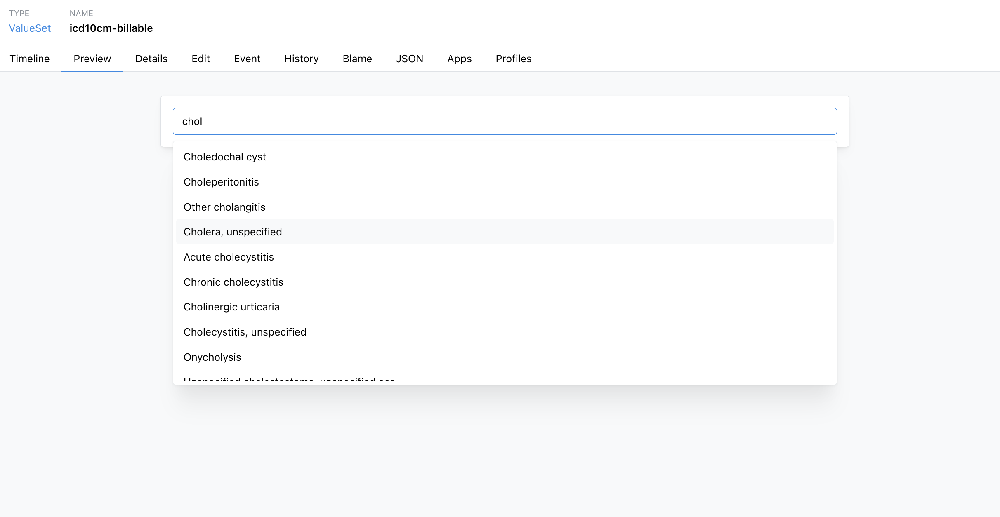
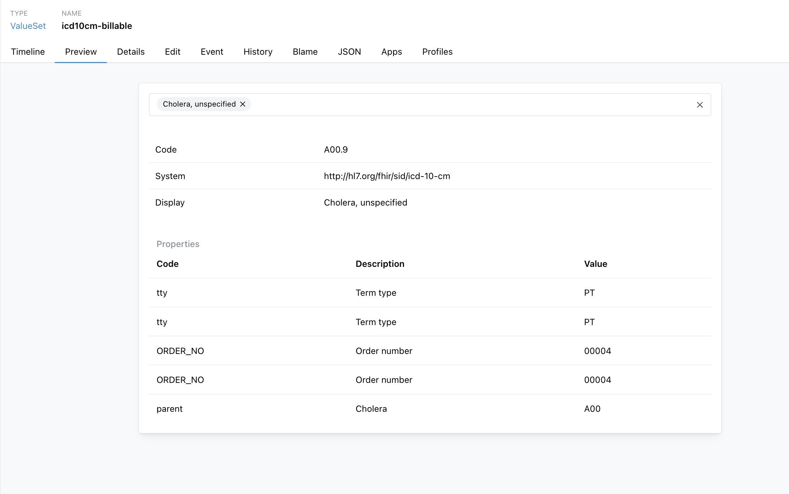

# Filtering Large Code Systems

SNOMED CT, RxNorm, and ICD-10-CM contain far more codes than a form field, typeahead, or Questionnaire should
expose directly. Binding to the full code system tends to surface the wrong codes: header codes next to
billable diagnoses, drug ingredients next to prescribable products, or clinical findings mixed in with
unrelated situations and qualifiers.

A scoped `ValueSet` fixes this. This guide covers the common case: filtering a `CodeSystem` you don't own, where you can read the
code system's data but can't modify the `CodeSystem` resource itself. You still create and own the `ValueSet`
— everything below works through `$lookup` and `ValueSet.compose.filter`, without needing write access to the
`CodeSystem` you're filtering.

If you're defining your own local codes instead, see [Local Codes](/docs/terminology/local-codes).

## Step 1: Understand the code system

### Hierarchy

A hierarchy is a parent-child relationship between codes, where the parent's meaning is a superset of the
child's — every child is a more specific kind of its parent. In SNOMED CT, for example, *Clinical finding*
contains *Diabetes mellitus*, which in turn contains *Type 2 diabetes mellitus*; selecting a parent implicitly
covers everything beneath it. That is what lets one filter stand in for thousands of codes.

Check `CodeSystem.hierarchyMeaning`. Most clinical code systems (SNOMED CT, and most `is-a` trees) use
`"is-a"` — an `is-a` or `descendent-of` filter selects codes that are children of some parent code. Some code systems, like LOINC, have
no real hierarchy. For those, filter on properties or list codes explicitly instead.

### Term types

Many code systems tag the *role* of a code separately from its position in the hierarchy, as a
`CodeSystem.concept.property` populated when the code system was imported. Two sibling codes can have very
different selectability:

- **RxNorm** uses `TTY` for `IN` (ingredient), `BN` (brand name), and `SCD`/`SBD` (the actual prescribable
  drug concepts). The default `MedicationRequest.medication` binding includes all of these, so a prescriber
  typing a drug name sees ingredients and brand names mixed in with real orderable products.
- **ICD-10-CM** has category codes (`Z01`) above billable leaf codes (`Z01.411`). Filtering on
  `property: tty, op: =, value: PT` ("Preferred Term") gets close to "billable codes only."
- **SNOMED CT** leans on its hierarchy rather than a term-type property. Every concept lives under one of a
  handful of top-level branches — *Clinical finding* (`404684003`), *Procedure* (`71388002`), and *Observable
  entity* (`363787002`) among them — so scoping a filter to the right branch is what keeps unrelated concepts
  (procedures, body structures, qualifiers) out of, say, a findings picker. Which branch you want depends on
  your use case.

Check whether a system you're filtering has a usable property by calling
[`$lookup`](/docs/api/fhir/operations/codesystem-lookup) on a few sample codes and inspecting the returned
`property` list. Not every system carries one. If it doesn't, you can't add it yourself — that requires write
access to the `CodeSystem` resource, which you typically don't have for a shared or standard system. Fall back
to a hierarchy filter or an explicit code list instead (see [Step 3](#step-3-exclude-header-and-non-selectable-codes)).

### Content completeness

`CodeSystem.content` (`complete`, `fragment`, or `example`) determines what `$expand` can return. If the
system only has a partial import (`content: "fragment"`), a filter can only match what was imported — it
silently returns nothing for codes outside that subset. If you need codes the current import doesn't have,
that's a question for whoever manages the import, not something a `ValueSet` filter can fix.

## Step 2: Filter by hierarchy, by property, or both

`ValueSet.compose.include.filter` supports two kinds of filters. Multiple filters in one `include` block are
combined with AND. Both work read-only, against whatever hierarchy and properties the `CodeSystem` already
defines.

**Hierarchy** (`property: "concept"`):

- `is-a <code>` — the code plus all descendants. Use when the parent itself is a selectable concept.
- `descendent-of <code>` — descendants only. Use when the parent is just an organizational label, and you
  want it excluded from the result.

For multiple, unrelated subtrees, add multiple `include` entries — entries combine with OR.

**Property** (`property: "<property-code>"`):

```json
{ "property": "tty", "op": "=", "value": "PT" }
```

Combine both to say "this subtree, only this term type":

```json
{
  "resourceType": "ValueSet",
  "status": "active",
  "url": "http://example.com/fhir/ValueSet/icd10-z01-billable",
  "compose": {
    "include": [
      {
        "system": "http://hl7.org/fhir/sid/icd-10-cm",
        "filter": [
          { "property": "concept", "op": "descendent-of", "value": "Z01" },
          { "property": "tty", "op": "=", "value": "PT" }
        ]
      }
    ]
  }
}
```

## Step 3: Exclude header and non-selectable codes

FHIR has a concept for codes that are valid but shouldn't be offered as new selections: a `notSelectable`
property on the concept. `ValueSet/$expand?excludeNotForUI=true` strips these out of the result after
expansion — separate from `compose.filter`, which controls membership during expansion.

This only helps if the `CodeSystem` already marks concepts this way — check with `$lookup` before relying on
it. Setting `notSelectable` means editing the `CodeSystem` resource, which most default or shared code
systems (SNOMED CT, RxNorm, ICD-10-CM, and other systems already loaded into your project) don't give you
write access to.

If `notSelectable` isn't already populated, exclude header and category codes with the tools from Step 2
instead:

- `descendent-of` naturally excludes the parent/header code from the result, with no property needed.
- An existing term-type property (like `tty = PT` on ICD-10-CM) is often a good substitute for "selectable."

## Testing Your ValueSet

You can preview a `ValueSet` in [app.medplum.com](https://app.medplum.com) before wiring it into your
application. Open the `ValueSet` resource and go to the **Preview** tab.

Preview runs `$expand` against your filter, with a search box wired to the `filter` parameter — type into it
to confirm your `compose.filter` returns the codes you expect. This is the same query your application will
make, so it's a fast way to check a filter without writing any code. Several similarly-named codes can match
the same search term — searching `chol` against a billable ICD-10-CM ValueSet turns up cholera,
cholecystitis, and choledochal cyst side by side:



Selecting a result shows the underlying code, system, and any properties defined on that concept — useful for
confirming you're getting the concept you meant to, and for checking properties like `tty` before relying on
them in a filter:


