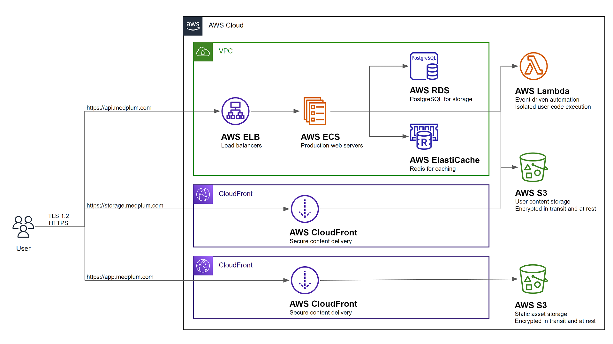
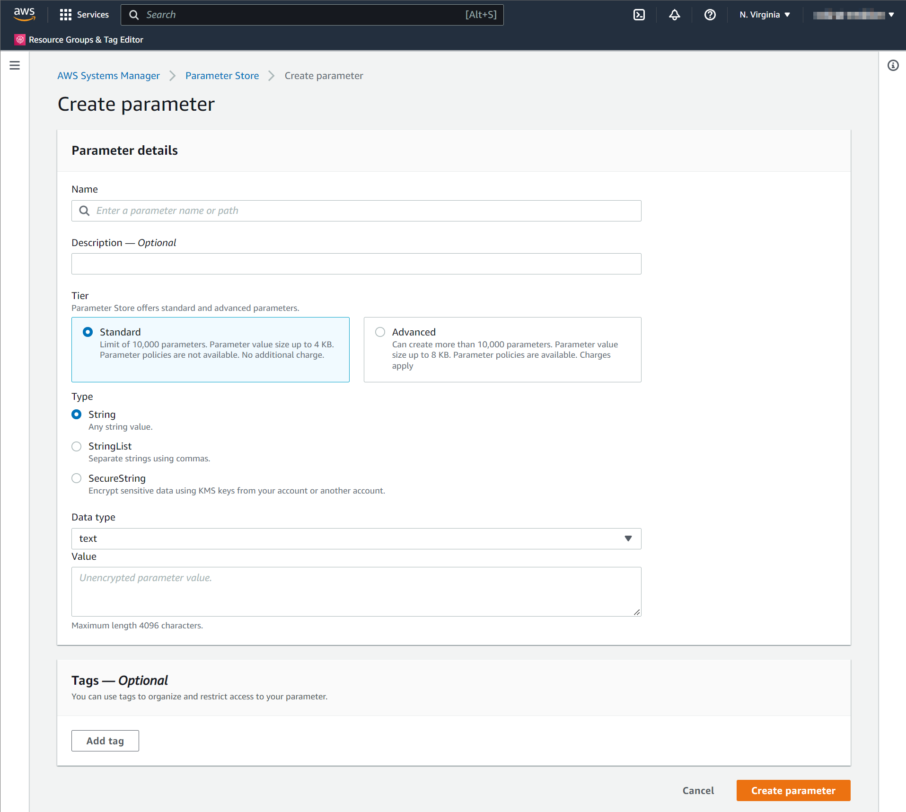

# Install on AWS

This guide will perform a complete production-ready installation in your AWS environment using [AWS CDK](https://aws.amazon.com/cdk/).

The resulting AWS configuration should look like the following:



## Prerequisites

You will need permission to access the following AWS services:

| Service                              | Details                                                                               |
| ------------------------------------ | ------------------------------------------------------------------------------------- |
| Elastic Compute Cloud (EC2)          | Create a Virtual Private Cloud (VPC) and related security groups                      |
| Elasticache                          | Create a hosted Redis cluster for caching and task queue                              |
| Elastic Load Balancing (ELB)         | Create a load balancer for server redundancy and high availability                    |
| Identity and Access Management (IAM) | Create service roles for the API server and bot lambdas                               |
| CloudFront                           | Securely deliver content with low latency and high transfer speeds                    |
| CloudWatch Logs                      | Create and manage log groups for server logs                                          |
| Relational Database Service (RDS)    | Create a hosted Postgres Aurora database                                              |
| Route 53                             | Create DNS entries for the services                                                   |
| Simple Storage Service (S3)          | Host static web content, store and retrieve dynamic user content for file attachments |
| Secrets Manager                      | Store encrypted secret configuration details such as database credentials             |
| Systems Manager (SSM)                | Store configuration details                                                           |
| Web Application Firewall (WAF)       | Protect your web applications or APIs against common web exploits and bots            |

## Setup

Most AWS resources are automatically created using CDK, but some either cannot or are not recommended. Please follow these initial setup steps to prepare your account.

### Create HTTPS certificates

You will need the ARN for [ACM Certificates](https://docs.aws.amazon.com/acm/latest/userguide/acm-overview.html) for the following hosts:

1. App (i.e., app.example.com)
2. API (i.e., api.example.com)
3. Storage (i.e., storage.example.com)

Follow the [Requesting a public certificate](https://docs.aws.amazon.com/acm/latest/userguide/gs-acm-request-public.html) guide three times, one for each certificate.

While CDK can provision certificates, it is not recommended.

### Create a signing key

<details>
  <summary>Why do I need a signing key?</summary>
  <div>
    <p>Medplum uses S3 and CloudFront for binary content such as images, videos, and other file attachments.  To serve this content, the API server generates <a href="https://docs.aws.amazon.com/AmazonCloudFront/latest/DeveloperGuide/private-content-signed-urls.html">AWS CloudFront signed URLs</a> which are valid for a configurable period of time.</p>
    <p>AWS CloudFront signed URLs have many desirable properties.  They are fast and virtually infinitely scalable.  They work well with standard web techniques such as `&lt;img&gt;` and `&lt;video&gt;` tags.  They support HTTP Range Requests for optimal video performance.</p>
  </div>
</details>

Generate a 2048 bit RSA key:

```sh
openssl genrsa -des3 -out private.pem 2048
```

Export the public key to a file:

```sh
openssl rsa -in private.pem -outform PEM -pubout -out public.pem
```

For more details, see [AWS CloudFront - Using signed URLs](https://docs.aws.amazon.com/AmazonCloudFront/latest/DeveloperGuide/private-content-signed-urls.html).

### Add the signing key to CloudFront

Follow the [Creating key pairs for your signers](https://docs.aws.amazon.com/AmazonCloudFront/latest/DeveloperGuide/private-content-trusted-signers.html#private-content-creating-cloudfront-key-pairs) guide to add your signing key to CloudFront.

Make note of the key ID for future steps.

### Create a S3 bucket for logging

Some components of the stack can be configured to capture detailed information, stored in an S3 bucket. This is optional, and disabled by default.

If you want to capture these detailed logs, follow these steps:

First, follow the [Creating a bucket](https://docs.aws.amazon.com/AmazonS3/latest/userguide/create-bucket-overview.html) guide to create an S3 bucket for logging. All log backups will be stored in this directory.

Second, follow the [Access logs for your Application Load Balancer](https://docs.aws.amazon.com/elasticloadbalancing/latest/application/load-balancer-access-logs.html) guide to setup permissions to the bucket.

Make note of the bucket name for the following CDK config settings below:

- `loadBalancerLoggingEnabled`
- `loadBalancerLoggingBucket`
- `loadBalancerLoggingPrefix`
- `clamscanEnabled`
- `clamscanLoggingBucket`
- `clamscanLoggingPrefix`

### Create a SES email address

Follow the [Creating and verifying identities in Amazon SES](https://docs.aws.amazon.com/ses/latest/dg/creating-identities.html) guide to register an email address for system generated emails.

### Create a CDK config file

Create a Medplum CDK config file. This is a JSON file that contains all of the custom infrastructure configuration settings of the new environment. Note that this is distinct from the server config file (see next section).

Here is a full example. See the table below for details on each setting.

| Key                          | Description                                                                                                                                                                                                                                    |
| ---------------------------- | ---------------------------------------------------------------------------------------------------------------------------------------------------------------------------------------------------------------------------------------------- |
| `name`                       | The short name of your environment. This should be unique among your Medplum deployments. This will be used as part of Parameter Store path and CloudWatch Logs path. For example, `prod` or `staging`.                                        |
| `stackName`                  | The long name of your environment. This will be included in many of the AWS resource names created by CDK. For example, `MyMedplumStack` or `MedplumStagingStack`.                                                                             |
| `accountNumber`              | Your AWS account number. A 12-digit number, such as 123456789012, that uniquely identifies an AWS account. Account IDs are not considered sensitive information.                                                                               |
| `region`                     | The AWS region where you want to deploy. **Note:** Only `use-east-1` is supported at this time.                                                                                                                                                |
| `domainName`                 | The domain name that represents your Route 53 Hosted Zone. For example, `medplum.com` or `my-med-app.io`.                                                                                                                                      |
| `apiDomainName`              | The domain name of the API server. This should be a subdomain of `domainName`. For example, `api.medplum.com` or `api.staging.medplum.com`.                                                                                                    |
| `apiPort`                    | The port number that the API server binds to inside the Docker image. By default, you should use `8103`. In some cases, you may need to use `5000`.                                                                                            |
| `apiSslCertArn`              | The ARN of the ACM Certificate for the API server domain that you registered before.                                                                                                                                                           |
| `appDomainName`              | The domain name of the app server. This should be a subdomain of `domainName`. For example, `app.medplum.com` or `app.staging.medplum.com`.                                                                                                    |
| `appSslCertArn`              | The ARN of the ACM Certificate for the app server domain that you registered before.                                                                                                                                                           |
| `storageBucketName`          | The name of the S3 bucket for file storage that you created before.                                                                                                                                                                            |
| `storageDomainName`          | The domain name that will be used to access the file storage using presigned URLs. For example, `storage.medplum.com`.                                                                                                                         |
| `storageSslCertArn`          | The ARN of the ACM Certificate for the storage server domain that you registered before.                                                                                                                                                       |
| `storagePublicKey`           | The contents of the public key file that you created before. By default, the file name is `public.pem`. The contents should start with `-----BEGIN PUBLIC KEY-----`.                                                                           |
| `maxAzs`                     | The maximum number of availability zones to use. If you want to use all availability zones, choose a large number such as 99. If you want to restrict the number, for example to manage EIP limits, then choose a small number such as 1 or 2. |
| `rdsInstances`               | The number of running RDS instances. Use `1` for a single instance, or `2` for a hot failover on standby.                                                                                                                                      |
| `desiredServerCount`         | The number of running ECS/Fargate instances in steady state. Use `1` when getting started, and increase as necessary or for high availability.                                                                                                 |
| `serverImage`                | The DockerHub server image to deploy. Use `medplum/medplum-server:latest` for the most recent version published by the Medplum team. Or use your own repository if you need to deploy a custom instance.                                       |
| `serverMemory`               | The amount (in MiB) of memory used by the ECS/Fargate instance. For example, 512, 1024, 2048, 4096, etc. See [Task size](https://docs.aws.amazon.com/AmazonECS/latest/developerguide/task_definition_parameters.html#task_size).               |
| `serverCpu`                  | The number of cpu units used by the task. For example, 512, 1024, 2048, 4096, etc. See [Task size](https://docs.aws.amazon.com/AmazonECS/latest/developerguide/task_definition_parameters.html#task_size).                                     |
| `loadBalancerLoggingEnabled` | Boolean flag to [Enable Access Logs to ELB](https://docs.aws.amazon.com/elasticloadbalancing/latest/application/enable-access-logging.html)                                                                                                    |
| `loadBalancerLoggingBucket`  | The logging bucket that you created before.                                                                                                                                                                                                    |
| `loadBalancerLoggingPrefix`  | A directory prefix to use for the S3 logs. For example, `elb`.                                                                                                                                                                                 |
| `clamscanEnabled`            | Boolean flag to enable [Serverless ClamScan antivirus](https://github.com/awslabs/cdk-serverless-clamscan)                                                                                                                                     |
| `clamscanLoggingBucket`      | The logging bucket that you created before.                                                                                                                                                                                                    |
| `clamscanLoggingPrefix`      | A directory prefix to use for the S3 logs. For example, `clamscan`.                                                                                                                                                                            |

Here is the server configuration for the Medplum staging environment:

```json
{
  "name": "staging",
  "stackName": "MedplumStagingStack",
  "accountNumber": "647991932601",
  "region": "us-east-1",
  "domainName": "medplum.com",
  "apiDomainName": "api.staging.medplum.com",
  "apiPort": 5000,
  "apiSslCertArn": "arn:aws:acm:us-east-1:647991932601:certificate/159b257b-a180-49c6-b188-4dc962d8e708",
  "appDomainName": "app.staging.medplum.com",
  "appSslCertArn": "arn:aws:acm:us-east-1:647991932601:certificate/b0d65b27-2ea8-4377-82e1-c41aa067655b",
  "storageBucketName": "medplum-staging-storage",
  "storageDomainName": "storage.staging.medplum.com",
  "storageSslCertArn": "arn:aws:acm:us-east-1:647991932601:certificate/2205bb8c-7da9-4992-b8ec-c2c79b43b586",
  "storagePublicKey": "-----BEGIN PUBLIC KEY-----\nMIIBIjANBgkqhkiG9w0BAQEFAAOCAQ8AMIIBCgKCAQEA3cnmD3HQbJU7WTGT2ZSO\nLt71c+xQ91m5FAzdFagfkQAG0CeyzHq8VzjLPinLDlOWCwQXfunjoBMP7iyVt/pE\n46ngR55In3UlzsMySHpUAi740u6oh0VeJOZA1x/FrVRYsxFx4XFJ92gcs5VvdT66\nwWTX7KznaIrxIvTWz384ogqXfg41QeoIISM2YUjqSMkyx7wY3xGrFvG5UuAAivbr\ni/ZZkkM2q9frpidpJx4evIuaHZS8fstbHFDbbFFqDMyuk7eAJRea1KH5TsjCHvTK\n5ANRyzq+mty47TKrI+2AQsxjH4mel2lC/at3udgtmfz1MTT7daFWfDKsVn8h3DsA\nJwIDAQAB\n-----END PUBLIC KEY-----",
  "maxAzs": 2,
  "rdsInstances": 1,
  "desiredServerCount": 1,
  "serverImage": "medplum/medplum-server:latest",
  "serverMemory": 512,
  "serverCpu": 256,
  "loadBalancerLoggingEnabled": true,
  "loadBalancerLoggingBucket": "medplum-logs-us-east-1",
  "loadBalancerLoggingPrefix": "elb-staging",
  "clamscanEnabled": true,
  "clamscanLoggingBucket": "medplum-logs-us-east-1",
  "clamscanLoggingPrefix": "clamscan"
}
```

Make note of this file name.

### Deploy Bot Lambda Layer

If you intend to use Medplum Bots, you will need an [AWS Lambda Layer](https://docs.aws.amazon.com/lambda/latest/dg/gettingstarted-concepts.html#gettingstarted-concepts-layer).

You can use the `deploy-bot-layer.sh` script to automate this process:

```bash
./scripts/deploy-bot-layer.sh
```

See the [Creating and sharing Lambda layers](https://docs.aws.amazon.com/lambda/latest/dg/configuration-layers.html) guide to learn more.

### Create a server config

Create a Medplum server config in AWS Parameter Store.

> **_TODO:_** Write documentation for how to use JSON config file format with Docker and CDK. It is technically possible using either a custom Dockerfile or a Docker layer on top of the official Medplum Docker image. It would require modifying the `MedplumTaskDefinition` `command` in `backend.ts`.

When running Medplum server on a local developer machine, Medplum server typically loads config settings from a JSON config file. By default, it loads config settings from `medplum.config.json`.

When running in AWS, Medplum server loads config settings from AWS Parameter Store, a feature of AWS Systems Manager (SSM).

Some configuration settings are created automatically by the CDK deployment (for example, database and redis connection details). Other settings must be created manually before the first deploy.

Learn more in the [Create a Systems Manager parameter](https://docs.aws.amazon.com/systems-manager/latest/userguide/parameter-create-console.html) AWS user guide.



When creating a parameter in AWS Parameter Store, you will be prompted for the parameter **Name**. The parameter **Name** uses the convention `/medplum/{environmentName}/{key}`.

For example, if your environment name is "prod", then the "baseUrl" parameter name is `/medplum/prod/baseUrl`.

You will also be prompted for a parameter "Type". The default option is "String". Medplum supports both "String" and "SecureString". "SecureString" is recommended for security and compliance purposes.

| Key                    | Description                                                                                                                                                                                           | Automatic |
| ---------------------- | ----------------------------------------------------------------------------------------------------------------------------------------------------------------------------------------------------- | --------- |
| `port`                 | The port number that the API server binds to inside the Docker image. By default, you should use `8103`. In some cases, you may need to use `5000`.                                                   | no        |
| `baseUrl`              | The fully qualified base URL of the API server including a trailing slash. For example, `https://api.example.com/`.                                                                                   | no        |
| `issuer`               | The JWK issuer. By default, Medplum server uses built in OAuth, so `issuer` should be the same as `baseUrl`.                                                                                          | no        |
| `audience`             | The JWK audience. By default, Medplum server uses built in OAuth, so `audience` should be the same as `baseUrl`.                                                                                      | no        |
| `jwksUrl`              | The JWKS URL. By default, Medplum server uses built in OAuth, so `jwksUrl` should be `baseUrl` + `.well-known/jwks.json`.                                                                             | no        |
| `authorizeUrl`         | The OAuth authorize URL. By default, Medplum server uses built in OAuth, so `authorizeUrl` should be `baseUrl` + `oauth2/authorize`.                                                                  | no        |
| `tokenUrl`             | The OAuth token URL. By default, Medplum server uses built in OAuth, so `tokenUrl` should be `baseUrl` + `oauth2/token`.                                                                              | no        |
| `userInfoUrl`          | The OAuth userinfo URL. By default, Medplum server uses built in OAuth, so `userInfoUrl` should be `baseUrl` + `oauth2/userinfo`.                                                                     | no        |
| `appBaseUrl`           | The fully qualified URL of the user-facing app. This is used for CORS and system generated emails. For example, `https://app.example.com/`.                                                           | no        |
| `binaryStorage`        | Where to store binary contents. This should be the CDK config `storageBucketName` with `s3:` prefix. For example, `s3:medplum-storage`.                                                               | no        |
| `storageBaseUrl`       | The fully qualified base URL of the binary storage. This should be the CDK config `storageDomainName` with `https://` prefix. For example, `https://storage.medplum.com/binary/`.                     | no        |
| `signingKeyId`         | The AWS key ID of the CloudFront signing key that you created before.                                                                                                                                 | no        |
| `signingKey`           | The private key of the CloudFront signing key.                                                                                                                                                        | no        |
| `signingKeyPassphrase` | The passphrase of the CloudFront signing key.                                                                                                                                                         | no        |
| `allowedOrigins`       | Optional comma separated list of allowed origins for [Cross-Origin Resource Sharing (CORS)](https://developer.mozilla.org/en-US/docs/Web/HTTP/CORS) requests. `appBaseUrl` is included automatically. | no        |
| `supportEmail`         | The email address to use when sending system generated messages. This email address must be registered in AWS SES.                                                                                    | no        |
| `googleClientId`       | If using Google Authentication, this is the Google Client ID.                                                                                                                                         | no        |
| `googleClientSecret`   | If using Google Authentication, this is the Google Client Secret.                                                                                                                                     | no        |
| `recaptchaSiteKey`     | If using reCAPTCHA, this is the reCAPTCHA site key.                                                                                                                                                   | no        |
| `recaptchaSecretKey`   | If using reCAPTCHA, this is the reCAPTCHA secret key.                                                                                                                                                 | no        |
| `botLambdaRoleArn`     | If using Medplum Bots, this is the ARN of the [Lambda execution role](https://docs.aws.amazon.com/lambda/latest/dg/lambda-intro-execution-role.html).                                                 | yes       |
| `botLambdaLayerName`   | If using Medplum Bots, this is the name of the [Lambda layer](https://docs.aws.amazon.com/lambda/latest/dg/invocation-layers.html). For example, `medplum-bot-layer`.                                 | no        |
| `database`             | The database connection details (created automatically).                                                                                                                                              | yes       |
| `redis`                | The redis connection details (created automatically).                                                                                                                                                 | yes       |

> **_TODO:_** Update the server with intelligent defaults to reduce the number of implicit configuration settings.

> **_TODO:_** Investigate creating a signing key automatically on first run.

## Synth

Run CDK synth:

```bash
npx cdk synth -c config=my-config.json
```

## Deploy

Run CDK deploy:

```bash
npx cdk deploy -c config=my-config.json
```

## Diff

Run CDK diff:

```bash
npx cdk diff -c config=my-config.json
```
