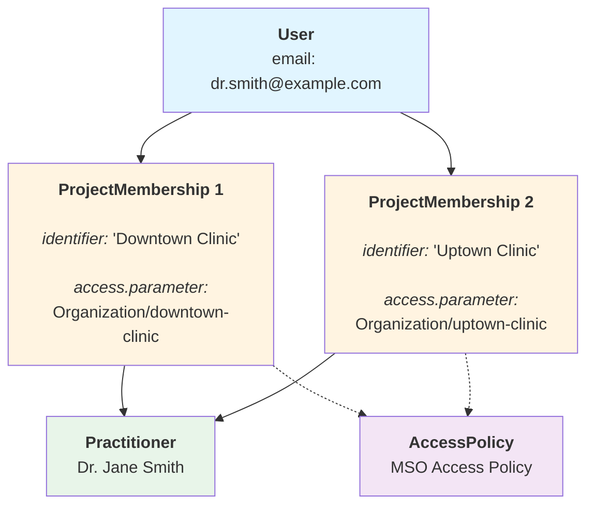
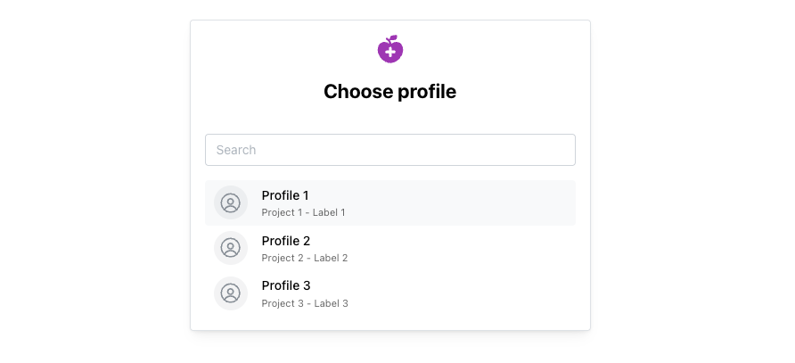

import Tabs from '@theme/Tabs';
import TabItem from '@theme/TabItem';

# Multiple ProjectMemberships in One Project

## Introduction

In Medplum, a single user can have multiple [`ProjectMembership`](/docs/api/fhir/medplum/projectmembership) resources within the same project, each with different [AccessPolicies](/docs/access/access-policies). This feature enables sophisticated access control scenarios where a user needs different levels of access to different subsets of data within a project.

:::warning Advanced Feature

Multiple ProjectMemberships is an **advanced Medplum feature**. ProjectMemberships are a crucial part of access control to the Medplum data store and determine what resources a user can read, write, or modify. Misconfiguring ProjectMemberships or AccessPolicies can result in Users being locked out of necessary resources or gaining unauthorized access to data.

**Before implementing multiple memberships:**
- Thoroughly understand [AccessPolicies](/docs/access/access-policies) and how they work
- Test extensively in a development environment
- Carefully plan your access control model
- Consider consulting with Medplum support or the community if you're unsure

:::

Common use cases include:

- **Multi-Organization Systems**: A practitioner working for multiple healthcare organizations within a Managed Service Organization (MSO), where each login provides access to a different organization's data. Read about the [Multi-Tenant Access Control](/docs/access/multi-tenant-access-policy) pattern and see our [MSO data model blog post](/blog/multi-tenant-mso) for more details.
- **Clinic-Specific Access**: A clinician who works at multiple clinic locations that needs different segmented login access to each clinic's patients and resources

## Core Concepts

By default, when you invite a user who is already a member of a project, Medplum will return an error to prevent duplicate memberships. However, you can override this behavior using the `forceNewMembership` parameter, which allows you to create additional ProjectMemberships for the same user.

Each ProjectMembership can have:
- A unique set of [AccessPolicies](/docs/access/access-policies) via the `access` or `accessPolicy` fields where a different parameter can be passed to the AccessPolicy for each membership
- Custom identifiers to help users distinguish between memberships during sign-in
- Different administrative privileges



## Creating Multiple Memberships

### Using forceNewMembership

To create multiple ProjectMemberships for the same user, use the [`/admin/projects/:projectId/invite`](/docs/api/project-admin/invite) endpoint with `forceNewMembership: true`.

<Tabs groupId="language">
  <TabItem value="ts" label="TypeScript">

```ts
// First membership - Downtown Clinic
await medplum.post('admin/projects/:projectId/invite', {
  resourceType: 'Practitioner',
  firstName: 'Jane',
  lastName: 'Smith',
  email: 'dr.smith@example.com',
  password: 'secure-password',
  membership: {
    access: [
      {
        policy: { reference: 'AccessPolicy/mso-policy' },
        parameter: [
          {
            name: 'organization',
            valueReference: { reference: 'Organization/downtown-clinic' }
          }
        ]
      }
    ],
    identifier: [
      {
        system: 'https://medplum.com/identifier/label',
        value: 'Downtown Clinic'
      }
    ]
  }
});

// Second membership - Uptown Clinic
// Note: forceNewMembership: true allows creating another membership
await medplum.post('admin/projects/:projectId/invite', {
  resourceType: 'Practitioner',
  firstName: 'Jane',
  lastName: 'Smith',
  email: 'dr.smith@example.com',
  forceNewMembership: true,
  membership: {
    access: [
      {
        policy: { reference: 'AccessPolicy/mso-policy' },
        parameter: [
          {
            name: 'organization',
            valueReference: { reference: 'Organization/uptown-clinic' }
          }
        ]
      }
    ],
    identifier: [
      {
        system: 'https://medplum.com/identifier/label',
        value: 'Uptown Clinic'
      }
    ]
  }
});
```

  </TabItem>
  <TabItem value="cli" label="CLI">

```bash
# First membership - Downtown Clinic
medplum post admin/projects/:projectId/invite \
'{
  "resourceType": "Practitioner",
  "firstName": "Jane",
  "lastName": "Smith",
  "email": "dr.smith@example.com",
  "password": "secure-password",
  "membership": {
    "access": [
      {
        "policy": { "reference": "AccessPolicy/mso-policy" },
        "parameter": [
          {
            "name": "organization",
            "valueReference": { "reference": "Organization/downtown-clinic" }
          }
        ]
      }
    ],
    "identifier": [
      {
        "system": "https://medplum.com/identifier/label",
        "value": "Downtown Clinic"
      }
    ]
  }
}'

# Second membership - Uptown Clinic
medplum post admin/projects/:projectId/invite \
'{
  "resourceType": "Practitioner",
  "firstName": "Jane",
  "lastName": "Smith",
  "email": "dr.smith@example.com",
  "forceNewMembership": true,
  "membership": {
    "access": [
      {
        "policy": { "reference": "AccessPolicy/mso-policy" },
        "parameter": [
          {
            "name": "organization",
            "valueReference": { "reference": "Organization/uptown-clinic" }
          }
        ]
      }
    ],
    "identifier": [
      {
        "system": "https://medplum.com/identifier/label",
        "value": "Uptown Clinic"
      }
    ]
  }
}'
```

  </TabItem>
  <TabItem value="curl" label="cURL">

```bash
# First membership - Downtown Clinic
curl https://api.medplum.com/admin/projects/:projectId/invite \
  -H "Authorization: Bearer $TOKEN" \
  -H "Content-Type: application/json" \
  -d '{
  "resourceType": "Practitioner",
  "firstName": "Jane",
  "lastName": "Smith",
  "email": "dr.smith@example.com",
  "password": "secure-password",
  "membership": {
    "access": [
      {
        "policy": { "reference": "AccessPolicy/mso-policy" },
        "parameter": [
          {
            "name": "organization",
            "valueReference": { "reference": "Organization/downtown-clinic" }
          }
        ]
      }
    ],
    "identifier": [
      {
        "system": "https://medplum.com/identifier/label",
        "value": "Downtown Clinic"
      }
    ]
  }
}'

# Second membership - Uptown Clinic
curl https://api.medplum.com/admin/projects/:projectId/invite \
  -H "Authorization: Bearer $TOKEN" \
  -H "Content-Type: application/json" \
  -d '{
  "resourceType": "Practitioner",
  "firstName": "Jane",
  "lastName": "Smith",
  "email": "dr.smith@example.com",
  "forceNewMembership": true,
  "membership": {
    "access": [
      {
        "policy": { "reference": "AccessPolicy/mso-policy" },
        "parameter": [
          {
            "name": "organization",
            "valueReference": { "reference": "Organization/uptown-clinic" }
          }
        ]
      }
    ],
    "identifier": [
      {
        "system": "https://medplum.com/identifier/label",
        "value": "Uptown Clinic"
      }
    ]
  }
}'
```

  </TabItem>
</Tabs>

### Key Parameters

| Parameter | Description |
|-----------|-------------|
| `forceNewMembership` | When `true`, creates a new ProjectMembership even if one already exists for this user in the project. Required for creating multiple memberships. |
| `membership.access` | Array of [AccessPolicy](/docs/access/access-policies) references with optional parameters. Allows fine-grained access control with parameterized policies. |
| `membership.identifier` | Array of identifiers to label the membership. Use the system `https://medplum.com/identifier/label` to add a display label. |

## Sign-In with Multiple Memberships

When a user has multiple ProjectMemberships, the Medplum sign-in process automatically prompts them to choose which membership to use for their session.

### Adding Labels to Memberships

To help users distinguish between their memberships, add an identifier with the system `https://medplum.com/identifier/label`:

```ts
{
  identifier: [
    {
      system: 'https://medplum.com/identifier/label',
      value: 'Downtown Clinic'
    }
  ]
}
```

The `SignInForm` component from `@medplum/react` will display this label in the membership selection screen, making it easy for users to identify which membership they want to use.




### Sign-In Flow

1. User enters their email and password
2. If the user has multiple ProjectMemberships, they see a selection screen
3. Each membership shows:
   - The profile display name (e.g., "Dr. Jane Smith")
   - The project display name
   - The custom label (e.g., "Downtown Clinic") if an identifier is set
4. User selects the desired membership
5. Access is granted according to that membership's AccessPolicy


