```mermaid  
flowchart TD
    subgraph MedplumServer["<div style='font-size:25px; font-weight:bold;'>Medplum Server</div>"]
        %% Server‑Scoped User
        SS1[<div style="text-align: center;">User<br><strong>Company Dev/Admin</strong><br><small><em style='color:gray;'>Server Scoped</em></small></div>]
        SS1 --> PM1_SS1
        SS1 --> PM2_SS1

        %% Staging Project subgraph
        subgraph StagingProject["<div style='font-size:20px; font-weight:bold;'>Staging Project</div>"]
            SD1[<div style="text-align: center;">User<br><strong>Test Doctor 1</strong><br><small><em style='color:gray;'>Project Scoped</em></small></div>]
            PM1[<div style="text-align: center;">ProjectMembership<br><small style='color:gray;'>Project: Staging Project<br>Profile: &lt;Practitioner&gt;</small></div>]
            SD1 --> PM1

            PAT1[<div style="text-align: center;">User<br><strong>Example Patient 1</strong><br><small><em style='color:gray;'>Project Scoped</em></small></div>]
            PM_PAT1[<div style="text-align: center;">ProjectMembership<br><small style='color:gray;'>Project: Staging Project<br>Profile: &lt;Patient&gt;</small></div>]
            PAT1 --> PM_PAT1

            PM1_SS1[<div style="text-align: center;">ProjectMembership<br><small style='color:gray;'>Project: Staging Project<br>Profile: &lt;Practitioner&gt;</small></div>]
        end

        %% Production Project subgraph
        subgraph ProdProject["<div style='font-size:20px; font-weight:bold;'>Production Project</div>"]
            PAT2[<div style="text-align: center;">User<br><strong>John Doe</strong><br><small><em style='color:gray;'>Project Scoped</em></small></div>]
            PM_PAT2[<div style="text-align: center;">ProjectMembership<br><small style='color:gray;'>Project: Production Project<br>Profile: &lt;Patient&gt;</small></div>]
            PAT2 --> PM_PAT2

            DR_SMITH[<div style="text-align: center;">User<br><strong>Dr. Alice Smith</strong><br><small><em style='color:gray;'>Project Scoped</em></small></div>]
            DR_SMITH_PM[<div style="text-align: center;">ProjectMembership<br><small style='color:gray;'>Project: Production Project<br>Profile: &lt;Practitioner&gt;</small></div>]
            DR_SMITH --> DR_SMITH_PM

            PM2_SS1[<div style="text-align: center;">ProjectMembership<br><small style='color:gray;'>Project: Production Project<br>Profile: &lt;Practitioner&gt;</small></div>]
        end
    end

    style MedplumServer fill:#f5f5f5,stroke:#888888,stroke-width:2px;

```

# Project vs Server Scoped Users


### Server Scoped Users

Server scoped [`Users`](/docs/api/fhir/medplum/user) can be used across multiple projects across the Medplum Server. Server scoped Users should be used for **developers and administrators** that need to interact with multiple projects (e.g. staging and production). By default, Practitioners are scoped to `server`.

### Project Scoped Users

Project scoped [`Users`](/docs/api/fhir/medplum/user) exist inside a single [`Project`](/docs/api/fhir/medplum/project). Project scoped Users should be used for **real practicing clinicians and patients** that will primarily interact with a single production project. By default, Patients are scoped to `project`. If you want to include a project scoped User in multiple projects, you will need to invite them to each [`Project`](/docs/api/fhir/medplum/project) separately. 

You can specify the scope of a [User](/docs/api/fhir/medplum/user) by adding the `scope` parameter to the [Invite User](/docs/api/project-admin/invite) endpoint.

```ts
const response = await medplum.post('/admin/projects/:projectId/invite', {
  resourceType: 'Practitioner',
  firstName: 'Test',
  lastName: 'User',
  email: 'test@example.com',
  scope: 'project' // or 'server'
})
```



:::info
For **hosted customers**, you will only have control over the User resources for your project scoped users. Self-hosted customers can access **server scoped users** from their [super admin project](/docs/self-hosting/super-admin-guide).
:::

:::note
If you want to create a [custom email flow](/docs/auth/custom-emails) for your Practitioners, they will need to be invited as a Project Scoped Users so that the UserSecurityRequest resources are also scoped to the project.
:::

## Changing the Name and Email of a Project-Scoped User

Project Admins have the ability to update the name and email address of project-scoped users directly from the Medplum Admin App or via the API. This is in contrast to server-scoped users, whose details can only be changed by Super Admins.

:::info
To change the email address that is displayed in the Medplum app (and in FHIR resources), you must update both the User resource and the user's Profile resource (such as Patient or Practitioner). The User resource controls login and authentication, while the Profile resource controls the display name and email shown in clinical and administrative contexts.

For example, if you update a user's email via the Admin App or API, be sure to also update the `telecom` field on their Profile resource to reflect the new email address.
:::

**How to update a project-scoped user's login email:**

- **Medplum Admin App:**  
  Navigate to the Project Admin page, select the "Users" tab, and click on the user you wish to edit. You can update their email address directly from the user details page.

- **API (SCIM):**  
  Project Admins can update a user's email using the SCIM API:
  ```bash
  curl -X PATCH 'https://api.medplum.com/scim/v2/Users/{userId}' \
    -H 'Authorization: Bearer {accessToken}' \
    -H 'Content-Type: application/json' \
    -d '{
      "schemas": ["urn:ietf:params:scim:api:messages:2.0:PatchOp"],
      "Operations": [{
        "op": "replace",
        "path": "emails[type eq \"work\"].value",
        "value": "new-email@example.com"
      }]
    }'
  ```
