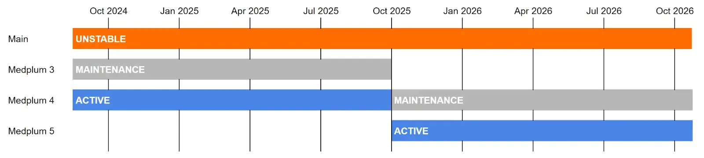

# Medplum Version Policy

## Overview

Medplum follows semantic versioning (semver) for all components of our healthcare developer platform. This document outlines our version release strategy, support timeline, and upgrade requirements to help organizations plan their deployment and maintenance schedules effectively.

## Component Versioning

All Medplum components are released in lockstep with the same version number:

- API Server
- Client SDKs
- React Component Library
- Agent
- Supporting tools and utilities

This means when version X.Y.Z is released, all components are updated to that version simultaneously, ensuring consistent compatibility across the platform.

## Release Schedule

### Major Versions (X.0.0)

- Released annually in Q4
- Support lifecycle consists of:
  - 1 year "Active" status with full support and feature updates
  - 1 year "Maintenance" status with critical updates only
- Primarily driven by updates to core dependencies
- Include any necessary breaking changes, concentrated into the annual release

### Minor Versions (X.Y.0)

- Released 2-3 times per year
- Require server maintenance including potential database migrations
- Must be deployed sequentially (cannot skip minor versions)
- Include backwards-compatible feature additions and improvements

### Patch Versions (X.Y.Z)

- Released approximately weekly
- Include bug fixes and non-breaking feature additions
- Can be deployed directly without intermediate steps

## Dependency Support

### Scheduled Release Dependencies

#### Node.js

- Supports current "Active" and "Maintenance" LTS Node.js versions
- All unit and integration tests are run against supported versions
- Follows Node.js even-numbered LTS release schedule (16.x, 18.x, 20.x, etc.)

See [https://nodejs.org/en/about/previous-releases](https://nodejs.org/en/about/previous-releases) for Node.js version support details.

#### PostgreSQL

- Supports all PostgreSQL LTS versions that overlap with Medplum "Active" releases
- Integration tests are run against all supported versions
- Typically covers 4 major PostgreSQL versions

See [https://www.postgresql.org/support/versioning/](https://www.postgresql.org/support/versioning/) for PostgreSQL version support details.

### Other Major Dependencies

Dependencies without predefined release schedules (e.g., Redis, React, Mantine) follow these support guidelines:

- The major version of each dependency supported at the start of a Medplum major version will continue to be supported throughout that Medplum version's lifecycle
- Support requirements are re-evaluated during each major Medplum version release
- Example: If Redis v6 is supported at the release of Medplum v4.0.0, it will continue to receive support throughout Medplum v4.x.x's lifecycle

## Deployment Requirements

### Self-Hosted Deployments

- Must use supported versions of Node.js and PostgreSQL
- Required to use Medplum CLI for version upgrades
- Must perform sequential minor version upgrades for proper data migration
- Automated tooling provided for migration processes

### Enterprise Considerations

#### Compliance Requirements

- HIPAA compliance requires maintaining supported software versions
- SOC 2 requirements include regular security updates and version maintenance
- ONC certification is only valid for "Active" versions
- Enterprise customers should maintain upgrade schedules aligned with support windows

#### Maintenance Support

During the "Maintenance" year of a major version, updates are limited to:

- Security vulnerabilities and patches
- Critical bug fixes
- Enterprise customer stability requirements

## Version Lifecycle Example

Using version 4.0.0 as an example:

- Q4 2024: Version 4.0.0 released, enters "Active" status
- Q4 2025: Version 5.0.0 released, version 3.x.x enters "Maintenance" status
- Q4 2026: Version 4.x.x reaches end-of-life

## Recommended Practices

1. Production deployments should maintain current "Active" versions when possible
2. Plan major version upgrades annually during the Q4 release window
3. Schedule minor version upgrades within 30 days of release
4. Monitor the Medplum changelog for security updates and patch releases
5. Use Medplum CLI for all version upgrades to ensure proper migration handling
