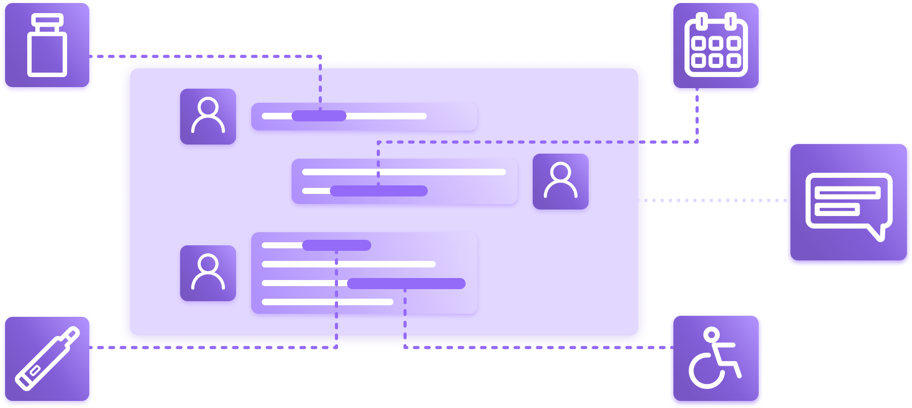

# Communications and Messaging

Communications platform that supports clinical workflows patient messaging a care team, communications regarding a care plan or appointment, sending messages to other EHRs, sending compliant emails, SMS notifications and video conferencing.

## Features

The Medplum communications and messaging implementation is a very standards compliant implementation of the [FHIR Communication](/docs/api/fhir/resources/communication). It has the following features.

- **Communication Records**: create a communication on [app.medplum.com](https://app.medplum.com/Communication) or via API. It has a rich data model and support linking to various actors and other FHIR resources. For example, a Communication can be from a patient and be about an Appointment.
- **SMS and Email**: Trigger SMS or emails via the Medplum [bots](/docs/bots) framework. Customize messages and messaging logic to your needs.
- **Documents, images, video and attachments**: great support for images, video and attachments. Try for yourself on [Foo Medical Messaging](https://foomedical.com/messages).
- **Direct Message to EHR**: Send direct messages to EHR Direct Message inboxes.
- **Video and Voice**: Synchronize data from common video and voice applications via [bots](/docs/bots) framework.

## FHIR Resources

| Resource             | App Link                                                 | Create New                                                     | API Documentation                                    |
| -------------------- | -------------------------------------------------------- | -------------------------------------------------------------- | ---------------------------------------------------- |
| Communication        | [View All](https://app.medplum.com/Communication)        | [Create New](https://app.medplum.com/Communication/new)        | [API](/docs/api/fhir/resources/communication)        |
| CommunicationRequest | [View All](https://app.medplum.com/CommunicationRequest) | [Create New](https://app.medplum.com/CommunicationRequest/new) | [API](/docs/api/fhir/resources/communicationrequest) |
| Attachment           | FHIR Datatype                                            | Create via API                                                 | [Reference](/docs/api/fhir/datatypes/attachment)     |
| Media                | [View All](https://app.medplum.com/Media)                | [Create New](https://app.medplum.com/Media/new)                | [API](/docs/api/fhir/resources/media)                |

## Demos and Reference Material

- [Foo Medical Messaging](https://foomedical.com/messaging) sample patient portal with messaging and attachments.
- [Provider Demo](https://provider.medplum.com/) sample simple EHR with provider messaging inbox.
- [Sample Code from Foo Medical](https://github.com/medplum/foomedical/blob/main/src/pages/messages/Chat.tsx) sample code for searching for messaging.
