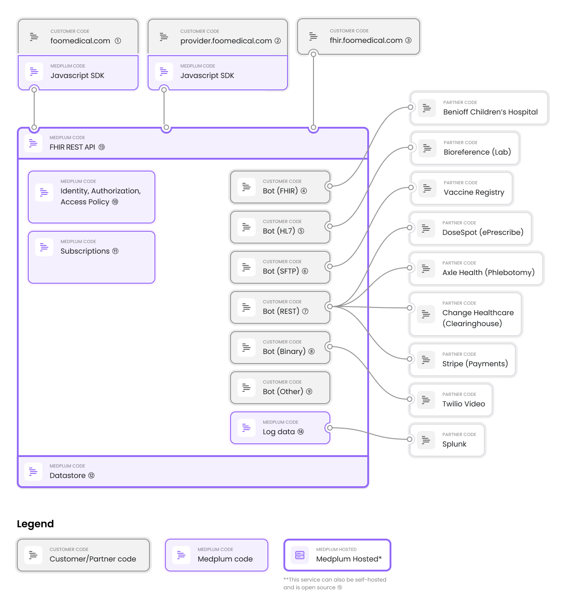
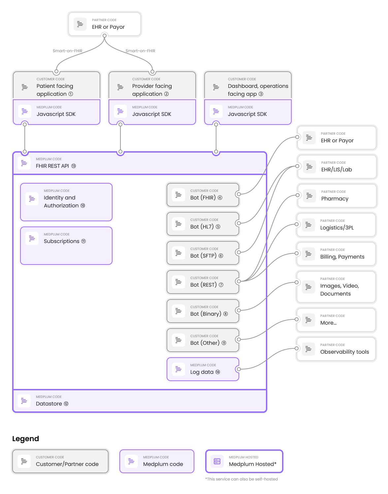

# Integrations and Interoperability Engine

Medplum offers **a powerful integration and interoperability engine** that speaks common healthcare "languages" (FHIR, HL7, SFTP, CCD-A and more). This is **the most commonly used feature of Medplum**. It can be used to receive data from and send data to other systems - medical or cloud based.

Medplum integrations and interoperability is an **event-driven** service. It listens to notifications from medical systems like a laboratory information system or EHRs. The service logs data and supports persistence to a FHIR datastore as needed. It is [open source](https://github.com/medplum/medplum).

## Overview

Medplum enables many medical and non-medical services to be effectively composed, and so allows a powerful user-facing application to be built on top. Medplum provides the following **event-driven** functionality:

- **Listens** to notifications from systems like LIS, EHR, and webhook enabled webapps
- **Sends** notifications and data to external systems, triggered off events
- **Transforms** data via a custom scripting engine, enabling bespoke workflows
- **Stores** data, allowing applications like dashboards to be built
- **Logs** activity and version history, enabling debugging and traceability

Below is an **example of a medical practice "Foo Medical" with connections** to various systems. This is an example deployment, but can give a sense of what connections might be needed in practice.

## Creating Medical Integrations

Creating effective integrations often requires writing some code. We provide pre-built integrations, high level SDKs, testing framework, deployment and provisioning features that **greatly reduce the engineering burden to build, and to maintain integrations**.

Our integration framework is called bots and there are detailed [bots tutorials](/docs/bots) in our technical documentation.

Before starting an integration, we recommend filling out the following checklist

- [ ] What system are you trying to connect to?
- [ ] What type of interfaces are available? (Check multiple if appropriate)
  - [ ] FHIR or Smart-On-FHIR
  - [ ] REST API
  - [ ] HL7
  - [ ] SFTP
  - [ ] XML based, like CCD-A or CDISC
  - [ ] File based - text or binary (e.g. X12, images, video)
  - [ ] Delimited Text
  - [ ] Something else?
- [ ] How can you request credentials/access to a test environment?
- [ ] What process is required to gain access to production?

## Examples: Integrations by Interface Type

To get started integrating services into Medplum, it can be useful to think about **which type of medical applications have which type of interfaces**. Medplum provides the infrastructure that helps connect systems like these together.

This is by no means a comprehensive list, but we provide this list of interfaces as examples of tools and systems indexed by type of integration is commonly seen.

| Interface Type | Systems with interface                         | Examples                                                                                                                                                                                                                                                                      |
| -------------- | ---------------------------------------------- | ----------------------------------------------------------------------------------------------------------------------------------------------------------------------------------------------------------------------------------------------------------------------------- |
| HL7            | Lab (LIS), Imaging, Legacy EHR                 | [Data Innovations](https://datainnovations.com/), [eRad PACS](https://erad.com/services/hl7-interface-engine-emr-integration/), [Athena HL7](https://www.athenahealth.com/~/media/athenaweb/files/developer-portal/clinical_results_interface_implementation_guide.pdf?la=en) |
| SFTP           | Lab, Government programs like vaccine registry | [Labcorp](https://www.labcorp.com/organizations/employers/it-solutions/integration-solutions), [Texas Immunization Registry](https://www.dshs.texas.gov/immunize/immtrac/docs/11-15236---Secure-File-Transfer-Protocol-Specifications.pdf)                                    |
| FHIR           | EHRs and payors                                | [Epic](https://fhir.epic.com), [CMS Blue Button](https://bluebutton.cms.gov/developers/)                                                                                                                                                                                      |
| XML Based      | Billing systems, EDC, Care Continuity          | [CCD-A](https://www.ihs.gov/rpms/PackageDocs/BCCD/bccd020u.pdf) workflow                                                                                                                                                                                                      |
| REST           | Many modern digital health services            | [Mobile phlebotomy](https://axle-health.readme.io/reference/create-a-new-address), [Eligibility Check](https://opkit.co/)                                                                                                                                                     |
| Text Delimited | Billing systems                                | EDI 837                                                                                                                                                                                                                                                                       |
| Binary files   | Billing systems, video and photo               | [CMS 1500](https://www.cms.gov/Medicare/Billing/ElectronicBillingEDITrans/16_1500), [X12](https://x12.org/examples), Twilio                                                                                                                                                   |

If you are interested in a specific integration type, please contact us at hello@medplum.com or in our [Discord](https://discord.gg/medplum).

## Examples: Integrations by Product Category

To get a medical application to work as intended often requires many systems to talk to each other, each with a different function. Medplum enables connectivity to various systems, through the [Bot](/docs/bots) framework.

Below are some of the classes of applications indexed by common integration methods. Medplum supports building interfaces of this type to enable connectivity.

| Product Category      | Common Integration Method | Comments                                                     |
| --------------------- | ------------------------- | ------------------------------------------------------------ |
| Lab                   | HL7, SFTP                 | HL7 ORU, OBX message types common                            |
| Legacy EHR            | HL7, SFTP, FHIR           | HL7 ADT, SIU message types and more, may also have Mirth     |
| PACS                  | HL7                       | HL7 ORU, OBX message types common                            |
| Vaccine Registry      | SFTP                      | Often operated by public health departments, government      |
| Payor                 | FHIR                      | Regulatory changes have increased payor FHIR adoption        |
| Pharmacy              | REST                      | Pharmacy API such as DoseSpot                                |
| Logging and Analytics | REST                      | Splunk, Freshpaint, Amplitude, Segment and related           |
| CRM                   | REST, CSV                 | CRM often have API or file based import                      |
| Forms                 | REST                      | Qualtrics, Jotforms, Formstack have REST API with webhooks   |
| EDC                   | REST, binary file         | Redcap, Medidata etc. support REST API or file import        |
| Records request       | FHIR                      | Records services like Particle or HealthGorilla support FHIR |
| Messaging             | REST                      | Twilio, Sendbird and more have REST API                      |
| Records request       | FHIR                      | Records services like Particle or HealthGorilla support FHIR |
| Logistics             | REST                      | 3PL like ShipBob or Fulfilled by Amazon have REST API        |
| Direct Project        | REST                      | Special medical grade email from companies like Paubox       |

We have a lot of experience with medical integrations, and welcome questions at hello@medplum.com or on our [Discord](https://discord.gg/medplum).

## System Diagram

Below is a system diagram that shows, at a high level all of the systems working in concert.

## Reference Material

- [Sample bots](https://github.com/medplum/medplum-demo-bots) these are a quickstart for building your integrations
- [Bot tutorials](/docs/bots)
- [Authentication, Authorization and Identity](/docs/auth)
- [Compliance Portal](/docs/compliance)
- [All Epic FHIR Endpoints](https://open.epic.com/MyApps/Endpoints)
