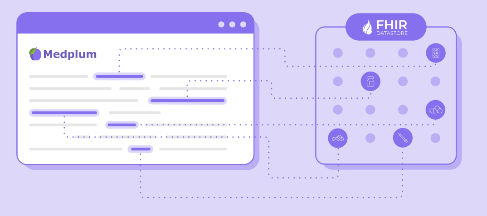

# Questionnaires

Get data from patients, clinicians, staff and other stakeholders using custom forms. Forms go by many names, questionnaires, surveys, ePRO, and more, but they have the same function: to collect data from a user in a standard way.

Medplum supports collecting form data in a standards compliant way and using it to drive automations, enforce QA or ensure conformance. Forms can be completed by patients, practitioners or others, depending on where they are embedded.

## Features

The Medplum Forms implementation is a very standards compliant implementation of the [FHIR Questionnaires](/docs/api/fhir/resources/questionnaire). It has the following features.

- **Questionnaire Builder**: Medplum supports a Google Forms-like experience for building questionnaires. You can build your questionnaires on [app.medplum.com](https://app.medplum.com/Questionnaire). See a sample on [storybook](https://storybook.medplum.com/?path=/docs/medplum-questionnairebuilder--basic).

- **Questionnaire Library**: Store and manage your questionnaires programmatically or on [app.medplum.com](/docs/api/fhir/resources/questionnaire).

- **React component**: Add forms to your applications via pre-built React components. View samples on [storybook](https://storybook.medplum.com/?path=/docs/medplum-questionnaireform--basic)

- **API and SDK**: Ability to search, create and update questionnaires and responses via API.

- **Response Management**: Automatically trigger emails, notifications and workflows after a user submits a form. View [tutorial](/docs/bots/bot-for-questionnaire-response)

- **Version history and tagging**: Add metadata such as category or intended audience to questionnaires as well as track version history.

## FHIR Resources

| Resource               | App Link                                                  | Create New                                              | API Documentation                                     |
| ---------------------- | --------------------------------------------------------- | ------------------------------------------------------- | ----------------------------------------------------- |
| Questionnaire          | [View All](https://app.medplum.com/Questionnaire)         | [Create New](https://app.medplum.com/Questionnaire/new) | [API](/docs/api/fhir/resources/questionnaire)         |
| Questionnaire Response | [View All](https://app.medplum.com/QuestionnaireResponse) | Create via API or workflow                              | [API](/docs/api/fhir/resources/questionnaireresponse) |

## Demos and Reference Material

- [Storybook Questionnaire Builder](https://storybook.medplum.com/?path=/docs/medplum-questionnairebuilder--basic)
- [Storybook Simple Questionnaire](https://storybook.medplum.com/?path=/docs/medplum-questionnaireform--groups)
- [Storybook Social Determinants of Health (SDH)](https://storybook.medplum.com/?path=/docs/medplum-questionnaireform--ahchrsn-screening)
- [Foo Medical](https://foomedical.com/) sample patient portal with questionnaires
- [Provider Demo](https://provider.medplum.com/) sample simple EHR with questionnaires
- [Questionnaire Automation Tutorial](/docs/bots) shows how to build automations on questionnaire submission
