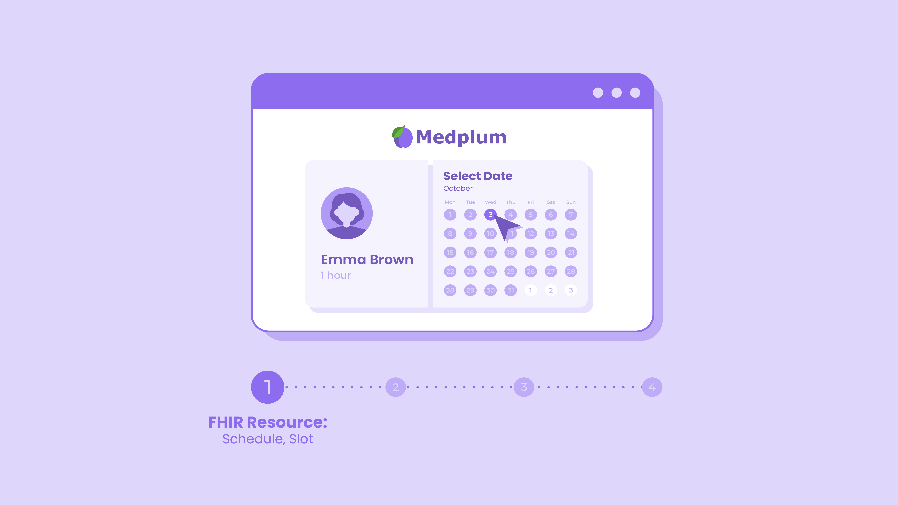

# Scheduling

Scheduling platform that supports clinical workflows such as clinician or location filtering, patient slot selection, custom notifications, pre-appointment forms and more. Medplum supports the full range of scheduling scenarios from very simple single schedule with slots, to a complex scheduling requirements with facilities, equipment and constraints requirements.

## Features

The Medplum scheduling implementation is a very standards compliant implementation of the [FHIR Schedule](/docs/api/fhir/resources/schedule). It has the following features.

- **Schedule creation**: create a schedule on [app.medplum.com](https://app.medplum.com/Schedule) or via API. Associate the appropriate metadata with the schedule, for example, what service type, location and practitioner is associated with this schedule.
- **Slot creation**: once a schedule is in place, creating slots at a certain time is the next step. Slots are commonly created via API, but can also be made on [app.medplum.com](https://app.medplum.com/Slot). Slots belong to a schedule and represent an opening on that schedule that can be booked.
- **Calendar scheduler for patients**: when allowing patients to book their appointments you can embed a schedule in your application that corresponds to a schedule. Here is the [React component](https://storybook.medplum.com/?path=/docs/medplum-scheduler--basic). When the patient selects a slot, create an appointment that references that slot programmatically and mark the `Slot.status=busy` and create an [Appointment](https://app.medplum.com/Appointment) that references that slot. An appointment can take one or more slots.
- **Embedded questionnaires**: you can require patients to fill out a questionnaire before scheduling, and to do so embed the questionnaire in the [React component](https://storybook.medplum.com/?path=/docs/medplum-scheduler--basic). The filled out questionnaire will be available as a [FHIR QuestionnaireResponse](https://app.medplum.com/QuestionnaireResponse?_count=20&_fields=id,_lastUpdated&_offset=0&_sort=-_lastUpdated).
- **Schedule search**: It's common to require that a patient be matched to a provider in a specific location or with a specific credential. Use the [search API](/docs/sdk/core.medplumclient.search) to match a schedule to a patient as needed.

## Common Configurations

When enabling scheduling by patients or referring physicians, it's critical that scheduling is only enabled under the correct conditions.

- **Geographic scheduling**: Medplum supports searching for [schedules by location](/docs/api/fhir/resources/schedule#search-parameters), and using that feature can ensure that patients are matched with providers in the appropriate location.
- **Scheduling for a specific doctor or practitioner**: schedule search can ensure that a patient only meets with their practitioner or [CareTeam](https://app.medplum.com/CareTeam). (See `Schedule.actor` in documentation.)
- Requiring a form, payment active insurance to be filled out before scheduling an appointment can be accomplished by showing users schedules or allowing them to book slots only when data is complete and verified.
- Best Practices for billing include tagging schedules and appointments with the appropriate [service type](https://x12.org/codes/service-type-codes)
- **Reminders and communications** regarding scheduling can be implemented using [bots](/docs/bots), and SMS reminders, emails, and calendar appointments are common.
- Video conferencing for virtual care is common and providers use the a one "meeting room with waiting area" per schedule model to provide a streamlined experience for providers, for example one [Zoom Meeting Room](https://support.zoom.us/hc/en-us/articles/204772869-Zoom-Rooms-User-Guide) per [schedule](https://app.medplum.com/Schedule).

## FHIR Resources

| Resource    | App Link                                        | Create New                                         | API Documentation                           |
| ----------- | ----------------------------------------------- | -------------------------------------------------- | ------------------------------------------- |
| Schedule    | [View All](https://app.medplum.com/Schedule)    | [Create New](https://app.medplum.com/Schedule/new) | [API](/docs/api/fhir/resources/schedule)    |
| Slot        | [View All](https://app.medplum.com/Slot)        | Create via API or workflow                         | [API](/docs/api/fhir/resources/slot)        |
| Appointment | [View All](https://app.medplum.com/Appointment) | Create via API or workflow                         | [API](/docs/api/fhir/resources/appointment) |

In general one Schedule has many Slots, one Appointment takes one or more Slots.

## Demos and Reference Material

- [Storybook Scheduler React Component](https://storybook.medplum.com/?path=/docs/medplum-scheduler--basic)
- [Foo Medical Scheduling](https://foomedical.com/get-care) sample patient portal with appointment booking experience.
- [Provider Demo](https://provider.medplum.com/) sample simple EHR with provider calendar and slot creation.
- [Sample Code](https://github.com/medplum/medplum-demo-bots/blob/main/src/examples/sample-account-setup.ts) sample code for searching for and creating schedules and slots.
