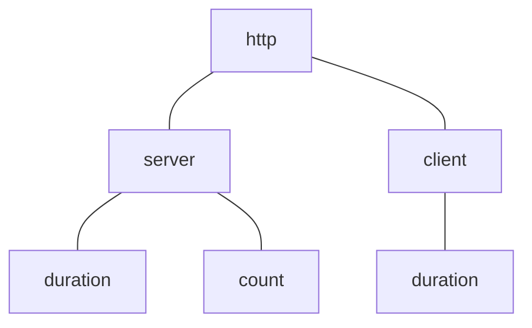

# OpenTelemetry and Service Metrics

Medplum server uses [OpenTelemetry][otel] to collect service health metrics and export them to a number of available
observability backend systems. The server publishes data points to a local sidecar container (the metrics collector),
which in turn pre-aggregates and sends the data on to an observability backend.

```mermaid
flowchart LR
  flowchart TD
    subgraph Medplum backend
        S[Medplum server] -.->|Data points| C[Metrics collector]
    end
    C -->|Aggregated data| O[Observability]
```

OpenTelemetry supports publishing three primary types of metrics:

- **Counter**: Incrementing count, useful for recording when an event occurs; can be post-processed to give rates etc.
  - e.g. Bot executions, created resources
- **Histogram**: Event-specific metrics with a numeric value, allows calculating stats like average and percentiles
  - e.g. request latency (in seconds), uploaded resource size (in bytes)
- **Gauge**: A value that has meaning at the time it's measured, not associated with an event
  - e.g. CPU usage (in percent), heap size (in bytes)

[otel]: https://opentelemetry.io/docs/what-is-opentelemetry/

## Adding metrics instrumentation

### Metric name

To start collecting a metric from some place in the code base, first select the type of metric from the list above, and
then decide on a name for your metric. Metric names follow a hierarchical, period-delimited format, e.g.
`http.server.duration`. The top-level categories help group metrics over the same part of the system, further
parts specify exactly which component is under measurement, and the final part describes what the quantity being
measured is. See the [OpenTelemetry Semantic Conventions][otel-sem-conv] for more details.



Existing top-level categories are:

- `http`: basic HTTP server and client measurements, such as connections, responses sent, requests made
- `medplum`: primary Medplum-server specific metrics such as Bot executions and resources created
- `system`: host-related metrics like CPU usage and free memory

> **NOTE**: You should not create new top-level categories unless really necessary; most new metrics should fit into a
> previously-defined group.

Middle elements of the name can be more freely added, but care should still be taken to try and group with existing
related metrics if possible.

The final part of the metric name should succinctly describe the concrete value being
captured. For example, we would prefer the following:

- **Histogram**: `http.server.duration` instead of `http.server.requestLatency` (more succinct)
- **Gauge**: `system.cpu.utilization` over `system.cpu` (describes what is being measured)
- **Counter**: `medplum.bot.execution.count` over `medplum.bot.execution.{success|failure}` (use attributes to combine metrics that are effectively measuring the same event)

[otel-sem-conv]: https://opentelemetry.io/docs/specs/semconv/general/metrics/

### Instrumenting the code

If we wanted to add a hypothetical new `medplum.resource.size` histogram metric, we could identify the place in the code
where new resources are being written to the DB and add instrumentation using the [available helper functions](./otel.ts):

```ts
import { recordHistogramValue } from './otel/otel';

class Repository {
  // ...
  private async updateResourceImpl<T extends Resource>(resource: T, create: boolean): Promise<T> {
    // ...

    if (!this.isResourceWriteable(existing, result)) {
      // Check after the update
      throw new OperationOutcomeError(forbidden);
    }

    await this.handleMaybeCacheOnly(result);
    await setCacheEntry(result);
    await addBackgroundJobs(result, { interaction: create ? 'create' : 'update' });

    /***** Adding new Otel code here *****/
    recordHistogramValue('medplum.resource.size', JSON.stringify(result).length, {
      resourceType: result.resourceType, // Attribute to split up the data by resource type
    });
    /***** End Otel instrumentation *****/

    this.removeHiddenFields(result);
    return result;
  }
}
```
